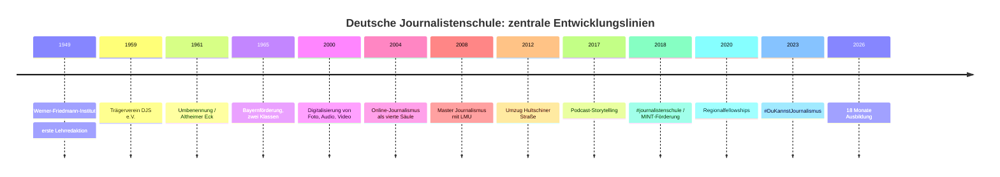
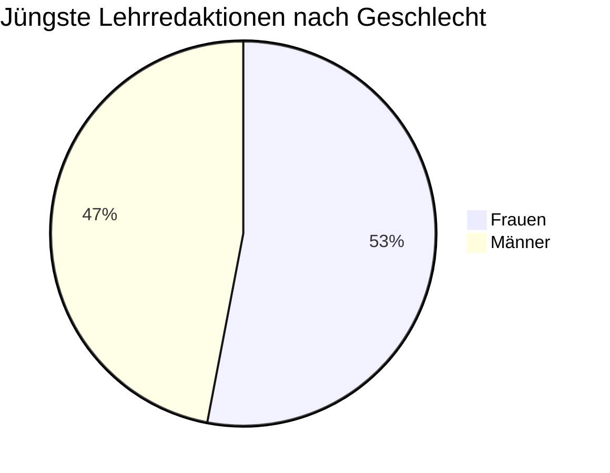
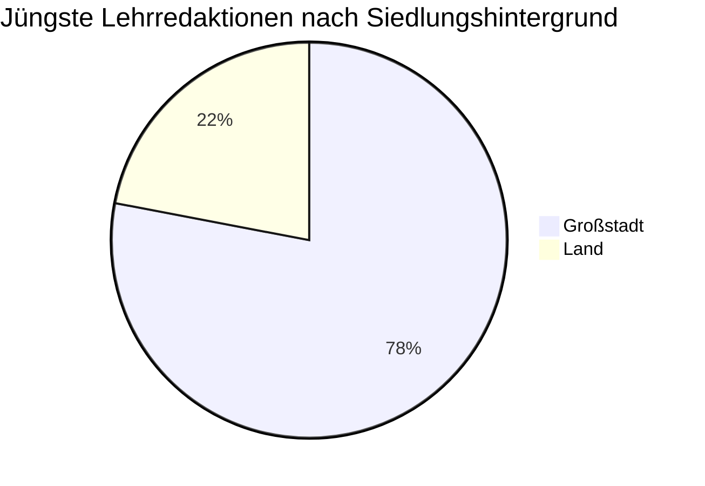
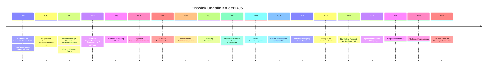
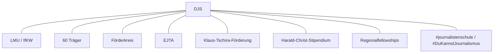
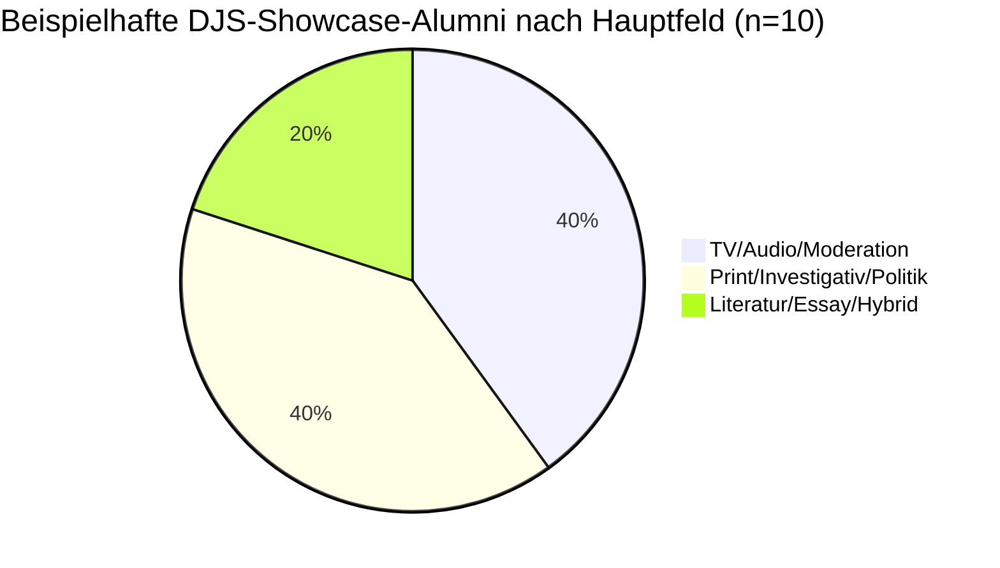

# INHALT_DJS-Dossier

Zusammengeführte Recherche zur Deutschen Journalistenschule (DJS) München.
Quelle für den DJS-Quiz-Modus der Lern-App. Bei Änderungen: Frage in `app/src/data/djsQuestions.json` ergänzen.

---

## Teil A — Erstes Dossier

# Dossier zur Deutschen Journalistenschule in München

## Executive Summary

Die entity["organization","Deutsche Journalistenschule","München, Deutschland"] in entity["city","München","Bayern, Deutschland"] ist die älteste praktische Journalistenschule der Bundesrepublik und gehört bis heute zu den sichtbarsten und einflussreichsten Ausbildungsinstitutionen des deutschen Journalismus. Sie wurde 1949 als Werner-Friedmann-Institut gegründet, 1959 in einen gemeinnützigen Trägerverein überführt und 1961 in Deutsche Journalistenschule umbenannt. Heute bildet sie nach eigenen Angaben jährlich 45 Nachwuchsjournalistinnen und -journalisten aus, davon zwei Drittel im Kooperationsmodell mit der entity["organization","Ludwig-Maximilians-Universität München","München, Deutschland"]. Die Ausbildung ist schulgeldfrei; finanziert wird sie durch eine breite Trägerschaft sowie Zuschüsse von Bund, Freistaat Bayern und der Landeshauptstadt München. citeturn16view0turn15view3turn19search1turn19search8turn9search0

Die herausragenden Stärken der DJS sind ihre institutionelle Langlebigkeit, ihr starkes Alumni-Netzwerk, die hohe Einbettung in Redaktionen und Branchenmilieus, die crossmediale Grundausrichtung sowie die schulische und wissenschaftliche Verzahnung im Mastermodell. Belastbare Erfolgsindikatoren veröffentlicht die DJS allerdings nur punktuell: Eine eigene Auswertung von 2019 kam für die jüngsten fünf Jahrgänge auf 92 Prozent hauptberufliche Tätigkeit im Journalismus, bei den 2018 Eingestiegenen sogar auf 98 Prozent; zwei Drittel der Befragten gaben ein Bruttojahreseinkommen von mehr als 40.000 Euro an. Zugleich zeigt die öffentlich verfügbare Quellenlage deutliche Leerstellen: Die Schule publiziert keine umfassend zugänglichen Jahresberichte oder vollständigen Haushalte; aktuelle, systematisch erhobene Daten zu sozialer Herkunft, regionaler Herkunft, Behinderung oder Klassenlage fehlen. citeturn15view0turn15view3turn26search3turn13view0

Analytisch ist die DJS weniger durch einen einzelnen Skandal als durch vier wiederkehrende Spannungen geprägt. Erstens: der Widerspruch zwischen dem Anspruch demokratischer Offenheit und der empirisch erkennbaren sozialen Selektivität journalistischer Eliten. Zweitens: die historische Spannung zwischen antifaschistischem Gründungsimpuls und bislang nur fragmentarisch aufgearbeiteten NS-Kontinuitäten einzelner früher Dozenten und Schulleiter. Drittens: die Ambivalenz einer „unabhängigen“ Schule, die zwar gerade wegen ihrer breiten Trägerschaft Autonomie reklamiert, aber institutionell eng mit Medienhäusern, Verbänden und politischen Akteuren verflochten bleibt. Viertens: die aktuelle Transformationsphase, in der Curriculum, Diversity-Politik und Ausbildungsdauer sichtbar umgebaut werden, die offizielle Webkommunikation diesen Übergang aber noch nicht überall konsistent abbildet. citeturn30view0turn32view0turn32view2turn39view3turn14search8turn8view7turn15view3

Im Vergleich zu anderen deutschen Journalistenschulen positioniert sich die DJS als generalistische, crossmediale, öffentlich wie privat vernetzte Schule mit starkem Qualitäts- und Elitenarrativ. Sie ist weniger konzerngebunden als die Henri-Nannen-Schule, weniger konfessionell profiliert als das ifp, weniger fachlich spezialisiert als die Kölner Journalistenschule und stärker universitär eingebunden als viele rein betriebliche Ausbildungsmodelle. Gerade diese Mischform erklärt ihre hohe Reputation – aber auch ihre besondere Verwundbarkeit für Kritik an sozialer Selektivität, Datenintransparenz und historischer Selbstbeschreibung. citeturn41search4turn41search16turn41search0turn41search1turn41search2turn41search6turn41search7turn27search15turn14search10

## Historie und institutionelle Entwicklung

Die DJS entstand aus einem sehr spezifischen Nachkriegsmoment. Auf einen Aufruf von entity["people","Werner Friedmann","Journalist und Gründer der DJS"] in der Münchner Abendzeitung meldeten sich 1949 rund 1.700 Interessierte; 21 Personen – vier Frauen und 17 Männer – wurden für die erste Lehrredaktion ausgewählt. Die Schule war von Beginn an als praktische, unentgeltliche Journalistenausbildung gedacht, ausdrücklich mit demokratischem Erneuerungsanspruch in einer vom Nationalsozialismus diskreditierten Presselandschaft. Zehn Jahre später wurde mit dem Trägerverein Deutsche Journalistenschule e.V. die institutionelle Grundlage geschaffen; 1961 erfolgte die Umbenennung von Werner-Friedmann-Institut in Deutsche Journalistenschule. citeturn42view0turn16view0turn16view1turn27search4turn27search5

Die DJS entwickelte sich seither in klar erkennbaren Schüben: Zunächst als printzentrierte Lehrredaktion mit allgemeinbildenden Elementen, ab Mitte der 1960er Jahre mit staatlicher Förderung, verlängerten Ausbildungszeiten sowie den ersten festen Modulen für Hörfunk und Fernsehen; ab den 1970er Jahren mit stärkerem Praxisfokus; seit den 1990er und 2000er Jahren mit newsroom-orientierter Computerisierung, kompletter Digitalisierung von Foto, Audio und Video, Online-Journalismus als vierter Säule, später Podcasting, Formatentwicklung und Integrationsmodulen für digitale Produktionslogiken. 2008 wurde die ältere Aufbaustudienstruktur in den kooperativen Master Journalismus mit der LMU überführt. Seit 2026 kommuniziert die DJS eine Verlängerung der Ausbildung auf 18 Monate. citeturn16view1turn16view5turn17view0turn17view1turn17view2turn17view4turn14search8

Weniger bekannt, aber institutionell wichtig, sind mehrere Seitenpfade dieser Entwicklung. 1986 richtete die DJS eine zusätzliche Kompaktklasse für Berliner Teilnehmende ein; aus diesem Modell ging 1992 eine eigenständige Berliner Journalistenschule hervor. Von 1989 bis 2011 absolvierte zudem die Burda-Journalistenschule ihre überbetriebliche Grundausbildung an der DJS. Nach dem Fall der Mauer schrieb die Schule 1990 zusätzlich ein Auswahlverfahren speziell für Bewerberinnen und Bewerber mit Wohnsitz in der DDR aus; acht ostdeutsche Teilnehmer wurden zusätzlich aufgenommen. Diese Episoden zeigen, dass die DJS nicht nur ausbildete, sondern zeitweise selbst als institutioneller Inkubator für weitere Journalismusausbildungen fungierte. citeturn16view2turn30view1

### Zeitleiste der institutionellen Entwicklung

| Jahr | Zäsur | Analytische Bedeutung | Quelle |
|---|---|---|---|
| 1949 | Gründung des Werner-Friedmann-Instituts, 1. Lehrredaktion | praktische Nachkriegsausbildung mit demokratischem Erneuerungsanspruch | citeturn42view0turn16view0 |
| 1959 | Gründung des Trägervereins DJS e.V. | Übergang von Gründerprojekt zur dauerhaft getragenen Institution | citeturn42view0turn16view0 |
| 1961 | Umbenennung in DJS, Einzug Altheimer Eck | institutionelle Konsolidierung | citeturn42view0turn16view1 |
| 1965 | Bayernförderung, zwei Klassen, Radio/TV im Plan | Kapazitäts- und Medienausweitung | citeturn16view1 |
| 2000 | vollständige Digitalisierung von Foto, Audio und Video | technischer Modernisierungsschub | citeturn16view5 |
| 2004 | Online-Journalismus als reguläre vierte Säule | formale Reaktion auf digitalen Medienwandel | citeturn17view1 |
| 2008 | Master Journalismus mit LMU | Hybridisierung von Praxis und Wissenschaft | citeturn17view2turn9search0 |
| 2012 | Umzug an die Hultschiner Straße | infrastrukturelle Modernisierung und Nähe zum Verlagsstandort | citeturn17view2turn23search0 |
| 2017 | Podcast-Storytelling als feste Ausbildungskomponente | Anpassung an neue Audioformate | citeturn17view4 |
| 2018 | #journalistenschule und MINT-/KTS-Förderung | Medienkompetenzarbeit und wissenschaftsjournalistische Öffnung | citeturn17view4turn19search2 |
| 2020 | Regionalfellowships | Brücke zum Regionaljournalismus und zur digitalen Transformation | citeturn17view5 |
| 2023 | #DuKannstJournalismus | institutionalisierte Diversity-Rekrutierung | citeturn17view5turn21search10 |
| 2026 | kommunizierte Verlängerung auf 18 Monate | curricularer Umbau in laufender Transformation | citeturn14search8turn11search6 |

Die Zeitleiste verdichtet ausschließlich in den öffentlichen Primärquellen und der begleitenden Forschung dokumentierte Entwicklungsschritte. citeturn42view0turn16view1turn17view0turn17view4turn17view5turn14search8

## Standort, Infrastruktur, Governance und Finanzierung

Die DJS sitzt heute an der Hultschiner Straße 8 in München. Seit 2012 befindet sie sich im vierten Stock des Verlags- und Medienhochhauses an diesem Standort; zuvor war sie mehr als fünf Jahrzehnte am Altheimer Eck in der Münchner Innenstadt untergebracht. Schon das alte Schulhaus am Altheimer Eck verfügte laut offizieller Geschichtsdarstellung über Hörfunkstudio, Fotolabor und elektronische Arbeitsplätze. Der neue Standort im Münchner Osten bietet eine deutlich modernere Gebäudestruktur; das Hochhaus selbst wurde 2007 fertiggestellt, misst 99,95 Meter und erhielt als nachhaltiger Bürokomplex ein LEED-Gold-Zertifikat. citeturn23search0turn23search2turn16view0turn17view2turn24view0

Für die Ausbildungsinfrastruktur ist weniger die Architektur als die Produktionsumgebung entscheidend. Offizielle DJS-Quellen nennen crossmediale Lehrredaktionen, Hörfunk-/Audioarbeit, TV-/Video-Elemente, Digitalproduktion und persönliche Entwicklungsangebote; die LMU-Modulhandbücher für den kooperativen Master konkretisieren dies in ECTS-bewertete Praxismodule zu Text-, Audio-, Video- und integrierter journalistischer Praxis. Gleichzeitig arbeitet die Schule mit rund 110 praxisaktiven Dozentinnen und Dozenten aus Print-, Online-, öffentlich-rechtlichen und privaten Medien. Die Einrichtung versteht sich also weniger als Campus im klassischen Hochschulsinn denn als verdichteter, redaktionsähnlicher Produktions- und Feedbackraum. citeturn15view1turn42view1turn42view2turn42view3turn42view4

Organisatorisch ist die DJS ein eingetragener, gemeinnütziger Verein. Der Vorstand des Trägervereins fungiert als Aufsichtsgremium; laut Datenschutzerklärung wird der Verein vom Vorsitzenden des Vorstands, entity["people","Volker Herres","Vorstandsvorsitzender der DJS"], und von der Schulleiterin und Geschäftsführerin entity["people","Henriette Löwisch","Schulleiterin der Deutschen Journalistenschule"] vertreten. Das operative Team umfasst sechs hauptamtliche Mitarbeitende; sie verantworten Ausbildung, Technik, Finanzen, Aufnahmeverfahren, Stipendien, Stundenpläne und die Koordination von Trägerverein und Förderkreis. Stellvertretender Schulleiter und Geschäftsführer für Technik, IT und Finanzen ist Sven Szalewa. citeturn18view0turn23search5turn19search8

Die Finanzierung ist plural, aber nur teilweise transparent. Offiziell erklären die Trägerseiten, dass Mitgliedsbeiträge von Medienhäusern, Verbänden, Gewerkschaften, Institutionen, Unternehmen, Stiftungen und Parteien zusammen mit Zuschüssen von Bund, Freistaat Bayern und Stadt München die schulgeldfreie Ausbildung ermöglichen. Zum 75-jährigen Jubiläum nennt die DJS 60 Träger. Der Förderkreis mit inzwischen mehr als 1.500 Mitgliedern finanziert nach DJS-Angaben sieben von 45 Ausbildungsplätzen. Zusätzlich gibt es zweckgebundene Förderinstrumente wie 50.000 Euro jährlich der Klaus Tschira Stiftung für wissenschaftsjournalistische Förderung und mindestens ein öffentlich dokumentiertes Bundesprojekt aus dem BKM-Programm zur „strukturellen Stärkung des Journalismus“ in Höhe von 169.170 Euro für „Vertrauen durch Vielfalt“. Im bayerischen Haushalt ist zudem ein freiwilliger Zuschuss von bis zu 70.000 Euro jährlich für die DJS ausgewiesen. Was fehlt, ist ein öffentlich zugänglicher Gesamthaushalt, aus dem sich Anteile, Abhängigkeiten und Mittelverwendung systematisch rekonstruieren ließen. citeturn19search1turn19search8turn15view3turn16view2turn19search2turn22view1turn21search7turn21search5

### Governance- und Finanzarchitektur im Überblick

| Element | Befund | Einordnung | Quelle |
|---|---|---|---|
| Rechtsform | eingetragener, gemeinnütziger Verein | institutionell nicht staatlich, aber öffentlich mitfinanziert | citeturn19search1turn19search8 |
| Aufsicht | Vorstand des Trägervereins | pluralistische Kontrolle statt singulärer Eigentümerstruktur | citeturn19search8turn23search5 |
| Operatives Team | sechs hauptamtliche Mitarbeitende | schlanke Verwaltung, hohe Dozentenabhängigkeit | citeturn18view0 |
| Trägerbasis | 60 Medienhäuser, Verbände, Institutionen, Unternehmen, Stiftungen, Parteien | Breite stärkt Unabhängigkeit, erschwert aber Transparenz über Einflussgewichte | citeturn15view3turn19search1 |
| Förderkreis | >1.500 Mitglieder, finanziert sieben von 45 Plätzen | Alumni-Netzwerk als substanzieller Kofinanzierer | citeturn16view2 |
| Öffentliche Mittel | Bund, Bayern, München; Bayern bis zu 70.000 Euro/Jahr; BKM-Projekt 169.170 Euro | öffentliche Mitfinanzierung plus projektbezogene Förderlogik | citeturn19search1turn21search5turn22view1 |
| Transparenzlücke | kein frei zugänglicher Vollhaushalt in den eingesehenen Quellen | erschwert externe Prüfung von Finanzierungsstruktur und Prioritäten | citeturn19search1turn19search8 |

## Auswahlverfahren, Ausbildungswege und soziale Zusammensetzung

Die DJS rekrutiert heute auf zwei Wegen: über die Kompaktausbildung und über den gemeinsam mit der LMU angebotenen Master Journalismus. Offizielle DJS-Seiten nennen 45 Ausbildungsplätze pro Jahr; davon entfallen 30 auf den Master und 15 auf die Kompaktausbildung. Für die Masterklassen läuft die Online-Anmeldung laut DJS üblicherweise vom 15. Mai bis 15. September, für die Kompaktklassen vom 15. Oktober bis 15. Januar. Die Ausbildung ist kostenlos; allerdings trägt die Schule nicht den Lebensunterhalt, weshalb Stipendien und Förderangebote relevant bleiben. citeturn15view3turn6view0turn6view2turn14search8turn19search2turn19search17

Das Auswahlverfahren ist mehrstufig und leistungsorientiert. Laut DJS beginnt es mit Online-Anmeldung, Lebenslauf, Arbeitsprobe und Fragebogen; im zweiten Schritt werden rund 150 Bewerberinnen und Bewerber zu einem zweitägigen Test nach München eingeladen. Dort gehören Wissenstest, Reportageaufgabe, Interview- bzw. Gesprächssituationen und weitere Eignungselemente zum Verfahren. Bemerkenswert ist, dass bereits die erste Aufnahmeprüfung 1949 ähnliche Elemente enthielt – Bildertest, Wissenstest, Reportage und Aufnahmegespräch. Die Schule inszeniert damit Kontinuität: weniger formale Zertifikate als journalistische Eignung, Beobachtungsfähigkeit und Schreibvermögen zählen. citeturn6view0turn6view3turn42view0

Die DJS kommuniziert Diversität als Auswahlziel, aber die Daten zeigen ein gemischtes Bild. Für die „jüngsten Lehrredaktionen“ nennt die Schule 53 Prozent Frauen und 47 Prozent Männer, 78 Prozent Großstadt- und 22 Prozent Landherkunft, 75 Prozent Auslandserfahrung, 10 Prozent „Deutsche mit sogenanntem Migrationshintergrund“ sowie weitere 6 Prozent aus dem Ausland; zudem hatten vier von fünf bereits ein Praktikum absolviert. Diese Angaben sind nützlich, aber methodisch unscharf: Erhebungszeitraum, Grundgesamtheit, Definitionen und Erhebungsverfahren werden auf der Website nicht weiter erläutert. citeturn13view0

Die wissenschaftliche Sekundärliteratur zeichnet für die Alumni-Population ein noch klareres Selektionsmuster. Die 2016 erhobene Alumni-Studie von Dirk Hansen beschreibt DJS-Absolventinnen und -Absolventen als mehrheitlich männlich, mit unterrepräsentiertem Migrationshintergrund, überwiegend westdeutscher Sozialisation und deutlich überdurchschnittlich gebildeten Elternhäusern. 8,5 Prozent der befragten Alumni hatten einen Migrationshintergrund; bei den Eltern lagen Hochschulabschlüsse signifikant über dem Bevölkerungsdurchschnitt. Hansen resümiert, dass die Herkunftsstruktur von DJS-Alumni deutlich von der Allgemeinbevölkerung abweicht und von bildungsbürgerlicher Mittelschicht dominiert wird. Damit bestätigt die Forschung strukturell das, was Kritikerinnen und Kritiker seit Jahren im deutschen Journalismus bemängeln: mangelnde soziale Öffnung. citeturn32view0turn32view1

### Schema des Aufnahmeverfahrens

Das Schema fasst die im offiziellen DJS-Bewerbungsverfahren beschriebenen Schritte zusammen; die Zahl von rund 150 Personen für die zweite Runde stammt aus der DJS-Darstellung der Aufnahmeprüfungen. citeturn6view0turn6view3

### Demografische Indikatoren

| Indikator | Aktuelle DJS-Webangabe zu „jüngsten Lehrredaktionen“ | Alumni-Befund in der Forschung | Einordnung | Quelle |
|---|---|---|---|---|
| Geschlecht | 53 % Frauen, 47 % Männer | 56 % männlich, 41,2 % weiblich, 2,8 % keine Angabe | aktuelles Webbild wirkt ausgeglichener als Alumni-Bestand | citeturn13view0turn32view0 |
| Regionale Herkunft | 78 % Großstadt, 22 % Land | 93,6 % Westdeutschland, 4,4 % neue Länder, 2 % Ausland (Kindheit) | Stadt-/Land-Angabe und Ost-/West-Angabe nicht direkt vergleichbar, deuten aber beide auf Selektivität | citeturn13view0turn32view0 |
| Migration | 10 % Deutsche mit Migrationshintergrund, 6 % aus dem Ausland | 8,5 % Migrationshintergrund | beide Werte liegen deutlich unter dem Bevölkerungsanteil | citeturn13view0turn32view0 |
| Praktische Vorerfahrung | 80 % hatten bereits ein Praktikum | nicht direkt ausgewiesen | frühe branchenspezifische Vorsozialisation ist fast Standard | citeturn13view0 |
| Soziale Herkunft | auf Website nicht erhoben | dominierende bildungsbürgerliche Mittelschicht, hohe Elternbildung | größte offene Datenlücke der DJS-Öffentlichkeit | citeturn26search3turn32view1 |

Die beiden Diagramme visualisieren ausschließlich die auf der DJS-Website veröffentlichten Prozentwerte zu den „jüngsten Lehrredaktionen“. Mangels Methodendokumentation sind sie als Selbstauskunft mit begrenzter Interpretierbarkeit zu lesen. citeturn13view0

## Curriculum, Didaktik und Leistungsnachweise

Das Curriculum der DJS ist gegenwärtig im Umbau. Die Startseite und die FAQ kommunizieren seit 2026 eine 18-monatige Ausbildung mit 12 Monaten Unterricht in München und 6 Monaten Praktika; für den Master werden 27 Monate einschließlich LMU-Anteilen und Masterarbeit genannt. Auf älteren bzw. nicht überall aktualisierten Unterseiten stehen jedoch weiterhin 16 Monate für die Kompaktausbildung oder Formulierungen von „gut 180 Arbeitstagen“ bzw. „zehn Monaten Ganztagesunterricht“. Diese Quellenkollision ist kein Nebenaspekt: Sie zeigt, dass die DJS ihr Ausbildungsmodell gerade sichtbar transformiert, die institutionelle Kommunikation diesen Übergang aber noch nicht vollständig harmonisiert hat. citeturn11search6turn14search8turn8view7turn15view3

Inhaltlich folgt die DJS einem generalistischen crossmedialen Ansatz. Offizielle Seiten gliedern den Unterricht in Grundlagen, Print, Hörfunk, TV & Video, Digital und Persönliche Entwicklung; Projektarbeit und Teamkritik sind laut DJS zentrale Lernformen. Für die Master-Ausbildung wird die journalistische Praxis über konkrete Pflichtmodule der LMU dokumentiert: „Kommunikationswissenschaftliche Theorie und journalistische Grundlagen“ im ersten Semester, danach Text-Journalismus, Audio-Journalismus, integrierte journalistische Praxis sowie Video-Journalismus. Die DJS-Seite selbst ergänzt dazu den Unterricht durch Praktikerinnen und Praktiker, Newsroom-Logik, Podcasting, Digital Storytelling und öffentlich sichtbare Projekte wie das Abschlussmagazin *Klartext*. citeturn15view1turn42view1turn42view2turn42view3turn42view4turn17view0turn17view4turn40search19

Didaktisch dominiert eine Werkstattlogik. Die DJS betont, dass sie keinen Frontalunterricht anbietet, sondern praktische Redaktionsarbeit, Konferenzen, Textkritik, Themenentwicklung, Recherchecoaching und produktionelle Verantwortung im Team. Die Dozierenden kommen direkt aus Redaktionen; zwischen Studierenden und Lehrenden soll ausdrücklich ein kollegiales Verhältnis entstehen. Das unterscheidet die DJS von rein akademischen Journalismusangeboten. Im Master ist die wissenschaftliche Rahmung gleichwohl substanziell: Öffentlichkeitstheorien, Mediensystem, Medienpolitik, Medienrecht, Medienökonomie und Forschungsmethoden gehören laut LMU-Handbuch explizit zum Curriculum. Die Schule bleibt also keine „reine Handwerksschule“, sondern ein Hybrid aus Handwerk, professionsbezogener Reflexion und universitärer Theoriebildung. citeturn15view1turn42view1turn9search0turn9search2

Bei den Leistungsnachweisen ist zwischen Ausbildungswegen zu unterscheiden. Die Kompaktausbildung endet nach DJS-Angabe mit dem „von den Tarifparteien anerkannten Redakteurszeugnis“. Im Master sind die DJS-Praxisblöcke als benotete Pflichtmodule mit ECTS-System in das LMU-Studium integriert; für mindestens ein Grundlagenmodul sind Klausur oder mündliche Prüfung explizit ausgewiesen, die Praxisanteile erscheinen als Pflichtübungen mit definierter Präsenzzeit und benoteter Modulstruktur. Hinzu kommen zwei obligatorische Praktika in der Kompaktausbildung beziehungsweise Pflichtpraktika als integraler Bestandteil des DJS-Trainings. Nicht öffentlich einsehbar sind dagegen detaillierte Bewertungsraster für einzelne journalistische Produkte oder eine konsolidierte Rubrik zur Kompetenzmessung über alle Ausbildungssegmente hinweg. citeturn8view7turn10view0turn42view2turn42view3turn42view4

### Kurzübersicht des Curriculums

| Bereich | Offiziell dokumentierte Inhalte | Assessment / Output | Quelle |
|---|---|---|---|
| Grundlagen | journalistische Grundlagen plus kommunikationswissenschaftliche Theorie | benotetes Pflichtmodul; im Master Klausur oder mündliche Prüfung möglich | citeturn42view1turn10view0 |
| Text | Ressorts, Textformen, Reportage, Feature, Layout, Zeitung/Zeitschrift | redaktionelle Arbeit, publizistische Produkte | citeturn42view2turn10view0 |
| Audio | Darstellungsformen, Audio-Technik, Sprechen, Moderation, digitaler Schnitt, Podcast, Internetradio | praktische Produktionen | citeturn42view3turn10view0 |
| Integrierte Praxis / Digital | aktuelle Herausforderungen des Journalismus, kanal- und plattformübergreifende Produktion, konzeptionelle Arbeit | crossmediale Projektarbeit | citeturn42view4turn15view1 |
| Video | Grundformen des Video-Journalismus und Produktion | praktische audiovisuelle Beiträge | citeturn10view0 |
| Praktika | zwei Pflichtpraktika, eines davon tagesaktuell | berufsbezogene Praxiserfahrung | citeturn8view7turn14search8 |
| Abschluss | Redakteurszeugnis bzw. Masterabschluss mit DJS/LMU-Verzahnung | tariflich bzw. hochschulisch anschlussfähig | citeturn8view7turn9search0turn10view1 |

## Alumni, Karrierewege, Netzwerke und Berufsausgänge

Zur Reichweite der Institution gehört vor allem ihr Netzwerk. Laut DJS haben inzwischen mehr als 2.600 Absolventinnen und Absolventen die Schule durchlaufen. Der Förderkreis zählt mehr als 1.500 Mitglieder; hinzu kommen rund 110 Dozierende aus der Praxis. Diese Zahlen sprechen dafür, die DJS nicht nur als Schule, sondern als dauerhaftes Netzwerkzentrum des deutschsprachigen Journalismus zu verstehen. Das wird auch in der Außendarstellung ständig mitkommuniziert: Die Alumni seien Teil des „Rückgrats“ der deutschsprachigen Medienlandschaft. Diese Formulierung ist selbstbewusst bis pathetisch, aber sie verweist auf einen realen Mechanismus symbolischer Macht: Wer DJS-Absolventin oder -Absolvent ist, erwirbt berufliche Kontakte, Sichtbarkeit und eine institutionell hoch bewertete Herkunftsmarke. citeturn15view3turn15view1turn30view3

Belastbarste Karrierekennziffer ist die DJS-interne Auswertung von 2019. Danach arbeiten 92 Prozent der neuesten Absolventinnen und Absolventen hauptberuflich im Journalismus; für den 2018 gerade in den Beruf eingetretenen Nachwuchs nennt die Schule 98 Prozent. Zwei Drittel der Befragten gaben ein Jahresbrutto von mehr als 40.000 Euro an; ein Jahr nach Abschluss lagen 15 Prozent über 50.000 Euro, fünf Jahre nach Abschluss 59 Prozent. Methodisch ist diese Statistik nicht unproblematisch, weil sie von der DJS selbst stammt, sich nur auf die Jahrgänge 50 bis 55 bezieht und mit einer durchschnittlichen Rücklaufquote von 62 Prozent arbeitet. Gleichwohl ist sie die einzige öffentlich sichtbare Outcome-Messung, die von der Institution selbst vorgelegt wird. citeturn15view0

Für die symbolische Reichweite der Alumni liefert die Forschung zusätzliche Hinweise. Die Studie von Dirk Hansen zeigt, dass DJS-Alumni in Preisen, Fachjurys und Ranglisten journalistischer Reputation überproportional vorkommen; für 2016 weist Hansen überdurchschnittliche Anteile bei Reporterpreis, Medium-Magazin-Rankings und anderen Formen fachlicher Anerkennung aus. Sein Befund ist analytisch wichtig: Die DJS produziert nicht nur Beschäftigung, sondern symbolisches Kapital. Sie vergibt – um Hansens Formulierung sinngemäß aufzugreifen – einen Stempel der Leistungselite und verstärkt damit die Deutungsmacht ihrer Absolventinnen und Absolventen im Feld. citeturn29view0turn30view2turn30view3

Die Partnerschaften sind dabei funktional. Im Master ist die LMU der akademische Partner; im Regionaljournalismus dienen die Regionalfellowships als Brücke zu regionalen Zeitungen; mit der Klaus Tschira Stiftung existiert eine wissenschaftsjournalistische Talentförderung; die Workshops von #DuKannstJournalismus entstehen in Kooperation mit Mitgliedern des Trägervereins; Austauschprogramme werden laut Teamseite organisatorisch betreut; seit den späten 1980er Jahren ist die DJS außerdem in europäische Netzwerke journalistischer Ausbildung eingebunden. Das Netzwerk ist also nicht nur ein Alumni-Effekt, sondern eine bewusst gepflegte institutionelle Infrastruktur. citeturn9search0turn17view4turn17view5turn18view0turn16view2

### Verifizierbare Karriere- und Netzwerkindikatoren

| Indikator | Befund | Bewertung | Quelle |
|---|---|---|---|
| Alumni gesamt | mehr als 2.600 | große historische Reichweite | citeturn15view3 |
| Hauptberuflich im Journalismus | 92 % der jüngsten fünf Jahrgänge | starke Berufsrelevanz, aber nur institutionseigene Messung | citeturn15view0 |
| 2018er Einstiegskohorte | 98 % hauptberuflich im Journalismus | bemerkenswert hoher Wert, methodisch vorsichtig zu lesen | citeturn15view0 |
| Einkommen | zwei Drittel > 40.000 Euro brutto/Jahr | über dem verbreiteten Krisennarrativ des Berufs | citeturn15view0 |
| Förderkreis | >1.500 Mitglieder | belastbares Alumni-Kapital | citeturn16view2 |
| Praxisdozierende | rund 110 | hohe Branchenanbindung | citeturn15view1 |

### Auswahl verifizierter prominenter Alumni

| Person | Verifizierte Rollen / Karriereangaben in den eingesehenen Quellen | Quelle |
|---|---|---|
| entity["people","Götz Aly","Historiker und Journalist, DJS-Alumnus"] | Historiker, Autor und Journalist; beschreibt selbst seine DJS-Zeit 1967/68 und seinen späteren Weg über Studium, Aktivismus und Journalismus | citeturn37view0 |
| entity["people","Nicole Diekmann","Journalistin und DJS-Alumna"] | seit 2015 Korrespondentin im ZDF-Hauptstadtstudio; zuvor Kriegs- und Krisenreporterin | citeturn20search5 |
| entity["people","Richard Gutjahr","Journalist und DJS-Alumnus"] | freier Reporter für die ARD, langjähriger News-Moderator, Kolumnist | citeturn20search8 |
| entity["people","Simon Hurtz","Journalist und DJS-Alumnus"] | journalistische Laufbahn zwischen DJS und Redaktionsarbeit; in BLM-Referentenbiografie dokumentiert | citeturn20search6 |

Die öffentlich zugängliche Alumni-Darstellung der DJS ist reich an Namen, aber arm an systematischer Outcome-Statistik. Eine vollständige, maschinenlesbare Absolventenliste oder ein nach Branchen geordnetes Karriere-Monitoring war in den eingesehenen Quellen nicht verfügbar; die entsprechende Website-Unterseite erschien im Textzugriff praktisch leer. citeturn15view2turn11search4

## Kontroversen, Kritik, öffentliche Wahrnehmung und blinde Flecken

In der öffentlichen Wahrnehmung genießt die DJS unübersehbar hohes Prestige. Sie bezeichnet sich selbst als „angesehenste unabhängige Ausbildungsstätte für Journalismus im deutschsprachigen Raum“, und externe Fach- und Medienquellen sprechen regelmäßig von einer „renommierten“ oder „einer der renommiertesten“ Journalistenschulen Deutschlands. Das 75-jährige Jubiläum 2024 mit einem Festakt im Prinzregententheater, einer Festrede des Bundeskanzlers und einem Grußwort des bayerischen Ministerpräsidenten war deshalb nicht nur Geburtstagsritual, sondern ein öffentlich sichtbarer Akt symbolischer Aufwertung. citeturn27search15turn14search10turn25search19turn15view3

Die schärfste substanzielle Kritik betrifft soziale und biografische Homogenität. Die Forschung von Hansen beschreibt DJS-Alumni als überwiegend westdeutsch, bildungsbürgerlich und mit unterrepräsentiertem Migrationshintergrund; die Debattenbeiträge von DJS-Alumni wie entity["people","Marco Maurer","Journalist und DJS-Alumnus"] und entity["people","Anne Fromm","Journalistin und DJS-Alumna"] werden in derselben Studie als Belege dafür gelesen, dass nicht nur Recherchequalität, sondern auch die soziale Zusammensetzung von Journalistenschulklassen ein Problem der Repräsentation ist. Hansen berichtet zudem, die DJS habe auf Nachfrage keine Daten zur sozioökonomischen Herkunft erhoben. Die Schule hat darauf in den vergangenen Jahren mit Diversity-Initiativen reagiert – etwa „Vertrauen durch Vielfalt“ und #DuKannstJournalismus –, aber die öffentliche Datengrundlage bleibt hinter dem programmatischen Anspruch zurück. citeturn26search3turn32view1turn32view2turn21search10turn17view5

Ein zweiter, deutlich heiklerer Kritikpunkt betrifft die historische Selbstaufarbeitung. In einer 2024 veröffentlichten Recherche der DJS-eigenen *Klartext*-Redaktion wird erstmals systematischer öffentlich gemacht, dass einzelne frühere Dozenten und ein früherer Schulleiter NS-belastete Biografien hatten. Die Redaktion arbeitet am Beispiel von Hermann Proebst, Hans Schuster und Franz Hugo Mösslang heraus, dass Personen mit erheblicher publizistischer Nähe zum NS-Regime später an der DJS lehrten oder sie leiteten. Wörtlich bilanziert die studentische Recherche, die DJS habe sich „bisher noch nicht systematisch“ mit diesem Aspekt ihrer Geschichte befasst. Das ist für eine Institution, die sich normativ auf Demokratie und freie Presse beruft, ein zentraler blinder Fleck. Wichtig ist dabei die Differenzierung: Es geht nicht um eine Gründungsidentität der DJS als NS-Projekt – der Gründer Werner Friedmann war selbst NS-verfolgt –, sondern um personelle Kontinuitäten in den Nachkriegsjahrzehnten. citeturn42view6turn39view3turn37view0turn38search2

Eine dritte Debattenlinie betrifft journalistische Ethik im Zeitalter von Relotius und narrativem Storytelling. Nach dem Fall Claas Relotius wurde öffentlich diskutiert, ob Journalistenschulen zu stark Dramaturgie, „Drehbuch“ und große Reportagegesten lehren. Für die DJS lässt sich aus den eingesehenen Quellen keine direkte institutionelle Verstrickung ableiten; sehr wohl aber eine Reaktion auf die Debatte. Deutschlandfunk berichtete 2019, die DJS prüfe inzwischen stärker, ob Szenen in Bewerbungsreportagen plausibel seien, und auf einer Tutzinger Fachtagung wurde berichtet, dass die DJS Medienrecht im Stundenplan aufgewertet habe. Das ist kein DJS-Skandal, sondern eher ein Zeichen professionsethischer Anpassung an eine Branchenkrise. citeturn40search2turn40search8turn40search4

Zu den kleineren, aber aussagekräftigen internen Geschichten der jüngeren Zeit gehört die 2024 veröffentlichte *Klartext*-Recherche zum Alkoholverbot. Die studentische Redaktion rekonstruierte anhand von Hausordnungen, Alumni-Gesprächen und einem E-Mail-Hinweis aus 2023, dass ein ausdrückliches schriftliches Alkoholverbot offenbar erst 2012 – also mit dem Umzug an die Hultschiner Straße – in der Hausordnung auftauchte und lange nicht konsequent durchgesetzt wurde. Das ist keine große Affäre. Aber es ist institutionell interessant, weil es zeigt, wie stark Journalismusausbildung an der Grenze zwischen Beruf, sozialer Gemeinschaft, Belastung und Überarbeitung operiert – und wie lange branchenübliche Kulturmuster selbst in Ausbildungskontexten nachwirken. citeturn35view1turn35view2

### Kritikfelder und institutionelle Reaktionen

| Kritikfeld | Evidenz | Reaktion / Gegenbewegung | Quelle |
|---|---|---|---|
| soziale Selektivität | bildungsbürgerliche Herkunft dominiert; zu wenig Daten über soziale Herkunft | #DuKannstJournalismus, „Vertrauen durch Vielfalt“, Stipendienprogramme | citeturn32view1turn32view2turn21search10turn17view5turn19search17 |
| historische Aufarbeitung | NS-belastete frühere Dozenten und Schulleiter; bisher keine systematische Aufarbeitung laut Klartext | bisher keine systematisch dokumentierte öffentliche Aufarbeitungsinitiative in den eingesehenen Quellen | citeturn39view3turn42view6 |
| Daten- und Transparenzlücken | keine öffentlich sichtbaren Vollhaushalte, keine umfassenden Outcome-Daten nach 2019 | punktuelle Faktenblätter, Jubiläums- und Websitekommunikation | citeturn19search1turn15view0turn42view0 |
| Kommunikationskonsistenz | parallele Angaben von 16, 18 und faktisch 10+6 Monaten auf verschiedenen DJS-Seiten | Übergang 2026, aber Webkonsistenz noch unvollständig | citeturn14search8turn8view7turn15view3 |

## Vergleich, Visualisierung und Quellenlage

Im Vergleich mit anderen deutschen Journalistenschulen fällt die DJS durch ihre Mischform auf: Sie ist nicht primär konzerngebunden, aber brancheneng; nicht rein akademisch, aber universitär verzahnt; nicht konfessionell, aber normativ stark gerahmt; nicht spezialisiert auf Politik/Wirtschaft oder Fernsehen allein, sondern generalistisch crossmedial. Die Henri-Nannen-Schule ist länger praktische Vollausbildung mit Vergütung und klarer Verlagsbindung; die Kölner Journalistenschule ist stärker fachlich auf Politik und Wirtschaft spezialisiert und institutionell enger an ein Studium gekoppelt; das ifp ist kirchlich getragen und studienbegleitend organisiert; die RTL Journalistenschule ist broadcaster- und plattformorientiert. Die DJS besetzt damit die Nische einer traditionsreichen, breit getragenen Generalistenschule mit hohem symbolischem Kapital. citeturn41search0turn41search4turn41search16turn41search1turn41search5turn41search2turn41search6turn41search7

### Vergleich mit anderen deutschen Journalistenschulen

| Schule | Trägerschaft / institutioneller Typ | Dauer / Struktur | Kohorte / Auswahl | Profil | Quelle |
|---|---|---|---|---|---|
| entity["organization","Deutsche Journalistenschule","München, Deutschland"] | gemeinnütziger Verein mit breiter Trägerschaft; Kooperation mit LMU | aktuell kommuniziert: 18 Monate; Master mit LMU parallel/verlängert | 45 pro Jahr, davon 30 Master / 15 Kompakt; ca. 150 in Endauswahlrunde | generalistisch, crossmedial, schulgeldfrei | citeturn15view3turn14search8turn6view3 |
| entity["organization","Henri-Nannen-Schule","Hamburg, Deutschland"] | von drei Verlagshäusern getragen | 21 Monate; 33 Wochen Schule, 50 Wochen Praktika; 1.400 € monatlich | Lehrgang alle zwei Jahre; zuletzt 15 Personen; 1.000–1.500 Registrierungen | stark redaktions- und verlagseinbettet, praxisintensiv | citeturn41search0turn41search16turn41search12turn41search8 |
| entity["organization","Kölner Journalistenschule für Politik und Wirtschaft","Köln, Deutschland"] | Schule mit enger Uni-Kopplung | 4 Jahre Vollausbildung oder 2 Jahre Kompaktausbildung | mit Bachelor bzw. Masteroption an Uni Köln verzahnt | Politik- und Wirtschaftsjournalismus | citeturn41search2turn41search6turn41search14 |
| entity["organization","Institut für publizistische Ausbildung","München, Deutschland"] | Journalistenschule der katholischen Kirche | studienbegleitend parallel zum Studium | offiziell als multimedial und kostenlos beschrieben | stärker konfessionell gerahmtes Modell | citeturn41search1turn41search5 |
| entity["organization","RTL Journalistenschule","Köln, Deutschland"] | betriebliche Journalistenschule | 2 Jahre; Schulblöcke und Praxisstationen | 15–18 Personen; mehrere Auswahlstufen | TV-, Online-, Audio- und Social-Media-orientiert | citeturn41search7turn41search11turn41search19 |

Für eine Präsentation oder Visualisierung dieses Dossiers empfiehlt sich eine Dreiteilung. Erstens eine historische Zeitleiste mit den Wendepunkten 1949, 1959, 2004, 2008, 2012, 2023 und 2026. Zweitens ein Strukturdiagramm, das Trägerverein, Förderkreis, öffentliche Zuschüsse, LMU-Kooperation, Regionalfellowships und Stiftungsförderung als Netzwerk zeigt. Drittens eine Doppelvisualisierung zur Zusammensetzung: aktuelle DJS-Webdaten zu Geschlecht, Großstadt/Land und Migrationsbezug neben den Alumni-Befunden der Hansen-Studie zu Bildungskapital und Herkunft. Besonders erhellend wäre außerdem ein transparenter Gap-Chart: „Was die DJS öffentlich misst“ versus „was für eine moderne Diversity- und Governance-Berichterstattung noch fehlt“. Diese Empfehlungen folgen direkt aus den dokumentierten Stärken und Datenlücken der Institution. citeturn13view0turn32view0turn19search1turn15view0

### Quellenlage und offene Fragen

Die belastbarsten Primärquellen in diesem Dossier waren die offizielle Website der urlDeutschen Journalistenschulehttps://djs-online.de, die Studien- und Modulunterlagen des kooperativen LMU-Studiengangs urlMaster Journalismus an der LMUhttps://www.sw.lmu.de/ifkw/de/studium/studiengaenge/ma-journalismus/, amtliche Haushalts- und Bundestagsdokumente sowie zwei einschlägige akademische Arbeiten aus dem LMU-Umfeld. Ergänzt wurden sie durch Fachpresse und qualitätsgesicherte Medienberichterstattung. citeturn27search15turn9search0turn21search5turn22view1turn29view0turn33view0turn14search10

Offen bleibt vor allem viererlei. Erstens fehlt ein öffentlich zugänglicher Gesamthaushalt der DJS; die Finanzierungsarchitektur ist erkennbar, die Mittelverteilung aber nicht. Zweitens gibt es keine kontinuierlich veröffentlichten Outcome-Daten nach 2019. Drittens sind aktuelle Daten zu sozialer Herkunft, Behinderung, Ost-/West-Herkunft oder Klassenlage der Studierenden weiterhin lückenhaft. Viertens ist die historische Aufarbeitung der NS-Kontinuitäten zwar angestoßen, aber in den eingesehenen Quellen nicht als institutionell abgeschlossenes Projekt dokumentiert. Diese offenen Punkte mindern nicht die Bedeutung der DJS, markieren aber präzise die Stellen, an denen ein professionelles Dossier, ein Jahresbericht oder eine externe Evaluation heute ansetzen müsste. citeturn19search1turn15view0turn26search3turn39view3

### Hauptquellen

**Primär- und amtliche Quellen**

- DJS: Geschichte der Schule, Team, Träger, Studierende, FAQ, Ausbildungswege, Jubiläum 75 Jahre. citeturn16view0turn18view0turn19search1turn13view0turn14search8turn15view3
- LMU / IfKW: Master Journalismus, Prüfungs- und Studienordnung 2025, Modulhandbuch 2026. citeturn9search0turn10view1turn10view0
- Deutscher Bundestag / BKM: Förderprogramm „Schutz und strukturelle Stärkung journalistischer Arbeit“. citeturn22view1
- Freistaat Bayern: Haushaltsunterlagen mit ausgewiesenem DJS-Zuschuss. citeturn21search5turn21search7

**Wissenschaftliche Quellen**

- Dirk Hansen: *Generationen bei der Grenzarbeit. Journalistenschüler:innen im Medienwandel* (LMU-Dissertation, 2023). citeturn29view0turn32view0turn32view1turn32view2
- Julia Bayer: *Media Diversity in Deutschland* (LMU, 2013). citeturn33view0

**Fachpresse und Medienberichte**

- ver.di *Menschen machen Medien* zur DJS als renommierter Journalistenschule. citeturn14search10
- Deutschlandfunk / APB Tutzing zur Relotius-Debatte und journalistischen Ausbildungsethik. citeturn40search2turn40search8
- DJS-*Klartext*-Recherche 2024 zu NS-Kontinuitäten und internen Schulgeschichte-Leerstelle. citeturn39view3turn42view6

---

## Teil B — Zweites Dossier (ergänzende Recherche)

# Dossier zur Deutschen Journalistenschule in München

## Executive Summary

Die urlDeutsche Journalistenschuleturn26search2, kurz DJS, ist eine der prägenden Institutionen der deutschen Journalistenausbildung. Sie entstand 1949 als Werner-Friedmann-Institut mit 21 Plätzen aus 1.700 Bewerbungen, wurde 1959 in einen Trägerverein überführt und 1961 in „Deutsche Journalistenschule“ umbenannt. Aus einer kleinen, zunächst stark printorientierten Lehrredaktion entwickelte sich über die Jahrzehnte eine multimediale Ausbildungsinstitution mit enger Anbindung an die urlLMU Münchenturn39view1, zwei Ausbildungswegen und einem sehr dichten Alumni- und Trägernetz. citeturn8view0turn7search1turn39view1

Der belastbare Kernbefund dieser Recherche lautet: Die DJS ist stark, prestigeträchtig und für den deutschen Journalismus nachweislich einflussreich – aber ihr Profil beruht auf einer produktiven Spannung. Einerseits ist sie kostenlos, praxisnah, personell gut vernetzt und curricular anpassungsfähig; andererseits ist sie institutionell eng in die bestehende Medienordnung eingebettet, sozial selektiv im Zugang und in einigen historischen sowie kulturellen Fragen weniger transparent, als die offizielle Selbstdarstellung nahelegt. Die DJS ist also nicht „unabhängig“ im Sinne großer Distanz zu Macht- und Medieneliten, sondern unabhängig im Sinne plural verteilter Trägerschaft ohne einzelnen beherrschenden Geldgeber. Das ist ein Unterschied. Diese Deutung ist eine aus den Quellen abgeleitete Schlussfolgerung. citeturn7search2turn9view0turn14view0

Aktuell vergibt die DJS pro Jahr 45 Ausbildungsplätze in drei Klassen. Die Kompaktausbildung dauert 18 Monate, der Masterstudiengang in Kooperation mit der LMU 27 Monate; beide Wege kombinieren intensive Praxisblöcke mit zwei Pflichtpraktika. Öffentliche Quellen belegen ein modernes Curriculum für Text, Audio, Video, Digital, Ethik und crossmediale Produktion. Unverkennbar ist zudem die strategische Reaktion der Schule auf Medienwandel und Vertrauenskrise: Online-Journalismus wurde 2004 reguläre Säule, Storytelling-Podcasts 2017 fester Bestandteil, Wissenschafts- und Regionalförderung starteten ab 2018/2020, und Diversitätsprogramme wurden seit 2023 sichtbar ausgebaut. citeturn9view4turn10search4turn10search1turn10search2turn10search3turn10search5turn10search6turn39view0turn35search1

Die wichtigsten kritischen Punkte sind vierfach. Erstens: Die soziale Zusammensetzung von Bewerber- und Studierendenschaft ist seit langem ein Problemfeld; akademische Arbeiten beschreiben die DJS als Ort starker sozialer Exklusivität, und selbst jüngere Quellen sehen deutliche Selektivität nach Herkunft und kulturellem Kapital. Zweitens: Die frühe Geschichte enthält eine bis heute nicht systematisch aufgearbeitete NS-Belastung einzelner Dozenten. Drittens: 2018 wurde die DJS öffentlich wegen eines Seminars zur Islamberichterstattung kritisiert; daran entzündete sich eine Debatte über Ausgewogenheit und Diskurskultur. Viertens: Weniger öffentlich, aber gut belegt ist, dass interne Kultur und Hausregeln nicht so bruchlos sind, wie Schulmythen es nahelegen – etwa beim 2024 rekonstruierten Thema Alkoholverbot und Archivzugang. citeturn14view1turn35search0turn34search0turn34search4turn19view1turn19view2turn20search5turn21search4turn23view0turn23view1turn18view1

| Kernpunkt | Befund | Beleg |
|---|---|---|
| Gründung | 1949 als Werner-Friedmann-Institut; erste praktische Journalistenausbildungsstätte der jungen Bundesrepublik | citeturn8view0turn7search1 |
| Größe heute | Mehr als 2.600 Absolventinnen und Absolventen; 45 Plätze pro Jahr | citeturn7search1turn7search2 |
| Struktur | Kompaktklasse plus Master in Kooperation mit LMU | citeturn9view1turn39view1 |
| Trägerschaft | 60 Träger aus Medien, Verbänden, Organisationen, Unternehmen und Stiftungen; Zuschüsse von Bund, Bayern, Stadt München | citeturn9view0 |
| Hauptkritikpunkte | soziale Selektivität, institutionelle Elitenähe, unaufgearbeitete Frühgeschichte, punktuelle Debatten über Ausgewogenheit | citeturn14view1turn19view1turn23view0turn23view1 |

## Geschichte und Entwicklung

Die DJS ist ein Nachkriegsprojekt im doppelten Sinn: personell durch den Gründer **entity["people","Werner Friedmann","journalist school founder"]**, politisch durch den Anspruch, journalistische Professionalität im demokratischen Geist gegen die Erfahrungen von Propaganda und Gleichschaltung neu aufzubauen. Das offizielle Geschichtsnarrativ ist dabei erstaunlich konsistent: 1949 entstanden die erste Lehrredaktion und ein zunächst zweijähriger Ausbildungsgang; 1959 gründete sich der Trägerverein, 1961 erfolgten Umbenennung und Einzug ins Schulhaus am Altheimer Eck. Schon der frühe Stundenplan zeigt den historischen Abstand zu heutigen Curricula: vormittags redaktionelle Arbeit, nachmittags Stenografie, Schreibmaschine und Englisch. citeturn8view0

In den sechziger und siebziger Jahren professionalisierte sich die Schule unter wachsendem Ressourcen- und Reformdruck. 1963 wurden Geschichtsstunden drastisch gekürzt und neue Praxis- und Sachgebiete eingeführt; 1965 verdoppelte sich die Schülerzahl, Bayern begann zu fördern, und Hörfunk sowie Fernsehen wurden systematisch in den Lehrplan aufgenommen. 1971 begann unter **entity["people","Jürgen Frohner","journalism educator"]** eine lange Praxisphase ohne allgemeinbildende Fächer; 1973 startete der Modellstudiengang Journalistik mit der LMU, 1979 wurde daraus ein regulärer Studiengang. Historisch ist das zentral: Die DJS hat nicht einfach „digitalisiert“, sondern schon früh die deutsche Mischform aus handwerklicher Schule und universitärer Reflexion mitgebaut. Dafür gibt es auch zeitgenössische Kritik: Schon die Reformdebatten der siebziger Jahre hielten die DJS zwar für „gut und effektiv“, bemängelten aber geringe Absolventenzahlen und Unterfinanzierung. citeturn8view0turn14view3

Die achtziger und neunziger Jahre waren die Dekaden der Technisierung und Vernetzung. U-matic-Kameras, Atex-Redaktionssystem, Burda-Klassen, Berliner Klassen, europäische Kooperationen und die ostdeutsche Sonderaufnahme nach dem Mauerfall zeigen: Die DJS reagierte nicht nur auf Technik, sondern auch auf politische Zäsuren. 1992 kam der Förderkreis hinzu; 1994 übernahm mit **entity["people","Mercedes Riederer","journalist school director"]** die erste Frau die Schulleitung. Um 2000 war die Digitalisierung von Foto, Audio und Video laut Schulgeschichte komplett; 2003 kam das **Klartext**-Magazin als dauerhaftes Projekt, 2004 wurde Online-Journalismus reguläre Säule. citeturn8view0turn11search4

Seit 2008/2012 ist die DJS zugleich Bologna- und Branchenwandel-Institution. Der Master wurde 2008 neu gefasst; 2012 zog die Schule unter **entity["people","Jörg Sadrozinski","journalism educator"]** in die Hultschiner Straße. Unter **entity["people","Henriette Löwisch","djs director"]**, seit 2017 Schulleiterin, wurden Podcast-Storytelling, Wissenschaftsförderung, Regionalfellowships und Diversitätsprogramme sichtbar verdichtet. Das 75-jährige Jubiläum 2024 mit Festreden von **entity["politician","Olaf Scholz","german chancellor"]** und einem Grußwort von **entity["politician","Markus Söder","bavarian minister-president"]** markierte symbolisch, wie stark die Schule in das politische und mediale Zentrum der Republik eingespannt ist. citeturn8view0turn7search12turn17search12turn35search2

Die folgende Zeitleiste verdichtet die belastbarsten Entwicklungssprünge. Sie basiert auf der offiziellen Schulgeschichte, dem Factsheet und universitären bzw. akademischen Quellen. citeturn8view0turn7search1turn14view3

## Lehrpläne, Ausbildung und Anpassungen

Die heutige DJS-Ausbildung ist öffentlich recht klar dokumentiert. Die Kompaktausbildung dauert 18 Monate: 12 Monate Unterricht in München plus zwei dreimonatige Pflichtpraktika. Der Master verbindet dieselbe praktische Ausbildung mit vier Semestern und 120 ECTS an der LMU; die DJS-Praxis ist integraler Teil des Masterstudiums, nicht bloß Add-on. Die Schule verleiht ein von den Tarifparteien anerkanntes Redakteurszeugnis; Masterstudierende erhalten zusätzlich den LMU-Abschluss. citeturn9view4turn9view1turn39view1turn39view0

Didaktisch ist der Kern nach wie vor handwerklich: recherchieren, schreiben, produzieren, redigieren, diskutieren. In den ersten fünf Monaten liegt der Schwerpunkt auf Recherche und Schreiben für Print, Online und Social Media; daran schließen sich Ausbildung in Audio und Video an. Im Grundlagenbereich stehen unter anderem Recherche, Nachrichten, Medienrecht, Gerichts-, Wirtschafts- und Sportberichterstattung, Fact-Checking und Themenverkauf. Der Printbereich reicht von Reportage über Kolumne, Porträt und Layout bis zur Magazinproduktion; Audio umfasst Moderation, Radioreportage, Digas-Schnitt und Podcasting; Video umfasst Videojournalismus, Moderation, TV-Nachrichten und investigative TV-Recherche; Digital deckt Social Media, Online-Verifikation, Webdesign und ein eigenes Digitalprojekt ab. citeturn10search4turn10search1turn10search2turn10search3turn10search5turn10search6

Der Master ist seit der Prüfungs- und Studienordnung 2025 noch klarer modularisiert. Er kombiniert im ersten Semester Theorie, Methoden und Forschungsprojekt; im zweiten und dritten Semester folgen Text-, Audio-, Video- und integrierte journalistische Praxis sowie journalistische Ethik; das vierte Semester umfasst Praktikum, Abschlussseminar, Masterarbeit und Disputation. Damit ist die DJS heute stärker als früher in ein prüfbares, kreditbasiertes Hochschulsystem übersetzt – ohne ihre handwerkliche Logik aufzugeben. citeturn39view0turn39view1turn16search4

### Vergleich der Curricula im Zeitverlauf

| Zeitfenster | Aufbau und Schwerpunkte | Analytischer Befund | Beleg |
|---|---|---|---|
| 1949 | Vormittags Redaktionsarbeit; nachmittags Stenografie, Schreibmaschine, Englisch; zunächst zweijährig | Stark print- und basishandwerklich; demokratischer Neubeginn mit eher schmalem Technikprofil | citeturn8view0 |
| 1961 | Zeitunglesen am Morgen; Nachrichten, Kommentar, Feature, Feuilleton, Presserecht, Layout, allgemeinbildende Vorlesungen | Ausbildung als Mischung aus Handwerk und Bildungsanspruch | citeturn8view0 |
| 1963 | Kürzung der Geschichtsstunden; Kriminalistik, Regionalpresse, Bildjournalismus; Atomphysik, Kybernetik, Soziologie, Psychologie | Mehr Praxis, aber noch starke Sachbildungs-Komponente | citeturn8view0turn14view0 |
| 1965 | Verlängerung auf 15 Monate; Hörfunk und Fernsehen kommen hinzu; Praktika umgebaut | Beginn der systematischen Multimedialisierung | citeturn8view0 |
| 1971–1979 | Unter Frohner mehr Praxis, keine allgemeinbildenden Fächer; LMU-Modellstudiengang ab 1973, regulär ab 1979 | Verschiebung von Bildungsinstitution zur professionellen Redakteurschmiede mit Hochschulanker | citeturn8view0turn14view3 |
| 2003–2008 | Klartext-Magazin, Online-Journalismus als reguläre Säule, VJ-Kurs, später Master-Umstellung | Übergang vom trimedialen zum crossmedialen Denken | citeturn8view0 |
| 2025/26 | 18 Monate bzw. 27 Monate; Text, Audio, Video, Digital, integrierte Praxis, Ethik, Masterarbeit/Disputation | Voll ausgebautes Crossmedia-Curriculum mit akademischer Reflexion und ECTS-Struktur | citeturn9view4turn10search4turn39view0turn39view1 |

Zur Prüfungslogik lässt sich öffentlich Folgendes sauber sagen: Zugang erhält man über mehrstufige Bewerbung, Reportage, Wissenstest, Bildertest, weitere Schreibaufgaben und Interview; im Master kommt ein Test am IfKW hinzu. Im Studium sind im Master Übungsmappen, Praktikum, Masterarbeit und Disputation explizit ausgewiesen. Für die Kompaktausbildung ist öffentlich das Redakteurszeugnis sichtbar, nicht aber eine genauso detaillierte, separat publizierte Prüfungsordnung wie im Master. Das ist eine reale Transparenzdifferenz. citeturn9view5turn39view0turn39view1turn16search4

Anpassungen an Medienwandel sind ein Hauptgrund, warum die DJS weiterhin relevant ist. Offiziell erkennbar sind insbesondere: Online als reguläre Säule ab 2004, Storytelling-Podcasts ab 2017, die MINT- und Wissenschaftsoffensive „Tiefgang“ ab 2018, Regionalfellowships ab 2020 und die Diversitäts- und Vertrauensoffensive #DuKannstJournalismus ab 2023. Auffällig ist dabei, dass die Schule Anpassungen fast immer zugleich technisch, personell und normativ begründet: neue Formate, neue Milieuzugänge und erneuerte Berufsethik. citeturn8view0turn26search1turn26search0turn34search0turn34search2

## Standorte und Ausstattung

Räumlich lässt sich die Geschichte der DJS in zwei Epochen lesen: das langjährige „rosa Haus“ am Altheimer Eck und der heutige Sitz im Münchner Osten. Seit 1961 befand sich die Schule am Altheimer Eck 3 in der Innenstadt; 2012 zog sie nach mehr als 50 Jahren in den vierten Stock des neuen Hochhauses des urlSüddeutschen Verlagsturn27search9 in der Hultschiner Straße 8. Der Gebäudekomplex des Verlags ist ein knapp 100 Meter hoher Büroturm mit Atrium und Flachbau; architektonisch steht er für die spätmoderne Medienzentrale, nicht mehr für die halb-häusliche Journalistenschule alter Prägung. citeturn8view0turn27search0turn27search3turn27search12

image_group{"layout":"carousel","aspect_ratio":"16:9","query":["Deutsche Journalistenschule Hultschiner Straße 8 München","SV-Hochhaus München Hultschiner Straße","Altheimer Eck 3 München"],"num_per_query":1}

Die technische Ausstattung ist öffentlich nur teilweise im Detail dokumentiert, aber die Linien sind klar. Historisch belegt sind Hörfunkstudio, Fotolabor, elektronische Arbeitsplätze, U-matic-Kameras, Atex/Hermes-Redaktionssysteme, DIGAS-Workstations und die komplette Digitalisierung von Foto, Audio und Video um 2000. Für die Gegenwart nennt die DJS ein Hörfunkstudio, Schnittplätze, Arbeit mit Kameras und Tablets, Videojournalismus, Social-Media- und Digitalprojekte; im Audio-Bereich wird ausdrücklich das branchenübliche Schnittprogramm Digas genannt. Rund 110 Dozierende aus der Praxis und sechs hauptamtliche Mitarbeitende organisieren den Betrieb. citeturn8view0turn10search2turn10search5turn9view2turn9view3turn38search0

Was sich **nicht** robust öffentlich belegen lässt, ist mindestens so wichtig wie das, was sich belegen lässt. In den zugänglichen Quellen fand sich kein belastbarer aktueller Inventarstand zu Kamera-, Schnitt- oder Studiozahl, kein öffentliches Technikverzeichnis und auch kein gegenwärtig dokumentierter Bibliotheks- oder Katalogbestand. Sichtbar ist stattdessen ein „Zeitungsarchiv“ als Lehrbaustein und die historische Ausstattungsgeschichte. Für ein Dossier heißt das: Über Räume, Studios und mediale Infrastruktur lässt sich viel sagen; über eine eigenständige Bibliothek nur sehr begrenzt. citeturn10search3turn10search2turn8view0

Bemerkenswert ist zudem, wie stark der Ortswechsel symbolisch wirkte. In der Alumni-Erinnerung war das Altheimer Eck ein improvisierter, familiärer, etwas bohemienhafter Raum; die neue Adresse markiert Professionalität, Vernetzung und Nähe zu einem großen Verlagshaus. Diese Deutung deckt sich mit der historischen Forschung, die den alten Standort als emotional aufgeladenen Erinnerungsort beschreibt und zugleich auf kritischere Stimmen jenseits der Nostalgie verweist. citeturn27search2

## Alumni, Karrieren und Netzwerke

Die Stärke der DJS liegt nicht nur im Unterricht, sondern im Netzwerk. Offizielle Quellen sprechen von mehr als 2.600 Absolventinnen und Absolventen seit 1949; der Förderkreis hat inzwischen mehr als 1.500 Mitglieder, finanziert sieben von 45 Ausbildungsplätzen und wird über **Klartext**-Magazine, Newsletter und Netzwerktreffen gepflegt. Bei der 75-Jahr-Feier 2024 waren laut DJS rund 1.100 Alumni und Ehrengäste im Prinzregententheater. Eine Institution mit dieser Reichweite prägt nicht nur Karrieren – sie strukturiert Berufszugänge, Rollenbilder und journalistische Sozialisation. citeturn7search1turn11search4turn7search13

Die Schule ist dabei eng mit etablierten Medienhäusern, Stiftungen und dem Wissenschaftsbetrieb verschaltet. Offiziell nennt sie 60 Träger aus Medien, Verbänden, Organisationen, Unternehmen und Stiftungen; der Vorstand um **entity["people","Volker Herres","ard executive"]** steht für diese Verbindung exemplarisch. Hinzu kommen der Förderkreis, die LMU-Kooperation, die European Journalism Training Association, die Klaus-Tschira-Förderung, Regionalzeitungsfellowships und inzwischen diversitätsorientierte Stipendienprogramme. Die DJS ist daher weniger eine isolierte Schule als ein Knotenpunkt im deutschen Medienfeld. citeturn9view0turn26search0turn26search1turn26search6turn34search4turn39view1

Die folgende Netzskizze abstrahiert diese Beziehungen. Sie ist eine analytische Verdichtung der offiziell dokumentierten Kooperationen und Gremienbezüge. citeturn9view0turn26search0turn26search1turn26search6turn39view1

Die folgende kleine Stichprobe zeigt **nicht** die tatsächliche Verteilung aller DJS-Alumni, sondern nur eine analytische Gruppierung von zehn Personen, die die DJS selbst 2024 in ihrem Pressematerial als Beispiel-Alumni hervorhob. Gerade als Stichprobe ist sie jedoch aufschlussreich: Sie bündelt TV/Audio, politische Berichterstattung, Investigativjournalismus, Literatur und Moderation. citeturn12view0

### Beispielhafte Karrierepfade von Alumni

| Person | Karrierepfad | Hauptsektor | Beleg |
|---|---|---|---|
| **entity["known_celebrity","Günther Jauch","tv presenter"]** | DJS-Absolvent; Karriere über BR/RIAS, heute vor allem als Moderator von urlRTLhttps://www.rtl.de-Formaten bekannt | TV/Moderation | citeturn12view0turn33search0 |
| **entity["people","Nicole Diekmann","zdf correspondent"]** | DJS-Ausbildung 2004/05; seit 2015 Korrespondentin im Hauptstadtstudio des urlZDFhttps://www.zdf.de | TV/Nachrichten | citeturn12view0turn32search6turn29search20 |
| **entity["people","Bastian Obermayer","investigative journalist"]** | DJS-Absolvent; lange bei der urlSüddeutschen Zeitunghttps://www.sueddeutsche.de, heute Mitgründer von paper trail media | Investigativ | citeturn12view0turn28search6turn28search10 |
| **entity["people","Annette Ramelsberger","court reporter"]** | Nach DJS bei AP, später Berliner Zeitung, Spiegel, seit 1997 bei der urlSüddeutschen Zeitunghttps://www.sueddeutsche.de, heute vor allem Gerichtsreportage | Print/Gericht | citeturn12view0turn28search3turn28search11 |
| **entity["people","Axel Hacke","columnist and author"]** | Ehemaliger Reporter/Kommentator der urlSüddeutschen Zeitunghttps://www.sueddeutsche.de, seit 1990 Kolumnist im urlSZ-Magazinhttps://sz-magazin.sueddeutsche.de | Kolumne/Literatur | citeturn12view0turn32search8turn32search4 |
| **entity["people","Jan Weiler","writer and journalist"]** | DJS-Absolvent; elf Jahre beim urlSZ-Magazinhttps://sz-magazin.sueddeutsche.de, zuletzt Chefredakteur; seit 2005 freier Schriftsteller | Literatur/Journalismus | citeturn12view0turn29search10 |
| **entity["known_celebrity","Christine Westermann","tv and radio host"]** | Zweijährige Ausbildung an der Journalistenschule in München; danach ZDF, WDR, Radio/TV, Bücher und Podcasts | TV/Radio/Literatur | citeturn12view0turn31view0 |
| **entity["people","Markus Feldenkirchen","political journalist"]** | DJS-Abschluss 2001; nach Tagesspiegel seit 2004 beim urlSPIEGELhttps://www.spiegel.de | Politik/Print/Podcast | citeturn12view0turn32search7turn29search13 |
| **entity["people","Dmitrij Kapitelman","writer and journalist"]** | Masterstudium an der DJS; arbeitet journalistisch u. a. für urlZEIThttps://www.zeit.de und als Schriftsteller | Literatur/Essay | citeturn12view0turn32search5turn32search13 |
| **entity["known_celebrity","Sandra Maischberger","tv host and producer"]** | DJS-Absolventin; Karriere als Journalistin, Produzentin und Talkmoderatorin | TV/Produktion | citeturn12view0turn33search3 |

Wer die DJS nüchtern betrachtet, muss aus diesen Daten zwei Schlüsse ziehen. Erstens: Die Schule liefert tatsächlich hohe Reichweite in zentrale Medienpositionen; die offizielle Rede vom „herausragenden Netzwerk“ ist kein bloßes Marketing. Zweitens: Genau dieses Netzwerk verstärkt auch die symbolische Macht der Institution – und damit wiederum die Kritik, dass Zugang zur DJS Zugang zu einem elitären Binnenmilieu ist. Beides ist gleichzeitig wahr. citeturn7search11turn11search4turn14view1

## Kontroversen, Kritik und Gegenbelege

Die offizielle DJS-Erzählung arbeitet mit Begriffen wie Unabhängigkeit, Qualitätsjournalismus, Demokratie und Vielfalt. Vieles davon ist sachlich gedeckt. Aber ein gründliches Dossier muss gerade dort nachhaken, wo Selbstdarstellung und Struktur nicht deckungsgleich sind. Das erste harte Gegenstück zur offiziellen „Unabhängigkeit“ ist die Governance selbst: Die DJS wird von 60 Trägern getragen, darunter Medienhäuser, Verbände, Unternehmen, Stiftungen und auch Parteien; hinzu kommen Zuschüsse von Bund, Freistaat Bayern und Stadt München. Das widerlegt die Unabhängigkeitsbehauptung nicht, aber es präzisiert sie entscheidend: unabhängig heißt hier **plural getragen und ohne einzelnen Beherrscher**, nicht institutionell distanziert vom deutschen Medien- und Machtfeld. Diese Lesart wird durch die historische Forschung gestützt, die die DJS als mediensystemrelevante Institution in der Kontinuität gesellschaftlicher Stabilisierung beschreibt. citeturn9view0turn7search2turn14view0

Das zweite große Kritikfeld ist soziale Selektivität. Die DJS nennt für jüngere Lehrredaktionen 78 Prozent Großstadt-Herkunft, 75 Prozent Auslandserfahrung und vier von fünf mit Praktikumserfahrung schon vor Ausbildungsbeginn. Das ist keine Sozialtopografie der Gesamtgesellschaft, sondern eher die eines bildungsnahen Rekrutierungsraums. Die Forschung ist noch deutlicher: Die DJS erhebe selbst keine systematischen Daten zur sozioökonomischen Herkunft, verweist aber auf Arbeiten, nach denen die Bewerbergruppe sozial hoch homogen ist; Kinder aus Arbeiter- oder ärmeren Haushalten bewerben sich kaum. Genau an dieser Stelle entstehen Programme wie #DuKannstJournalismus und neue Stipendien – also als institutionelle Antwort auf eine reale Schwäche. citeturn35search0turn14view1turn24search2turn34search0turn34search4

Das dritte, historisch heikelste Feld ist die frühe personelle Belastung. Ein 2024 erschienenes **Klartext**-Stück der DJS selbst rekonstruiert, dass Dozenten wie **entity["people","Hermann Proebst","sz editor"]** und **entity["people","Hans Schuster","sz editor"]** an der DJS lehrten, obwohl ihre NS-Verstrickungen erheblich waren. Der Text bilanziert ausdrücklich, diese Rolle sei bis heute nicht systematisch aufgearbeitet. Das ist eine selten offene, aber institutionell folgenreiche Selbstkritik. Sie wird von externer historischer Literatur gestützt: Für Proebst dokumentieren biografische und pressehistorische Quellen Nähe und Funktionen im NS- und Ustascha-Kontext; für Schuster verweisen Quellen auf NSDAP-Mitgliedschaft und eine antisemitische Dissertation von 1939. Daraus folgt keine pauschale Delegitimierung der frühen DJS, wohl aber der klare Befund, dass die Schulgeschichte komplizierter ist als die Heldenfassung des demokratischen Neubeginns. citeturn19view1turn19view2turn19view3turn20search5turn21search4turn21search11

Das vierte Feld betrifft interne Kultur und Diskursregeln. 2024 recherchierte eine DJS-Lehrredaktion zur Frage des Alkoholverbots und kam zu einem bemerkenswerten Ergebnis: In den im Archiv verfügbaren Hausordnungen taucht ein schriftliches Alkoholverbot erst 2012 – also nach dem Umzug in die Hultschiner Straße – auf; Alumni berichten zugleich von deutlich informellerer Kultur am Altheimer Eck und noch später. Zusätzlich teilt derselbe Text mit, dass die Redaktion keinen freien Vollzugriff aufs Archiv erhielt; verfügbar waren nur einzelne Hausordnungen, eine Selbstrecherche sei aus Datenschutzgründen nicht erlaubt gewesen. Das ist keine Affäre. Aber es ist eine belastbare, weniger bekannte Korrektur an der romantischen Binnen-Erzählung der Schule. citeturn18view1

Öffentlich am sichtbarsten war 2018 der Streit um ein Seminar mit der Initiative „The Muslim Story“. Kritiker wie **entity["people","Ahmad Mansour","psychologist and author"]**, **entity["people","Constantin Schreiber","television journalist"]** und **entity["people","Hamed Abdel-Samad","author and commentator"]** warfen der Schule mangelnde Ausgewogenheit vor. Die DJS verteidigte sich damit, dass Studierende sich von niemandem etwas „in den Block diktieren“ ließen und dass Schulveranstaltungen bewusst vertraulich seien, um offene Diskussion zu ermöglichen. Gerade dieser Fall zeigt ein dauerhaftes Strukturproblem journalistischer Ausbildung: Wie offen muss ein diskursiver Lehrraum sein, und wann kippt Offenheit aus Sicht von Außenstehenden in Einseitigkeit? Klare, endgültige Auflösung gibt es dafür nicht; aber der Fall ist gut belegt und gehört in jede ernsthafte DJS-Geschichte. citeturn23view0turn23view1

### Zeitleiste der wichtigsten Kontroversen und Konfliktfelder

| Jahr | Vorgang | Was belastbar feststeht | Beleg |
|---|---|---|---|
| 1970 | Interner Konflikt um kritischen Schülertext über Dozenten | Laut Klartext drohte sechs Schülern der Rauswurf; der Artikel erschien nicht, Auszüge später in **Pardon** | citeturn19view1 |
| 2018 | Streit um Seminar mit „The Muslim Story“ | Öffentliche Vorwürfe der Unausgewogenheit; DJS betonte Vertraulichkeit und kritische Eigenständigkeit der Studierenden | citeturn23view0turn23view1 |
| 2020 | Debatte über politische Diversität im Nachwuchs | Löwisch lehnte einen „Gesinnungstest“ ab, machte aber Perspektivenvielfalt selbst zum Thema | citeturn25view0 |
| 2023–2026 | Kritik an sozialer Selektivität, Antwort durch Diversitätsprogramme | Forschung und öffentliche Debatte beschreiben soziale Homogenität; DJS reagiert mit Workshops und Stipendien | citeturn14view1turn34search0turn34search4 |
| 2024 | Selbstkritik an der NS-Frühgeschichte | DJS-eigene Recherche erklärt die Rolle einzelner belasteter Dozenten für nicht systematisch aufgearbeitet | citeturn19view1turn19view2 |
| 2024 | Weniger bekannte Rekonstruktion des Alkoholverbots | Schriftliches Verbot erstmals in den verfügbaren Hausordnungen 2012; Archivzugang unvollständig | citeturn18view1 |

Ein eigenes Unterkapitel verdienen die „Meinungen“ über die DJS. Positiv fallen regelmäßig Praxisnähe, Renommee und Netzwerk auf; selbst ältere Reformkritik nannte die Schule „gut und effektiv“. Kritisch werden vor allem Selektivität, Binnenmilieu und die Nähe zur etablierten Medienelite beschrieben. Auffällig ist: Die härteste Kritik kommt weniger aus klassischen „Anti-Medien“-Lagern als aus mediennahen, journalistischen oder wissenschaftlichen Kontexten, also gerade von Leuten, die die Schule ernst nehmen. Das spricht eher für Relevanz als gegen sie. citeturn14view3turn17search4turn24search2turn14view1

## Dossier-Konzept, Quellenpriorität und Grenzen

Für die **Aufbereitung** dieses Dossiers würde ich ein dreistufiges Format empfehlen.

Erstens eine **acht- bis zehnseitige Management-Fassung** für Entscheiderinnen und Entscheider in Medien, Hochschulen, Stiftungen und Trägerkreisen. Diese Version beginnt mit fünf Kernthesen, einer Zeitleiste, einer Governance-Grafik und einer Risiko-Matrix zu Selektivität, Transparenz und historischer Aufarbeitung. Zweitens ein **langes Voll-Dossier** von etwa 30 bis 40 Seiten mit Quellenapparat, Tabellen, Kontroversen- und Curriculumsvergleich, Alumni-Matrix und Anhang. Drittens eine **öffentliche Scrollytelling-Fassung** mit weniger Text, dafür stärkerer visueller Führung: Standorte, historische Dokumente, Meilensteine, ein Netzwerkdiagramm und wenige, gut kontextualisierte Fallvignetten. Diese Aufteilung ist sinnvoll, weil die DJS zugleich mehrere Öffentlichkeiten bedient: Bewerber, Alumni, Träger, Forschende, Medienkritik und interessierte Öffentlichkeit. citeturn9view0turn39view1turn11search4

Für die **visuelle Dramaturgie** eignen sich besonders: eine historische Timeline, ein Standorte-Panel mit Altheimer Eck versus Hultschiner Straße, eine Curriculumsmatrix, eine Alumni-Sektorengrafik, eine Kontroversen-Zeitleiste und ein „offizielle Erzählung versus Gegenbeleg“-Raster. Zielgruppen wären in der Verteilung unterschiedlich zu adressieren: PDFs für Hochschul- und Stiftungsumfelder, eine Webfassung für Bewerber und Alumni, eine kurze Foliensammlung für Vorträge oder Redaktionsdebatten. Inhaltlich würde ich bewusst zwei Dinge vermeiden: ungesicherte Interna und reine Promi-Erzählung. Der Wert dieses Dossiers liegt gerade darin, dass es Struktur, Geschichte und Gegenbelege zusammenführt.

### Priorisierte Quellenarten

| Priorität | Quellengattung | Warum sie im Dossier oben steht | Typische Grenzen | Beispiele |
|---|---|---|---|---|
| sehr hoch | Offizielle Primärquellen der DJS | beste Basis für Struktur, Satzungslogik, Selbstdarstellung, Zahlen, Ausbildung, Teams | interessengeleitet, lückenhaft bei Konflikten | urlDJS-Startseiteturn26search2, urlDJS-Geschichteturn7search5, urlDJS-Trägerturn7search0 |
| sehr hoch | Offizielle LMU-/IfKW-Dokumente | belastbar für Masterstruktur, Module, Prüfungen, ECTS | betreffen nur den Hochschulzweig, nicht die ganze DJS | urlLMU-Masterseiteturn39view1, urlLMU-Modulübersicht 2025turn16search2 |
| hoch | Wissenschaftliche Arbeiten | liefern Distanz, historische Einordnung, Soziologie des Feldes, Kritik an Selektivität | teilweise älter; nicht immer DJS-spezifisch in allen Details | urlLMU-Dissertation von Dirk Hansenturn13search2, urlSpringer-Kapitel zu sozialer Herkunftturn13search9 |
| hoch | Qualitätsmedien und Rundfunk | wichtig für öffentlich bekannte Konflikte und Debatten | häufig anlassbezogen, nicht systematisch | urlDeutschlandfunk Kultur zum Seminarstreit 2018turn22search1, urlTagesspiegel zum Seminarstreit 2018turn22search2 |
| mittel | DJS-eigene Lehrredaktionsmagazine | wertvoll als halbinterne Selbstbeobachtung mit Archivspuren und Schulmythen | keine unabhängige Außenquelle; teils essayistisch | urlKlartext Vier 2024turn17search1, urlKlartext Wir 2024turn7search7 |
| mittel | Personen- und Arbeitgeberprofile | gut für Alumni-Pfade und Karriereverläufe | selektiv, oft PR-nah | urlRTL-Biografie Günther Jauchturn33search0, urlNicole Diekmann – Über michturn29search0 |

### Offene Fragen und Grenzen

Mehrere Punkte bleiben trotz tiefer Recherche offen oder nur eingeschränkt verifizierbar:

- Ein **vollständiger Zugang zu internen Archiven**, Protokollen, Lehrmaterialien und Hausordnungen war öffentlich nicht möglich; sogar eine DJS-Lehrredaktion berichtete 2024 über eingeschränkten Archivzugang. citeturn18view1
- Für die **soziale Herkunft** von Studierenden und Bewerbern gibt es keine kontinuierlich publizierte, institutionell erhobene DJS-Statistik; die stärksten Aussagen stammen aus Einzelstudien und Sekundäranalysen. citeturn14view1turn24search2
- Zur **aktuellen Bibliothek bzw. zu Beständen** fand sich in den zugänglichen öffentlichen Quellen kein belastbar dokumentierter eigener Katalog oder Raumplan. Öffentlich sauber belegt sind vor allem Studios, Lehrmodule und historische Technikentwicklung. citeturn10search2turn10search3turn9view2
- Bei der **NS-Frühgeschichte** einzelner DJS-Dozenten ist die Gesamtlage plausibel, aber nicht vollständig institutionengeschichtlich aufgearbeitet; mehrere Aussagen beruhen auf DJS-eigener Recherche plus externer Presse- und Biografieliteratur. citeturn19view1turn20search5turn21search4
- Für **Alumni-Gesamtkarrieren** existiert öffentlich keine systematische, bereinigte Outcomes-Datenbank; sichtbar sind vor allem Listen, Showcase-Namen und Einzelprofile. citeturn11search1turn12view0

## Quizfragen

Die folgende Tabelle enthält 60 einfache bis mittlere Quizfragen mit Antworten. Die Lösungen beruhen auf den im Dossier belegten Angaben.

| Nr. | Frage | Antwort | Beleg |
|---|---|---|---|
| 1 | In welchem Jahr wurde die DJS gegründet? | 1949. | citeturn8view0 |
| 2 | Wie hieß die Schule anfangs? | Werner-Friedmann-Institut. | citeturn8view0 |
| 3 | Wie viele Personen wurden 1949 aus 1.700 Bewerbungen ausgewählt? | 21. | citeturn8view0 |
| 4 | Wer war der Gründer der Schule? | Werner Friedmann. | citeturn8view0 |
| 5 | Wann entstand der Trägerverein Deutsche Journalistenschule e.V.? | 1959. | citeturn8view0 |
| 6 | Wann wurde das Werner-Friedmann-Institut in Deutsche Journalistenschule umbenannt? | 1961. | citeturn8view0 |
| 7 | Wo lag das Schulhaus ab 1961? | Am Altheimer Eck 3 in München. | citeturn8view0turn27search13 |
| 8 | Seit welchem Jahr sitzt die DJS in der Hultschiner Straße 8? | Seit 2012. | citeturn8view0turn27search12 |
| 9 | In welchem Stadtgebiet von München liegt der heutige Standort ungefähr? | Im Münchner Osten / beim Süddeutschen Verlag. | citeturn8view0turn27search4 |
| 10 | Wie viele Ausbildungsplätze vergibt die DJS pro Jahr? | 45. | citeturn7search1turn7search2 |
| 11 | Auf wie viele Klassen verteilen sich diese Plätze? | Auf drei Klassen. | citeturn7search1 |
| 12 | Welche zwei Ausbildungswege bietet die DJS an? | Kompaktausbildung und Masterstudiengang. | citeturn9view1turn9view4 |
| 13 | Wie lange dauert die Kompaktausbildung insgesamt? | 18 Monate. | citeturn9view4 |
| 14 | Wie lange dauert der Masterstudiengang insgesamt? | 27 Monate. | citeturn9view1turn9view4 |
| 15 | Wie viele Pflichtpraktika gehören zur Ausbildung? | Zwei. | citeturn9view4 |
| 16 | Wie lang ist jedes Pflichtpraktikum? | Drei Monate. | citeturn9view4 |
| 17 | Ist die Ausbildung an der DJS kostenpflichtig? | Nein, sie ist kostenfrei. | citeturn7search2turn9view4 |
| 18 | Mit welcher Universität kooperiert die DJS im Master? | Mit der Ludwig-Maximilians-Universität München. | citeturn39view1 |
| 19 | Seit wann besteht die Kooperation mit der LMU laut Schulgeschichte? | Seit 1973. | citeturn8view0 |
| 20 | Wie viele Masterplätze bieten DJS und LMU jährlich zusammen an? | 30. | citeturn7search1turn16search10 |
| 21 | Welche vier großen Praxisbereiche trainiert die DJS heute? | Text/Print, Audio, Video/TV und Digital. | citeturn10search4turn10search1turn10search2turn10search3turn10search5turn10search6 |
| 22 | Welches Audioprogramm nennt die DJS ausdrücklich? | Digas. | citeturn10search2 |
| 23 | Seit wann ist Online-Journalismus reguläre vierte Säule des Curriculums? | Seit 2004. | citeturn8view0 |
| 24 | Seit wann gehören Storytelling-Podcasts fest zur Ausbildung? | Seit 2017. | citeturn8view0 |
| 25 | Wie heißt das Magazinprojekt, das seit 2003 fester Bestandteil des Lehrplans ist? | Klartext. | citeturn8view0 |
| 26 | Welche Aktion startete die DJS 2018 zum Tag der Pressefreiheit? | #journalistenschule. | citeturn8view0 |
| 27 | Wie heißt die MINT-/Wissenschaftsförderung der DJS? | Tiefgang. | citeturn8view0turn26search1 |
| 28 | Mit welcher Stiftung arbeitet die DJS bei „Tiefgang“ zusammen? | Mit der Klaus Tschira Stiftung. | citeturn8view0turn26search1 |
| 29 | Wie heißt die Diversitätsinitiative der DJS seit 2023? | #DuKannstJournalismus. | citeturn35search1turn34search0 |
| 30 | Wen möchte #DuKannstJournalismus besonders ermutigen? | Menschen aus Arbeiterfamilien, mit Migrations- oder Diskriminierungserfahrung oder aus Ostdeutschland. | citeturn35search1turn34search0 |
| 31 | Wie viele Träger hat die DJS heute? | 60. | citeturn9view0 |
| 32 | Welche zusätzlichen öffentlichen Geldgeber finanzieren die DJS mit? | Bund, Freistaat Bayern und Stadt München. | citeturn9view0 |
| 33 | Wie viele Mitglieder hat der Förderkreis nach offiziellen Angaben? | Mehr als 1.500. | citeturn11search4 |
| 34 | Wie viele Ausbildungsplätze finanziert der Förderkreis laut Schulgeschichte? | Sieben von 45. | citeturn8view0 |
| 35 | Wie viele hauptamtliche Mitarbeitende organisieren laut Teamseite die Schule? | Sechs. | citeturn38search0 |
| 36 | Wie viele Dozierende nennt die DJS ungefähr? | Rund 110. | citeturn9view3 |
| 37 | Wer leitet die DJS seit 2017? | Henriette Löwisch. | citeturn38search0 |
| 38 | Wer leitete die Schule ab 1971 für 25 Jahre? | Jürgen Frohner. | citeturn8view0 |
| 39 | Wer war die erste Frau an der Spitze der DJS? | Mercedes Riederer. | citeturn8view0 |
| 40 | Wer hielt die Festrede zum 60-jährigen Jubiläum 2009? | Angela Merkel. | citeturn8view0 |
| 41 | Wer hielt die Festrede zum 75-jährigen Jubiläum 2024? | Olaf Scholz. | citeturn7search12turn17search12 |
| 42 | Wo fand die 75-Jahr-Feier 2024 statt? | Im Prinzregententheater in München. | citeturn7search12turn35search2 |
| 43 | Welcher bayerische Politiker sprach 2024 ein Grußwort? | Markus Söder. | citeturn7search12turn35search2 |
| 44 | Welche neue Wohnunterstützungsinitiative wurde beim Jubiläum erwähnt? | „Dach über dem Kopf“. | citeturn35search2turn36search0 |
| 45 | Welcher Verlag sollte diese Wohnunterstützung künftig finanziell unterstützen? | Der Zeit Verlag. | citeturn35search2turn36search0 |
| 46 | Wie läuft das Aufnahmeverfahren grob ab? | Online-Anmeldung, Bewerbungstext mit Rechercheweg und Lebenslauf, Aufnahmeprüfung, Zu- oder Absage. | citeturn9view5 |
| 47 | In welchem Monat findet die Aufnahmeprüfung 2026 laut FAQ statt? | Im Juni. | citeturn9view5 |
| 48 | Was müssen Bewerber am ersten Prüfungstag unter anderem können? | Aktuelle Bilder und Ereignisse erkennen, Wissenstest absolvieren und einen journalistischen Text schreiben. | citeturn9view5 |
| 49 | Was brauchen Bewerber für die Kompaktklasse formal mindestens? | Abitur oder abgeschlossene Berufsausbildung. | citeturn9view4 |
| 50 | Was brauchen Bewerber für die Masterklassen formal? | Einen Bachelor-Abschluss. | citeturn9view4turn39view1 |
| 51 | Wie viele Semester umfasst der Master Journalismus? | Vier Semester. | citeturn39view1turn39view0 |
| 52 | Welche Abschlussleistungen umfasst das vierte Mastersemester? | Praktikum, Abschlussseminar, Masterarbeit und Disputation. | citeturn39view0 |
| 53 | Welches Zeugnis vergibt die DJS am Ende ihrer Ausbildung? | Ein von den Tarifparteien anerkanntes Redakteurszeugnis. | citeturn9view4 |
| 54 | Welche aktuelle Kontroverse entzündete sich 2018 an der DJS? | Der Streit um ein Seminar mit „The Muslim Story“ zur Islamberichterstattung. | citeturn23view0turn23view1 |
| 55 | Was war der zentrale Vorwurf der Kritiker 2018? | Mangelnde Ausgewogenheit bzw. diskreditierende Darstellung bestimmter Islamkritiker. | citeturn23view0turn23view1 |
| 56 | Wie verteidigte die DJS 2018 ihren Lehrraum? | Mit dem Hinweis auf kritische Studierende und vertrauliche Schulveranstaltungen. | citeturn23view0turn23view1 |
| 57 | Welches weniger bekannte interne Thema rekonstruierte Klartext 2024? | Die Geschichte des Alkoholverbots in den Schulräumen. | citeturn18view1 |
| 58 | Seit welchem Jahr taucht das schriftliche Alkoholverbot in den verfügbaren Hausordnungen auf? | Seit 2012. | citeturn18view1 |
| 59 | Welches historische Problemfeld erklärte Klartext 2024 für nicht systematisch aufgearbeitet? | Die NS-Vergangenheit einzelner früher Dozenten. | citeturn19view1turn19view2 |
| 60 | Nenne einen prominenten DJS-Alumnus aus dem Investigativjournalismus. | Zum Beispiel Bastian Obermayer. | citeturn12view0turn28search6 |