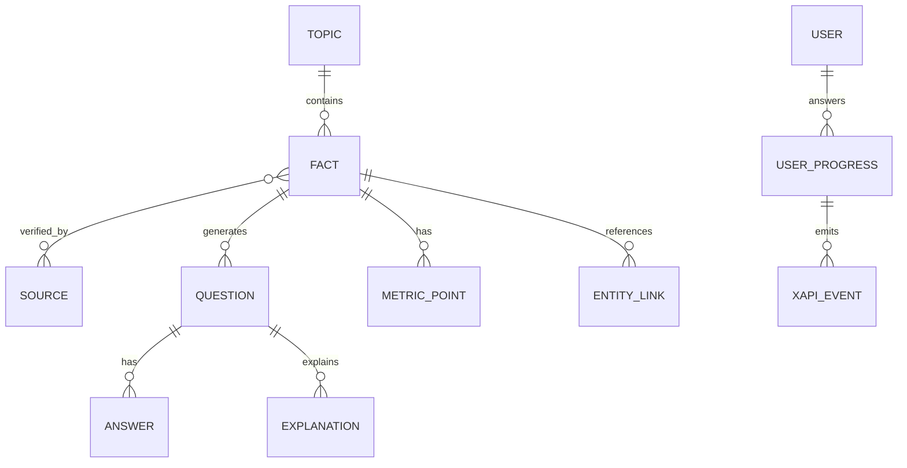

# DJS Lernplattform – Recherchebasis 2025/2026

**Stand:** 11. Mai 2026  
**Zweck:** Zentrale Recherche- und Quellengrundlage für die DJS-Lernplattform. Enthält geprüfte Faktenbasis, Themenpriorisierung, Datenmodell-Empfehlungen und alle Direktquellen.

---

## 0. Kurzfazit

Die Projektbasis verlangt eine Lernsoftware für die Aufnahmeprüfung der Deutschen Journalistenschule mit alten DJS-Wissenstests als Rohdatenbasis, verifizierten Antworten, Musteranalyse, aktueller Wissensbasis für 2025/2026 und späterer Software-Logik. Die vorhandene DJS-Fragensammlung zeigt als Ausgangspunkt öffentlich verfügbare Wissenstests für 2025, 2024, 2023, 2022, 2019, 2018, 2017 und 2016 sowie mehrere Fototests. [I001, I002, Q001, Q002, Q003]

Aus den Alttests ergeben sich klare DJS-Muster: Kartenwissen, Länder/Lückensätze, Single Choice, Multiple Response, Zuordnungen, Zitate, Personen, aktuelle Amtsinhaber, Konflikte, Wirtschaftszahlen, Gerichtsentscheidungen, Medienereignisse, Kulturpreise und Fototest-Motive. Für 2025/2026 sind deshalb besonders wichtig: Politik/Wahlen/Institutionen, Krieg/Sicherheit/Geopolitik, Wirtschaft/Arbeit/Industrie, Digitalisierung/KI/digitaler Staat, Klima/Energie/Resilienz sowie Compliance/Cybersecurity/Standards.

**Software-Konsequenz:** Inhalte sollten nicht nur als fertige Fragen gespeichert werden, sondern als überprüfte `Fact Records` mit Quellenpaar, Gültigkeitsdatum, Ereignisdatum, Jurisdiktion, Thema, Relevanz, möglichem Fragetyp und Prüfstatus.

---

## 1. Ausgangsbasis: DJS-Muster und Projektlogik

### 1.1 Projektlogik

Das Projekt zielt nicht auf eine lose Faktensammlung, sondern auf ein strukturiertes Trainingssystem mit:

- alten DJS-Wissenstests als Rohdatenbasis,
- verifizierten Antworten,
- Analyse wiederkehrender Muster,
- aktuellen Wissensdaten für 2025/2026,
- ableitbaren Übungsfragen,
- späterer Lernsoftware-Logik mit Modulen, Fragetypen und Fortschrittsauswertung.

Für die Recherche gilt: erst Muster verstehen, dann aktuelle Fakten sammeln, anschließend alles maschinenlesbar normalisieren.

### 1.2 DJS-Muster aus den Alttests

| Muster | Wiederkehrende Ausprägung | Konsequenz für 2025/2026 |
|---|---|---|
| Kartenaufgabe | Israel, Türkei, Ukraine, Myanmar und Nachbarstaaten | Aktuelle Krisenregionen mit Nachbarstaaten und Grenzverläufen priorisieren |
| Länder ergänzen | Ereignis → Land | Datenbank `country_event_facts` |
| Single Choice | präziser aktueller Fakt | kurze, eindeutig verifizierte Faktenkarten |
| Multiple Response | mehrere richtige Ereignisse/Orte/Personen | Fragen mit Teilpunkten und Negativmarkierung |
| Zuordnungen | Person ↔ Zitat, Land ↔ Regierung, Gericht ↔ Urteil | Matching-Modul und Entitäten-Datenbank |
| Fototest | Person/Bild/Ereignis erkennen | Personen-, Bild- und Ereignis-Tracker |
| Wirtschaftszahlen | BIP, Inflation, Arbeitslosigkeit, EZB-Zins | Zeitreihen mit Release- und Revisionsdatum |
| Medien/Journalismus | Rechercheverbünde, Pressefreiheit, Journalistensicherheit | Medienmodul mit DJS-Relevanzscore |

---

## 2. Priorisierung für die Themenrecherche 2025/2026

| Priorität | Themenfeld | Warum wichtig? | Typische Datenobjekte |
|---|---|---|---|
| A | Politik, Wahlen, Institutionen | DJS-Kernmuster; Rollenwechsel, Koalitionen, EU-Regeln | `election`, `officeholder`, `party`, `coalition`, `law` |
| A | Krieg, Sicherheit, Geopolitik | Karten-, Konflikt-, Pressefreiheits- und Personenwissen | `conflict`, `sanctions`, `deployment`, `humanitarian_status` |
| A | Wirtschaft, Arbeit, Industrie | numerisch gut prüfbar; DJS fragt Kennzahlen | `metric_point`, `policy_change`, `market_event` |
| A | Digitalisierung, KI, digitaler Staat | 2025/2026 starke Regulierungswelle | `regulation`, `rollout`, `digital_identity`, `health_it` |
| A | Klima, Energie, Resilienz | datenbasiert, bildstark, politisch relevant | `climate_indicator`, `energy_mix`, `extreme_event` |
| A | Compliance, Cybersecurity, Standards | direkt produktrelevant für spätere Software | `security_obligation`, `schema_standard`, `accessibility_rule` |
| B | Gesundheit / globale Governance | WHO, Pandemieabkommen, Krisenvorsorge | `treaty`, `health_emergency`, `organization` |
| B | Medien, Desinformation, Pressefreiheit | DJS-spezifisch und fototestgeeignet | `media_event`, `press_freedom_case`, `platform_policy` |
| B | Recht / Gerichte / Verfassung | Zuordnungsaufgaben und Grundsatzurteile | `court_decision`, `constitutional_case` |
| C | Kultur, Sprache, Preise | häufig saisonal, aber gut abfragbar | `award`, `book`, `film`, `word_of_year` |
| C | Sport | oft Fototest-/Ereigniswissen | `sport_event`, `athlete`, `record` |

---

## 3. Methodik und Prüfstatus

### 3.1 Verifikationslogik

| Status | Regel |
|---|---|
| offiziell DJS | Frage/Antwort stammt aus DJS-Seite oder interner DJS-Extraktion |
| doppelt verifiziert | mindestens zwei unabhängige seriöse Quellen, bevorzugt Primärquellen |
| einfach verifiziert | eine seriöse Quelle, bei unkritischem oder rein institutionellem Fakt |
| dynamisch / laufend prüfen | aktiver Konflikt, laufende Gesetzgebung, Prognose, Wahl-/Krisenlage |
| offen | Quelle nicht ausreichend, widersprüchlich oder noch nicht recherchiert |

### 3.2 Empfohlenes Standard-Fact-Record

```json
{
  "fact_id": "slug-YYYY-001",
  "domain": "politik",
  "subdomain": "wahl",
  "statement": "Präziser geprüfter Fakt in einem Satz.",
  "jurisdiction": "DE/EU/Welt/Land",
  "event_date_start": "YYYY-MM-DD",
  "event_date_end": null,
  "as_of_date": "2026-05-10",
  "confidence": "hoch/mittel/dynamisch",
  "source_primary": "Q000",
  "source_secondary": "Q000",
  "djs_relevance": "A/B/C",
  "possible_question_types": ["single_choice", "matching", "cloze", "map", "image"],
  "valid_until": null,
  "revision_note": ""
}
```

---

## 4. Themenfeld A: Politik, Wahlen und Institutionen

### 4.1 Zusammenfassung

Politik und Institutionen sind für DJS-typische Prüfungen Priorität A. Abgefragt werden nicht nur Personen, sondern auch Rollen, Wahltermine, Koalitionen, Gesetzgebung, internationale Organisationen und konkrete Datums-/Zahlenangaben.

### 4.2 Geprüfte Kernfakten

| ID | Kernfakt | Prüfstatus | Quellen | Software-Felder |
|---|---|---|---|---|
| POL-2025-DE-BTW-001 | Die Bundestagswahl fand am 23.02.2025 statt; die Wahlbeteiligung lag beim endgültigen Ergebnis bei 82,5 Prozent; die Union wurde stärkste Kraft. | doppelt verifiziert / amtlich | Q004, Q005 | `election_date`, `turnout_pct`, `winner_block`, `result_scope` |
| POL-2025-DE-BREG-001 | Friedrich Merz ist seit dem 06.05.2025 Bundeskanzler. | doppelt verifiziert / amtlich | Q006, Q007 | `officeholder`, `office_since`, `cabinet`, `government_type` |
| POL-2025-DE-BREG-002 | Das Bundeskabinett wird als amtliche Quelle von der Bundesregierung geführt und ist als Rollen-/Amtsinhaber-Datensatz relevant. | amtlich | Q007 | `minister`, `portfolio`, `party`, `valid_from` |
| POL-2026-EU-MIG-001 | Der EU-Migrations- und Asylpakt wurde vom Rat der EU als Reformrahmen beschrieben; für 2026 sind Umsetzungs- und Anwendungsfristen zentral. | doppelt verifiziert / EU | Q008, Q009 | `law_family`, `effective_date`, `jurisdiction`, `procedure_type` |
| POL-2025-WHO-PAN-001 | Das WHO-Pandemieabkommen wurde 2025 angenommen; der PABS-Anhang wurde 2026 weiter verhandelt. | doppelt verifiziert / WHO | Q010, Q011 | `treaty_status`, `adoption_date`, `annex_status` |

### 4.3 Lernsoftware-Ableitungen

| Fragetyp | Beispiel-Logik |
|---|---|
| Single Choice | „Wer wurde am 06.05.2025 Bundeskanzler?“ |
| Matching | Bundesminister:in ↔ Ressort |
| Lückensatz | „Die Bundestagswahl 2025 hatte eine Wahlbeteiligung von ___ Prozent.“ |
| Timeline | Bundestagswahl → Kanzlerwahl → Kabinettsbildung |
| Zuordnung | EU-Reform ↔ Thema ↔ Anwendungsjahr |

### 4.4 Offene Ergänzungsliste

- Landtags- und Kommunalwahlen 2025/2026.
- Bundesratsmehrheiten und neue Länderkoalitionen.
- Parteiführungswechsel 2025/2026.
- Bundesverfassungsgericht und politische Grundsatzentscheidungen.
- EU-Kommission, Europäischer Rat, EU-Parlament: aktuelle Spitzenpersonalien.

---

## 5. Themenfeld A: Krieg, Sicherheit und Geopolitik

### 5.1 Zusammenfassung

Dieses Feld verbindet Kartenwissen, Konfliktwissen, internationale Organisationen, humanitäre Lage, Sanktionen, Pressefreiheit und Fototest-Motive. 2025/2026 sind besonders relevant: Ukrainekrieg, Russland-Sanktionen, NATO-Ostflanke, Litauen-Brigade, Gaza/Nahost und Journalistensicherheit.

### 5.2 Geprüfte Kernfakten

| ID | Kernfakt | Prüfstatus | Quellen | Software-Felder |
|---|---|---|---|---|
| SEC-2026-UKR-EU-001 | Die EU führt weiterhin Sanktionspakete gegen Russland; der EU-Rat dokumentiert den Stand der Maßnahmen gegen Russland. | doppelt verifiziert / institutionell | Q012, Q013 | `sanctions_package`, `actor`, `target_country`, `as_of_date` |
| SEC-2026-UKR-NATO-001 | Die NATO dokumentiert fortlaufende Unterstützung für die Ukraine. | institutionell | Q013 | `aid_type`, `alliance`, `recipient`, `support_status` |
| SEC-2026-UKR-HUM-001 | UNHCR beschreibt für 2026 fortbestehende Vertreibung, humanitären Bedarf und Hilfsplanung für die Ukraine. | doppelt verifiziert / UNHCR | Q014, Q015 | `needs_population`, `idp_count`, `refugee_count`, `financial_requirement` |
| SEC-2025-DE-LTU-001 | Die deutsche Panzerbrigade 45 wurde am 01.04.2025 in Litauen in Dienst gestellt und ist als dauerhaft stationierter Bundeswehrverband prüfungsrelevant. | doppelt verifiziert / amtlich | Q016, Q017 | `deployment_date`, `host_country`, `brigade_name`, `nato_context` |
| SEC-2026-GAZA-PRESS-001 | Reporter ohne Grenzen führt die Lage in Palästina/Gaza als zentrales Thema der Journalistensicherheit. | dynamisch, institutionell | Q018, Q020 | `journalist_fatalities`, `press_freedom_flag`, `conflict_zone` |
| SEC-2026-MENA-HEALTH-001 | Die WHO beschreibt eine vertiefte Gesundheitskrise im Nahen Osten im Kontext der Konflikte. | dynamisch, institutionell | Q019, Q020 | `health_system_status`, `evacuation_status`, `humanitarian_access` |

### 5.3 Lernsoftware-Ableitungen

| Fragetyp | Beispiel-Logik |
|---|---|
| Kartenquiz | Litauen, Ukraine, Russland, Belarus, Polen, Baltikum |
| Lückensatz | „Seit April 2025 ist eine deutsche Brigade in ___ stationiert.“ |
| Multiple Response | Welche Institutionen berichten zu Ukraine/Gaza? |
| Matching | Organisation ↔ Rolle: NATO, EU-Rat, UNHCR, WHO, RSF |
| Bildertest | Zerstörung, Gefangenenaustausch, Proteste, Pressebilder, Militärstationierung |

### 5.4 Besondere Datenmodell-Regeln

Für Kriege und Krisen sind Pflichtfelder:

```json
{
  "as_of_date": "YYYY-MM-DD",
  "source_claim_scope": "wer zählt was?",
  "range_or_exact": "range/exact",
  "conflict_party_context": [],
  "last_checked": "YYYY-MM-DD",
  "dynamic_status": true
}
```

---

## 6. Themenfeld A: Wirtschaft, Arbeit und Industrie

### 6.1 Zusammenfassung

Wirtschaftsdaten sind DJS-typisch, weil sie klar abfragbar und zeitgebunden sind. Besonders wichtig sind BIP, Inflation, Arbeitslosigkeit, Mindestlohn, EZB-Leitzinsen, Industriepolitik und EU-Handels-/Klimainstrumente wie CBAM.

### 6.2 Geprüfte Kernfakten

| ID | Kernfakt | Prüfstatus | Quellen | Software-Felder |
|---|---|---|---|---|
| ECO-2025-DE-BIP-001 | Das preisbereinigte Bruttoinlandsprodukt Deutschlands wuchs 2025 um 0,2 Prozent. | amtlich / doppelt institutionell | Q021, Q022 | `metric_name`, `metric_value`, `year`, `actual_or_forecast` |
| ECO-2026-DE-BIP-PROJ-001 | Der IMF führt für Deutschland 2026 aktuelle Projektionen; für Softwarezwecke müssen Prognosen klar von Ist-Zahlen getrennt werden. | institutionell / Prognose | Q022 | `forecast_year`, `forecast_source`, `revision_date` |
| ECO-2025-DE-INF-001 | Die Jahresinflationsrate 2025 in Deutschland lag bei 2,2 Prozent. | amtlich | Q023, Q024 | `inflation_rate`, `reference_year`, `series_id` |
| ECO-2026-DE-AL-001 | Die Bundesagentur für Arbeit meldete für April 2026 einen Arbeitsmarktbericht mit Arbeitslosenquote und Arbeitslosenzahl. | amtlich | Q025 | `unemployment_rate`, `unemployed_total`, `reference_month` |
| ECO-2025-DE-MW-001 | Der gesetzliche Mindestlohn betrug ab 01.01.2025 12,82 Euro; die weitere Anpassung ab 2026 ist in amtlichen Quellen dokumentiert. | doppelt amtlich | Q026, Q027 | `minimum_wage`, `effective_from`, `legal_basis` |
| ECO-2026-EU-ECB-001 | Die EZB veröffentlicht geldpolitische Entscheidungen mit aktuellem Zinssatz und Begründung. | Primärquelle | Q028, Q029 | `deposit_facility_rate`, `main_refinancing_rate`, `date` |
| ECO-2026-EU-CBAM-001 | CBAM trat am 01.01.2026 in die definitive Phase ein. | doppelt EU | Q030, Q031 | `cbam_phase`, `sector_scope`, `reporting_obligation` |

### 6.3 Lernsoftware-Ableitungen

| Fragetyp | Beispiel-Logik |
|---|---|
| Zuordnung | Kennzahl ↔ Wert ↔ Zeitraum |
| Single Choice | „Wie hoch war der Mindestlohn ab 01.01.2025?“ |
| Timeline | Mindestlohn 2025 → Mindestlohn 2026 |
| Multiple Response | Welche Institutionen veröffentlichen welche Wirtschaftsdaten? |
| Revisionsfrage | Prognose vs. Ist-Wert unterscheiden |

### 6.4 Pflichtfelder für Zeitreihen

```json
{
  "metric_name": "Inflationsrate",
  "value": 2.2,
  "unit": "Prozent",
  "geo": "DE",
  "period": "2025",
  "release_date": "2026-01-XX",
  "source": "Q023",
  "revision_status": "final/preliminary/revised",
  "frequency": "monthly/annual"
}
```

---

## 7. Themenfeld A: Digitalisierung, KI und digitaler Staat

### 7.1 Zusammenfassung

2025/2026 ist für Digitalisierung besonders relevant, weil mehrere zentrale Regime wirksam werden: EU AI Act, Data Act, ePA, EUDI Wallet, Plattform- und Interoperabilitätsregeln. Diese Themen sind zugleich DJS-prüfungsrelevant und direkt relevant für die spätere Lernsoftware.

### 7.2 Geprüfte Kernfakten

| ID | Kernfakt | Prüfstatus | Quellen | Software-Felder |
|---|---|---|---|---|
| DIG-2025-EU-AIACT-001 | Der EU AI Act trat am 01.08.2024 in Kraft; einzelne Pflichten gelten gestaffelt 2025/2026. | EU / doppelt | Q034, Q035 | `regulation`, `applies_from`, `risk_class`, `obligation_type` |
| DIG-2025-EU-DATAACT-001 | Der Data Act gilt in der EU seit dem 12.09.2025 und regelt unter anderem Zugang zu geräteerzeugten Daten. | EU / doppelt | Q036 | `data_access_right`, `device_generated_data`, `contract_fairness` |
| DIG-2025-DE-EPA-001 | Die ePA für alle startete am 15.01.2025; der bundesweite Rollout begann am 29.04.2025. | doppelt amtlich / institutionell | Q032, Q033 | `rollout_phase`, `mandatory_from`, `health_record_type`, `opt_out` |
| DIG-2026-EU-EUDI-001 | EU Digital Identity Wallets sollen bis Ende 2026 für Bürgerinnen, Bürger, Unternehmen und Einwohner bereitgestellt werden. | EU / Umsetzungsquelle | Q037, Q038 | `wallet_type`, `issuer`, `credential_type`, `availability_target` |

### 7.3 Lernsoftware-Ableitungen

| Fragetyp | Beispiel-Logik |
|---|---|
| Timeline | AI Act Inkrafttreten → Verbote → GPAI → allgemeine Anwendbarkeit |
| Lückensatz | „Die ePA für alle startete am ___ bundesweit in den Rollout.“ |
| Matching | Regelwerk ↔ Inhalt: AI Act, Data Act, eIDAS/EUDI, ePA |
| Multiple Response | Welche Digitalgesetze gelten 2025/2026? |
| Szenariofrage | Welche Daten darf eine Behörde / App / Plattform nutzen? |

### 7.4 Software-Hinweis

Diese Themen sollten im Produkt nicht nur als Quizfragen, sondern auch als Compliance-Wissen angelegt werden. Beispiel: Eine KI-gestützte Lernsoftware muss selbst prüfen, welche Rolle sie unter dem AI Act einnimmt, welche Trainings-/Nutzungsdaten verarbeitet werden und welche Transparenzpflichten entstehen können.

---

## 8. Themenfeld A: Klima, Energie und Resilienz

### 8.1 Zusammenfassung

Klima- und Energiethemen sind DJS-relevant, weil sie datenbasiert, politisch aufgeladen, bildstark und international vergleichbar sind. Wichtig sind Temperaturrekorde, Strommix, Extremereignisse, Klimapolitik und EU-Klimainstrumente.

### 8.2 Geprüfte Kernfakten

| ID | Kernfakt | Prüfstatus | Quellen | Software-Felder |
|---|---|---|---|---|
| CLM-2025-GLOBAL-001 | Die WMO dokumentiert den globalen Klimastand 2025; Copernicus bewertet 2025 als eines der wärmsten Jahre. | doppelt institutionell | Q039, Q040 | `temperature_anomaly`, `baseline_period`, `global_rank`, `dataset` |
| CLM-2025-EUROPE-001 | WMO/ECMWF dokumentieren den europäischen Klimastand 2025 mit Hitzewellen und regionalen Extremereignissen. | doppelt institutionell | Q041, Q042 | `region`, `heatwave`, `event_type`, `anomaly` |
| CLM-2025-EU-ENERGY-001 | Der europäische Strommix und der Anteil erneuerbarer Energien werden als prüfungsrelevante Kenngrößen im European State of the Climate beschrieben. | institutionell | Q041, Q042 | `electricity_mix_share`, `renewables_share`, `solar_share` |
| CLM-2026-EU-CBAM-001 | CBAM ist zugleich Wirtschafts- und Klimapolitik und ab 2026 besonders prüfungsrelevant. | doppelt EU | Q030, Q031 | `carbon_leakage`, `import_sector`, `certificate_phase` |

### 8.3 Lernsoftware-Ableitungen

| Fragetyp | Beispiel-Logik |
|---|---|
| Single Choice | „Welche Organisation veröffentlicht den State of the Global Climate?“ |
| Matching | Institution ↔ Bericht: WMO, Copernicus, ECMWF |
| Lückensatz | „CBAM trat am 01.01.___ in die definitive Phase ein.“ |
| Kartenfrage | Hotspots: Südeuropa, Arktis, Fennoskandien, Mittelmeer |
| Datenfrage | Temperaturabweichung ↔ Basiszeitraum |

### 8.4 Modellierungsregel

Klimadaten brauchen immer:

```json
{
  "baseline_period": "1850-1900 / 1991-2020 / andere",
  "dataset": "WMO/Copernicus/ECMWF/DWD",
  "geo_scope": "global/europe/germany",
  "rank_type": "warmest/second-warmest/joint",
  "uncertainty_note": ""
}
```

---

## 9. Themenfeld A: Compliance, Cybersecurity und Standards

### 9.1 Zusammenfassung

Dieser Block ist für die spätere Software am direktesten relevant. Es geht um Datenschutz, Sicherheit, Barrierefreiheit, API- und Datenstandards sowie Lern- und Assessment-Interoperabilität.

### 9.2 Geprüfte Kernfakten

| ID | Kernfakt | Prüfstatus | Quellen | Software-Felder |
|---|---|---|---|---|
| COMP-EU-DSGVO-001 | Die DSGVO verlangt Datenschutz durch Technikgestaltung und durch datenschutzfreundliche Voreinstellungen. | doppelt EU/EDPB | Q043, Q044 | `privacy_by_design`, `privacy_by_default`, `purpose`, `retention` |
| COMP-EU-NIS2-001 | Die NIS2-Richtlinie schafft einen europäischen Cybersecurity-Rahmen; Deutschland dokumentiert die nationale Umsetzung über das BSI. | doppelt EU/BSI | Q045, Q046 | `sector_scope`, `risk_management`, `incident_reporting` |
| COMP-EU-CRA-001 | Der Cyber Resilience Act trat 2024 in Kraft; Reporting- und Hauptpflichten greifen stufenweise später. | doppelt EU | Q047, Q048 | `product_with_digital_elements`, `vulnerability_reporting`, `deadline` |
| STD-QTI-001 | QTI ist ein Standard für Austausch von Prüfungsitems, Tests, Nutzungsdaten und Ergebnissen. | Standardquelle | Q049, Q050 | `item_package_format`, `scoring_logic`, `test_manifest` |
| STD-OPENAPI-001 | OpenAPI beschreibt HTTP-APIs maschinenlesbar. | Standardquelle | Q051 | `api_contract`, `endpoint`, `schema_ref` |
| STD-JSONSCHEMA-001 | JSON Schema eignet sich für Validierung von JSON-Datenobjekten. | Standardquelle | Q052 | `schema_validation`, `fact_record_schema`, `question_schema` |
| STD-WCAG-001 | WCAG 2.2 ist der zentrale Web-Accessibility-Standard. | Standardquelle | Q053 | `accessibility_level`, `success_criterion`, `ui_requirement` |
| STD-XAPI-001 | xAPI dient zur standardisierten Erfassung von Lernaktivitäten und Lernerfahrungen. | Standardquelle | Q054 | `learning_event`, `verb`, `object`, `statement` |

### 9.3 Produktableitungen

| Bereich | Empfehlung |
|---|---|
| Datenmodell | JSON Schema für `fact`, `source`, `question`, `metric_point`, `entity`, `user_progress` |
| API | OpenAPI 3.x für alle internen/externen Endpunkte |
| Assessment | QTI 3.0 als Export-/Importformat für Prüfungsitems |
| Learning Analytics | xAPI für Lernereignisse, Fehler, Wiederholungen, Sitzungen |
| UI | WCAG 2.2 AA als Mindestziel |
| Datenschutz | Privacy-by-default: minimale Datenerhebung, Rollenrechte, kurze Speicherfristen |
| Security | NIS2-/CRA-orientiertes Produktdenken, auch wenn nicht zwingend direkt anwendbar |

---

## 10. Themenfelder B/C als Backlog für die nächste Rechercherunde

Diese Themen wurden im Fundamentschnitt als relevant markiert, aber noch nicht in gleicher Tiefe ausrecherchiert. Sie sollten für die nächste Runde mit jeweils mindestens zwei Quellen pro Fakt nachgezogen werden.

### 10.1 Medien, Journalismus, Desinformation

| Thema | Warum relevant? | Mögliche Datenobjekte |
|---|---|---|
| Pressefreiheit und getötete Journalist:innen | bereits DJS-2025-relevant über Gaza/RSF | `press_freedom_case`, `journalist_death_count`, `organization` |
| Große Rechercheverbünde | DJS fragt Correctiv, Relotius, Medienethik | `investigation`, `media_org`, `impact` |
| Plattformpolitik / Desinformation | KI, Social Media, Wahlkampf | `platform_policy`, `misinformation_case` |
| Öffentlich-rechtlicher Rundfunk | Medienpolitik, Reformen, Gebühren | `media_law`, `broadcasting_body` |

### 10.2 Recht, Gerichte, Verfassung

| Thema | Warum relevant? | Mögliche Datenobjekte |
|---|---|---|
| Bundesverfassungsgericht | DJS fragt Grundsatzurteile | `court_decision`, `constitutional_topic` |
| EuGH / EGMR | EU- und Grundrechtsfragen | `court`, `case`, `legal_principle` |
| AfD-Verbotsdebatte | DJS-2025 indirekt relevant | `party_ban_actor`, `legal_threshold` |
| Internationale Gerichtsbarkeit | Ukraine, Gaza, Kriegsverbrechen | `icc_case`, `icj_case`, `warrant` |

### 10.3 Kultur, Sprache, Preise

| Thema | Warum relevant? | Mögliche Datenobjekte |
|---|---|---|
| Nobelpreise 2025/2026 | jährlich gut abfragbar | `award`, `laureate`, `category` |
| Deutscher Buchpreis / Booker / Bachmann | DJS-2025 bereits abgefragt | `author`, `work`, `award` |
| Duden-Neuaufnahmen / Jugendwort / Unwort | DJS-typisches Sprachwissen | `word`, `context`, `year` |
| Film und Fernsehen | Fototest und Kulturwissen | `film`, `actor`, `award`, `controversy` |

### 10.4 Sport

| Thema | Warum relevant? | Mögliche Datenobjekte |
|---|---|---|
| Fußballturniere / Trainerwechsel / Verbände | sehr fototestgeeignet | `sport_event`, `team`, `person` |
| Olympia / Paralympics | DJS nutzt Personen und Kontroversen | `athlete`, `medal`, `incident` |
| Große deutsche Erfolge | einfache Single-Choice-Fragen | `achievement`, `sport`, `date` |

### 10.5 Wissenschaft, Technik, Raumfahrt

| Thema | Warum relevant? | Mögliche Datenobjekte |
|---|---|---|
| ISS / Raumfahrtmissionen | DJS-2025: Wilmore/Williams | `space_mission`, `astronaut`, `duration` |
| KI-Unternehmen / Chips / Nvidia | Fototest- und Wirtschaftswissen | `company`, `ceo`, `market_event` |
| Nobelpreise / Forschung | klassisches Allgemeinwissen | `research_field`, `award`, `discovery` |

---

## 11. Roadmap für die Lernsoftware

### 11.1 Empfohlenes Datenmodell



### 11.2 Kernobjekte

| Objekt | Pflichtfelder | Zweck |
|---|---|---|
| `topic` | `topic_id`, `domain`, `subdomain`, `priority`, `jurisdiction`, `tags` | Themenstruktur |
| `fact` | `fact_id`, `statement`, `as_of_date`, `event_date_start`, `confidence`, `source_primary`, `source_secondary`, `status` | verifizierter Wissenskern |
| `source` | `source_id`, `author`, `title`, `publisher`, `language`, `url`, `publication_date`, `access_date`, `source_type`, `officiality` | Quellenverwaltung |
| `metric_point` | `series_id`, `metric_name`, `value`, `unit`, `geo`, `period`, `revision_status` | Zahlen/Zeitreihen |
| `question` | `question_id`, `question_type`, `prompt`, `options`, `answer_key`, `difficulty`, `valid_until`, `explanation_id` | Prüfungsitem |
| `entity` | `entity_id`, `entity_type`, `name`, `disambiguation`, `valid_from`, `valid_to` | Personen, Orte, Institutionen |
| `xapi_event` | `actor`, `verb`, `object`, `result`, `timestamp` | Lernaktivität |

### 11.3 Empfohlene Standards

| Bereich | Standard | Zweck |
|---|---|---|
| API-Vertrag | OpenAPI 3.x | Endpunkte, Payloads, Versionierung |
| Datenschema | JSON Schema | Fact-/Source-/Question-Validierung |
| Prüfungsinhalte | QTI 3.0 | Item-Import/-Export und Scoring |
| Learning Analytics | xAPI | Lernereignisse, Sessions, Fehlerpfade |
| Accessibility | WCAG 2.2 AA | Barrierearme Bedienung |
| Datenschutz | DSGVO | Privacy-by-default, Minimierung, Rollenrechte |
| Security | NIS2-/CRA-orientiert | Risiko- und Incident-Management |

### 11.4 Produkt-Roadmap

| Phase | Ziel | Inhalt |
|---|---|---|
| Phase 1: Fundament | belastbare Wissensbasis | Fact-Store, Quellenstore, DJS-Muster, A-Themenfelder |
| Phase 2: Redaktion | Arbeitsoberfläche | Admin-Editor, Reviewstatus, Quellenprüfung, Versionierung |
| Phase 3: Lernmodus | nutzbares Training | Karteikarten, Quiz, Matching, Kartenmodus, Fehlerliste |
| Phase 4: Prüfungsmodus | DJS-Simulation | Zeitlimit, Fragetypmix, Auswertung nach Themen |
| Phase 5: Bildertest | Personen-/Ereigniserkennung | Bildrechte-/Metadatenmodell, Personenprofile |
| Phase 6: Analytics | Lernfortschritt | Spaced Repetition, xAPI, Stärken/Schwächen |
| Phase 7: Export/Interop | Zukunftssicherheit | QTI-Export, JSON-/CSV-Export, OpenAPI |

---

## 12. Konkrete potenzielle DJS-Fragen aus dieser Recherche

### 12.1 Politik

1. **Lückensatz:** Die Bundestagswahl 2025 fand am ______ statt.  
   **Antwort:** 23. Februar 2025.  
   **Quelle:** Q004/Q005.

2. **Single Choice:** Wer wurde am 06.05.2025 Bundeskanzler?  
   **Antwort:** Friedrich Merz.  
   **Quelle:** Q006/Q007.

3. **Matching:** Ordne EU-Reform und Thema zu: Migrationspakt, AI Act, Data Act, CBAM.  
   **Antwort:** Migration/Asyl; Künstliche Intelligenz; Datenzugang; CO₂-Grenzausgleich.

### 12.2 Sicherheit

1. **Lückensatz:** Seit April 2025 ist eine deutsche Panzerbrigade dauerhaft in ______ stationiert.  
   **Antwort:** Litauen.  
   **Quelle:** Q016/Q017.

2. **Matching:** Ordne Organisationen ihrer Rolle zu: NATO, EU-Rat, UNHCR, WHO, RSF.  
   **Antwort:** Sicherheitshilfe; Sanktionen; Flucht/Vertreibung; Gesundheit; Pressefreiheit.

### 12.3 Wirtschaft

1. **Single Choice:** Wie stark wuchs das deutsche BIP 2025 preisbereinigt?  
   **Antwort:** 0,2 Prozent.  
   **Quelle:** Q021.

2. **Lückensatz:** Die Jahresinflation 2025 in Deutschland lag bei ______ Prozent.  
   **Antwort:** 2,2 Prozent.  
   **Quelle:** Q023/Q024.

3. **Single Choice:** Wofür steht CBAM?  
   **Antwort:** Carbon Border Adjustment Mechanism / CO₂-Grenzausgleichssystem.  
   **Quelle:** Q030/Q031.

### 12.4 Digitalisierung

1. **Timeline:** Ordne die Daten: ePA-Start, ePA-Rollout, Data Act, AI-Act-Stufen.  
2. **Single Choice:** Wofür steht ePA?  
   **Antwort:** Elektronische Patientenakte.  
   **Quelle:** Q032/Q033.
3. **Lückensatz:** Der Data Act gilt seit dem ______.  
   **Antwort:** 12. September 2025.  
   **Quelle:** Q036.

### 12.5 Klima

1. **Single Choice:** Welche Organisation veröffentlicht den „State of the Global Climate“?  
   **Antwort:** WMO.  
   **Quelle:** Q039.
2. **Matching:** WMO, Copernicus, ECMWF ↔ Klima-/Wetterdaten und Berichte.  
3. **Lückensatz:** CBAM trat am 01.01.______ in die definitive Phase ein.  
   **Antwort:** 2026.  
   **Quelle:** Q030/Q031.

---

## 13. Redaktionsworkflow für neue Inhalte

1. Thema erfassen.
2. Primärquelle suchen.
3. Zweitquelle suchen.
4. Faktensatz normalisieren.
5. Entitäten anlegen oder verlinken.
6. DJS-Relevanzscore vergeben.
7. mögliche Fragetypen ableiten.
8. Erklärung und Lernhinweis schreiben.
9. Reviewstatus setzen.
10. späteren Recheck terminieren.

### Empfohlene Review-Felder

```json
{
  "review_status": "draft/reviewed/approved/needs_update/archived",
  "reviewer": "",
  "last_checked": "YYYY-MM-DD",
  "next_check_due": "YYYY-MM-DD",
  "change_risk": "low/medium/high",
  "djs_relevance_score": 0.0
}
```

---

## 14. Grenzen dieser Recherche

Diese Datei ist ein Fundamentschnitt der abgeschlossenen Breitrecherche. Besonders gut abgedeckt sind die sechs A-Felder. Nicht in gleicher Tiefe ausrecherchiert sind Kulturpreise 2025/2026, vollständige Sportdaten, alle nationalen Wahlen weltweit, alle Bundesländerentwicklungen, alle Grundsatzurteile und ein vollständiger Bildertest-Katalog. Diese Themen sind als Backlog markiert und sollten in einer zweiten Rechercherunde ergänzt werden.

Für aktive Kriege, Konflikte, Gesundheitslagen und laufende EU-/nationale Umsetzungsvorgänge gilt: Jeder Fakt braucht `as_of_date`, `last_checked`, `source_scope` und `dynamic_status`.

---

## 15. Interne Projektquellen

| ID | Quelle | Inhalt |
|---|---|---|
| I001 | `LERNSOFTWARE_djs_lernsoftware_arbeitsweg_masterprompts.md` | Projektlogik, Arbeitsweg, Masterprompts, Zieldateien, Qualitätsregeln |
| I002 | `NUR FRAGEN UND ANTWORTEN_djs_aufnahmepruefungen_2025_2016.md` | DJS-Wissenstests und Fototests 2025–2016 als Musterbasis |

---

## 16. Externe Quellenverweise

Die vollständigen Direktlinks stehen in der separaten Datei:

`Quellen_Breitrecherche_2025-2026_fuer_DJS-Lernsoftware.md`

---

# Quellenverzeichnis

## 1. Interne Projektquellen

| ID | Datei | Rolle im Projekt |
|---|---|---|
| I001 | `LERNSOFTWARE_djs_lernsoftware_arbeitsweg_masterprompts.md` | Projektlogik, Qualitätsregeln, Zieldateien, Softwarekonzept |
| I002 | `NUR FRAGEN UND ANTWORTEN_djs_aufnahmepruefungen_2025_2016.md` | DJS-Fragenbasis, Wissenstests, Fototests, Musteranalyse-Basis |

---

## 2. Alle externen Direktquellen

| ID | Institution / Autor | Titel | Jahr | Sprache | Direktquelle | Typ / Zweck |
|---|---|---|---:|---|---|---|
| Q001 | Deutsche Journalistenschule | Aufnahmeprüfungen | 2026 | DE | https://djs-online.de/bewerben/aufnahmepruefungen/ | DJS-Primärquelle / Prüfungsübersicht |
| Q002 | Deutsche Journalistenschule | Aufnahmeprüfung 2025 | 2025 | DE | https://djs-online.de/bewerben/aufnahmepruefungen/aufnahmepruefung-2025/ | DJS-Primärquelle / aktueller Wissenstest und Fototest |
| Q003 | Deutsche Journalistenschule | Aufnahmeprüfung 2024 | 2024 | DE | https://djs-online.de/bewerben/aufnahmepruefungen/aufnahmepruefung-2024/ | DJS-Primärquelle / Mustervergleich |
| Q004 | Die Bundeswahlleiterin | Bundestagswahl 2025: Endgültiges Ergebnis | 2025 | DE | https://www.bundeswahlleiterin.de/info/presse/mitteilungen/bundestagswahl-2025/29_25_endgueltiges-ergebnis.html | Amtliche Wahlquelle |
| Q005 | Die Bundeswahlleiterin | Ergebnisse Deutschland | 2025 | DE | https://www.bundeswahlleiterin.de/bundestagswahlen/2025/ergebnisse/bund-99.html | Amtliche Ergebnistabelle |
| Q006 | Bundesregierung | Friedrich Merz: Bundeskanzler | 2025 | DE | https://www.bundesregierung.de/breg-de/bundesregierung/bundeskabinett/friedrich-merz-2342660 | Amtliche Regierungsquelle |
| Q007 | Bundesregierung | Das Bundeskabinett im Überblick | 2025 | DE | https://www.bundesregierung.de/breg-de/bundesregierung/bundeskabinett | Amtliche Regierungsquelle |
| Q008 | Rat der Europäischen Union | Migration and asylum pact | 2026 | EN | https://www.consilium.europa.eu/en/policies/eu-migration-asylum-reform-pact/ | EU-Primärquelle |
| Q009 | Rat der Europäischen Union | Council gives final greenlight to measures to make the EU’s asylum system more efficient and robust | 2026 | EN | https://www.consilium.europa.eu/en/press/press-releases/2026/02/23/council-gives-final-greenlight-to-measures-to-make-the-eu-s-asylum-system-more-efficient-and-robust/ | EU-Primärquelle |
| Q010 | World Health Organization | WHO Pandemic Agreement | 2026 | EN | https://www.who.int/health-topics/who-pandemic-agreement | UN-/WHO-Primärquelle |
| Q011 | World Health Organization | WHO Member States agree to extend negotiations on Pathogen Access and Benefit Sharing annex | 2026 | EN | https://www.who.int/news/item/01-05-2026-who-member-states-agree-to-extend-negotiations-on-pathogen-access-and-benefit-sharing-annex | WHO-Pressemitteilung |
| Q012 | Rat der Europäischen Union | Russia’s war against Ukraine: EU sanctions | 2026 | EN | https://www.consilium.europa.eu/en/policies/sanctions-against-russia/ | EU-Primärquelle |
| Q013 | NATO | NATO’s support for Ukraine | 2026 | EN | https://www.nato.int/en/what-we-do/partnerships-and-cooperation/natos-support-for-ukraine | NATO-Primärquelle |
| Q014 | UNHCR | After a brutal winter, millions of Ukrainians face deepening displacement and hardship | 2026 | EN | https://www.unhcr.org/news/briefing-notes/after-brutal-winter-millions-ukrainians-face-deepening-displacement-and | UNHCR-Quelle |
| Q015 | UNHCR | Ukraine Situation 2026 plans and financial requirements | 2026 | EN | https://data.unhcr.org/en/documents/download/120716 | UNHCR-Dokument/PDF |
| Q016 | Bundeswehr | Deutsche Panzerbrigade 45 in Litauen in Dienst gestellt | 2025 | DE | https://www.bundeswehr.de/de/organisation/heer/aktuelles/deutsche-panzerbrigade-45-litauen-indienststellung-5927738 | Amtliche Bundeswehrquelle |
| Q017 | Bundeswehr | Panzerbrigade 45 | 2025 | DE | https://www.bundeswehr.de/de/organisation/heer/struktur/10-panzerdivision/panzerbrigade-45 | Amtliche Bundeswehrquelle |
| Q018 | Reporter ohne Grenzen | Palestine | 2026 | EN | https://rsf.org/en/country/palestine | Pressefreiheits-/Journalistensicherheitsquelle |
| Q019 | World Health Organization | Conflict deepens health crisis across Middle East, WHO says | 2026 | EN | https://www.who.int/news/item/11-03-2026-conflict-deepens-health-crisis-across-middle-east--who-says | WHO-Quelle |
| Q020 | OCHA oPt | Humanitarian Situation Report, 1 May 2026 | 2026 | EN | https://www.ochaopt.org/content/humanitarian-situation-report-1-may-2026 | UN-OCHA Lagebericht |
| Q021 | Statistisches Bundesamt | Bruttoinlandsprodukt im Jahr 2025 um 0,2 % gewachsen | 2026 | DE | https://www.destatis.de/DE/Presse/Pressemitteilungen/2026/01/PD26_017_811.html | Amtliche Statistik |
| Q022 | International Monetary Fund | Germany and the IMF | 2026 | EN | https://www.imf.org/en/countries/deu | Institutionelle Wirtschaftsquelle |
| Q023 | Statistisches Bundesamt | Inflationsrate im Jahr 2025 bei +2,2 % | 2026 | DE | https://www.destatis.de/DE/Presse/Pressemitteilungen/2026/01/PD26_019_611.html | Amtliche Statistik |
| Q024 | Statistisches Bundesamt | Verbraucherpreisindex und Inflationsrate | 2026 | DE | https://www.destatis.de/DE/Themen/Wirtschaft/Preise/Verbraucherpreisindex/_inhalt.html | Amtliche Statistik |
| Q025 | Bundesagentur für Arbeit | Arbeitsmarkt im April 2026 | 2026 | DE | https://www.arbeitsagentur.de/presse/2026-15-arbeitsmarkt-im-april-2026 | Amtliche Arbeitsmarktquelle |
| Q026 | Bundesministerium für Arbeit und Soziales | Vierte Mindestlohnanpassungsverordnung | 2023 | DE | https://www.bmas.de/DE/Service/Gesetze-und-Gesetzesvorhaben/vierte-mindestlohnanpassungsverordnung-milov4.html | Amtliche Rechts-/Ministeriumsquelle |
| Q027 | Bundesregierung | Fragen und Antworten zum Mindestlohn | 2026 | DE | https://www.bundesregierung.de/breg-de/aktuelles/mindestlohn-faq-1688186 | Amtliche Regierungsquelle |
| Q028 | European Central Bank | Monetary policy decisions | 2026 | EN | https://www.ecb.europa.eu/press/pr/date/2026/html/ecb.mp260430~81b7179e6f.en.html | EZB-Primärquelle |
| Q029 | European Central Bank | Monetary policy decisions | 2025 | EN | https://www.ecb.europa.eu/press/pr/date/2025/html/index.en.html | EZB-Quellenindex |
| Q030 | European Commission DG TAXUD | Carbon Border Adjustment Mechanism | 2026 | EN | https://taxation-customs.ec.europa.eu/carbon-border-adjustment-mechanism_en | EU-Kommissionsquelle |
| Q031 | European Commission DG TAXUD | CBAM successfully entered into force on 1 January 2026 | 2026 | EN | https://taxation-customs.ec.europa.eu/news/cbam-successfully-entered-force-1-january-2026-2026-01-14_en | EU-Kommissionsmitteilung |
| Q032 | Bundesministerium für Gesundheit | Die ePA für alle | 2026 | DE | https://www.bundesgesundheitsministerium.de/themen/digitalisierung/elektronische-patientenakte/epa-fuer-alle | Amtliche Ministeriumsquelle |
| Q033 | gematik | Die bundesweite Einführung der ePA für alle startet am 29. April 2025 | 2025 | DE | https://www.gematik.de/newsroom/news-detail/aktuelles-die-bundesweite-einfuehrung-der-epa-fuer-alle-startet-am-29-april-2025 | Institutionelle Umsetzungsquelle |
| Q034 | European Commission | AI Act | 2026 | EN | https://digital-strategy.ec.europa.eu/en/policies/regulatory-framework-ai | EU-Kommissionsquelle |
| Q035 | Rat der Europäischen Union | Artificial intelligence: Council and Parliament agree to simplify and streamline rules | 2026 | EN | https://www.consilium.europa.eu/en/press/press-releases/2026/05/07/artificial-intelligence-council-and-parliament-agree-to-simplify-and-streamline-rules/ | EU-Ratsquelle |
| Q036 | European Commission | Data Act enters into force: what it means for you | 2024 | EN | https://commission.europa.eu/news-and-media/news/data-act-enters-force-what-it-means-you-2024-01-11_en | EU-Kommissionsquelle |
| Q037 | European Commission | European Digital Identity | 2026 | EN | https://commission.europa.eu/topics/digital-economy-and-society/european-digital-identity_en | EU-Kommissionsquelle |
| Q038 | European Commission | EU Digital Identity Wallet Home | 2026 | EN | https://ec.europa.eu/digital-building-blocks/sites/spaces/EUDIGITALIDENTITYWALLET/pages/694487738/EU%2BDigital%2BIdentity%2BWallet%2BHome | EU-Umsetzungsseite |
| Q039 | World Meteorological Organization | State of the Global Climate 2025 | 2026 | EN | https://wmo.int/publication-series/state-of-global-climate/state-of-global-climate-2025 | WMO-Klimaquelle |
| Q040 | Copernicus Climate Change Service | 2025 on course to be joint-second warmest year | 2025 | EN | https://climate.copernicus.eu/copernicus-2025-course-be-joint-second-warmest-year-november-third-warmest-record | Copernicus-Klimaquelle |
| Q041 | World Meteorological Organization / ECMWF | European State of the Climate 2025 | 2026 | EN | https://wmo.int/news/media-centre/european-state-of-climate-2025-record-heatwaves-from-mediterranean-arctic-while-glaciers-shrink-and | WMO/ECMWF Klimaquelle |
| Q042 | World Meteorological Organization | State of the Climate in Europe 2025 | 2026 | EN | https://wmo.int/resources/publication-series/state-of-climate-europe/european-state-of-climate-2025 | WMO-Klimaquelle |
| Q043 | European Commission | What does data protection ‘by design’ and ‘by default’ mean? | 2026 | EN | https://commission.europa.eu/law/law-topic/data-protection/rules-business-and-organisations/obligations/what-does-data-protection-design-and-default-mean_en | EU-Datenschutzquelle |
| Q044 | European Data Protection Board | Data protection basics | 2026 | EN | https://www.edpb.europa.eu/sme-data-protection-guide/data-protection-basics_en | EDPB-Datenschutzquelle |
| Q045 | European Commission | NIS2 Directive: securing network and information systems | 2026 | EN | https://digital-strategy.ec.europa.eu/en/policies/nis2-directive | EU-Cybersecurityquelle |
| Q046 | BSI | NIS-2-Umsetzungsgesetz ab morgen in Kraft | 2025 | DE | https://www.bsi.bund.de/DE/Service-Navi/Presse/Pressemitteilungen/Presse2025/251205_NIS-2-Umsetzungsgesetz_in_Kraft.html | BSI-Quelle |
| Q047 | European Commission | Cyber Resilience Act | 2025 | EN | https://digital-strategy.ec.europa.eu/en/policies/cyber-resilience-act | EU-Cybersecurityquelle |
| Q048 | European Commission | Cyber Resilience Act – Reporting obligations | 2026 | EN | https://digital-strategy.ec.europa.eu/en/policies/cra-reporting | EU-Cybersecurityquelle |
| Q049 | 1EdTech | Question & Test Interoperability | 2026 | EN | https://www.1edtech.org/standards/qti | Assessment-Standard |
| Q050 | 1EdTech | High-Level Comparison Between the Latest QTI Versions | 2026 | EN | https://www.1edtech.org/standards/qti/versions | Assessment-Standard |
| Q051 | OpenAPI Initiative | OpenAPI Specification v3.2.0 | 2025 | EN | https://spec.openapis.org/oas/v3.2.0.html | API-Standard |
| Q052 | JSON Schema | JSON Schema Specification | 2026 | EN | https://json-schema.org/specification | Datenvalidierungsstandard |
| Q053 | W3C | Web Content Accessibility Guidelines 2.2 | 2024 | EN | https://www.w3.org/TR/WCAG22/ | Accessibility-Standard |
| Q054 | ADL / xAPI Spec Repository | xAPI-Spec | 2026 | EN | https://github.com/adlnet/xAPI-Spec | Learning-Analytics-Standard |

---

## 3. Quellen nach Themenfeld

### 3.1 DJS / Prüfungsbasis

- Q001 — https://djs-online.de/bewerben/aufnahmepruefungen/
- Q002 — https://djs-online.de/bewerben/aufnahmepruefungen/aufnahmepruefung-2025/
- Q003 — https://djs-online.de/bewerben/aufnahmepruefungen/aufnahmepruefung-2024/

### 3.2 Deutschland: Wahl, Bundesregierung, Amtsinhaber

- Q004 — https://www.bundeswahlleiterin.de/info/presse/mitteilungen/bundestagswahl-2025/29_25_endgueltiges-ergebnis.html
- Q005 — https://www.bundeswahlleiterin.de/bundestagswahlen/2025/ergebnisse/bund-99.html
- Q006 — https://www.bundesregierung.de/breg-de/bundesregierung/bundeskabinett/friedrich-merz-2342660
- Q007 — https://www.bundesregierung.de/breg-de/bundesregierung/bundeskabinett

### 3.3 EU / Migration / WHO / internationale Governance

- Q008 — https://www.consilium.europa.eu/en/policies/eu-migration-asylum-reform-pact/
- Q009 — https://www.consilium.europa.eu/en/press/press-releases/2026/02/23/council-gives-final-greenlight-to-measures-to-make-the-eu-s-asylum-system-more-efficient-and-robust/
- Q010 — https://www.who.int/health-topics/who-pandemic-agreement
- Q011 — https://www.who.int/news/item/01-05-2026-who-member-states-agree-to-extend-negotiations-on-pathogen-access-and-benefit-sharing-annex

### 3.4 Ukraine / Russland / NATO / Litauen / Nahost / Pressefreiheit

- Q012 — https://www.consilium.europa.eu/en/policies/sanctions-against-russia/
- Q013 — https://www.nato.int/en/what-we-do/partnerships-and-cooperation/natos-support-for-ukraine
- Q014 — https://www.unhcr.org/news/briefing-notes/after-brutal-winter-millions-ukrainians-face-deepening-displacement-and
- Q015 — https://data.unhcr.org/en/documents/download/120716
- Q016 — https://www.bundeswehr.de/de/organisation/heer/aktuelles/deutsche-panzerbrigade-45-litauen-indienststellung-5927738
- Q017 — https://www.bundeswehr.de/de/organisation/heer/struktur/10-panzerdivision/panzerbrigade-45
- Q018 — https://rsf.org/en/country/palestine
- Q019 — https://www.who.int/news/item/11-03-2026-conflict-deepens-health-crisis-across-middle-east--who-says
- Q020 — https://www.ochaopt.org/content/humanitarian-situation-report-1-may-2026

### 3.5 Wirtschaft / Arbeit / Inflation / EZB / CBAM

- Q021 — https://www.destatis.de/DE/Presse/Pressemitteilungen/2026/01/PD26_017_811.html
- Q022 — https://www.imf.org/en/countries/deu
- Q023 — https://www.destatis.de/DE/Presse/Pressemitteilungen/2026/01/PD26_019_611.html
- Q024 — https://www.destatis.de/DE/Themen/Wirtschaft/Preise/Verbraucherpreisindex/_inhalt.html
- Q025 — https://www.arbeitsagentur.de/presse/2026-15-arbeitsmarkt-im-april-2026
- Q026 — https://www.bmas.de/DE/Service/Gesetze-und-Gesetzesvorhaben/vierte-mindestlohnanpassungsverordnung-milov4.html
- Q027 — https://www.bundesregierung.de/breg-de/aktuelles/mindestlohn-faq-1688186
- Q028 — https://www.ecb.europa.eu/press/pr/date/2026/html/ecb.mp260430~81b7179e6f.en.html
- Q029 — https://www.ecb.europa.eu/press/pr/date/2025/html/index.en.html
- Q030 — https://taxation-customs.ec.europa.eu/carbon-border-adjustment-mechanism_en
- Q031 — https://taxation-customs.ec.europa.eu/news/cbam-successfully-entered-force-1-january-2026-2026-01-14_en

### 3.6 Digitalisierung / KI / ePA / Data Act / EUDI Wallet

- Q032 — https://www.bundesgesundheitsministerium.de/themen/digitalisierung/elektronische-patientenakte/epa-fuer-alle
- Q033 — https://www.gematik.de/newsroom/news-detail/aktuelles-die-bundesweite-einfuehrung-der-epa-fuer-alle-startet-am-29-april-2025
- Q034 — https://digital-strategy.ec.europa.eu/en/policies/regulatory-framework-ai
- Q035 — https://www.consilium.europa.eu/en/press/press-releases/2026/05/07/artificial-intelligence-council-and-parliament-agree-to-simplify-and-streamline-rules/
- Q036 — https://commission.europa.eu/news-and-media/news/data-act-enters-force-what-it-means-you-2024-01-11_en
- Q037 — https://commission.europa.eu/topics/digital-economy-and-society/european-digital-identity_en
- Q038 — https://ec.europa.eu/digital-building-blocks/sites/spaces/EUDIGITALIDENTITYWALLET/pages/694487738/EU%2BDigital%2BIdentity%2BWallet%2BHome

### 3.7 Klima / Energie / Resilienz

- Q039 — https://wmo.int/publication-series/state-of-global-climate/state-of-global-climate-2025
- Q040 — https://climate.copernicus.eu/copernicus-2025-course-be-joint-second-warmest-year-november-third-warmest-record
- Q041 — https://wmo.int/news/media-centre/european-state-of-climate-2025-record-heatwaves-from-mediterranean-arctic-while-glaciers-shrink-and
- Q042 — https://wmo.int/resources/publication-series/state-of-climate-europe/european-state-of-climate-2025

### 3.8 Datenschutz / Cybersecurity / Standards / Softwarearchitektur

- Q043 — https://commission.europa.eu/law/law-topic/data-protection/rules-business-and-organisations/obligations/what-does-data-protection-design-and-default-mean_en
- Q044 — https://www.edpb.europa.eu/sme-data-protection-guide/data-protection-basics_en
- Q045 — https://digital-strategy.ec.europa.eu/en/policies/nis2-directive
- Q046 — https://www.bsi.bund.de/DE/Service-Navi/Presse/Pressemitteilungen/Presse2025/251205_NIS-2-Umsetzungsgesetz_in_Kraft.html
- Q047 — https://digital-strategy.ec.europa.eu/en/policies/cyber-resilience-act
- Q048 — https://digital-strategy.ec.europa.eu/en/policies/cra-reporting
- Q049 — https://www.1edtech.org/standards/qti
- Q050 — https://www.1edtech.org/standards/qti/versions
- Q051 — https://spec.openapis.org/oas/v3.2.0.html
- Q052 — https://json-schema.org/specification
- Q053 — https://www.w3.org/TR/WCAG22/
- Q054 — https://github.com/adlnet/xAPI-Spec

---

## 4. Empfohlene Quellenfelder für die Software

```json
{
  "source_id": "Q001",
  "author": "Institution / Autor",
  "title": "Titel der Quelle",
  "publisher": "Institution",
  "url": "https://...",
  "language": "DE/EN",
  "publication_year": 2026,
  "publication_date": null,
  "access_date": "2026-05-10",
  "source_type": "official / institution / standard / data / report",
  "officiality": "primary / secondary / supporting",
  "used_for_fact_ids": [],
  "notes": ""
}
```

---

## 5. Prüfempfehlung für Aktualisierungen

| Quellentyp | Recheck-Rhythmus |
|---|---|
| DJS-Seiten | monatlich während Bewerbungs-/Prüfungszeit |
| Amtliche Wahlergebnisse | nach Veröffentlichung endgültiger Ergebnisse; danach jährlich |
| Wirtschaftsdaten | monatlich/vierteljährlich je nach Kennzahl |
| Konflikt-/Krisenlagen | wöchentlich bis monatlich |
| EU-Rechtsakte mit Fristen | monatlich vor Stichtagen |
| Standards | halbjährlich |
| Kultur-/Sportpreise | saisonal nach Preisvergabe / Turnierabschluss |
