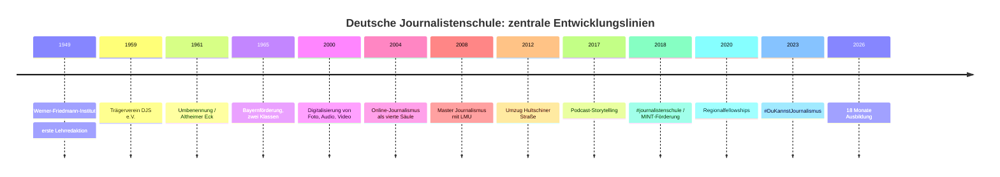
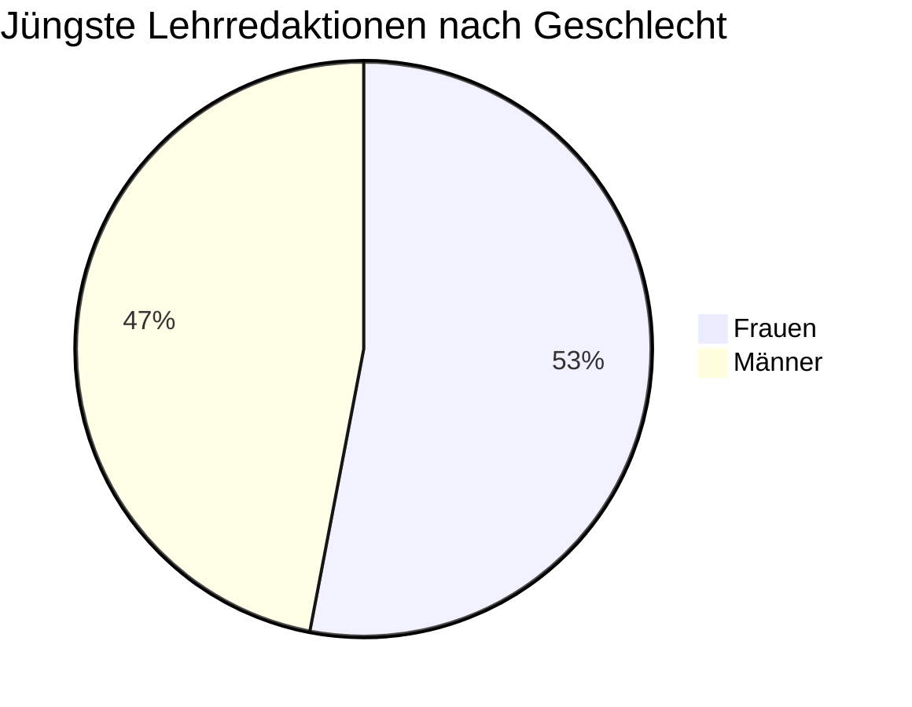
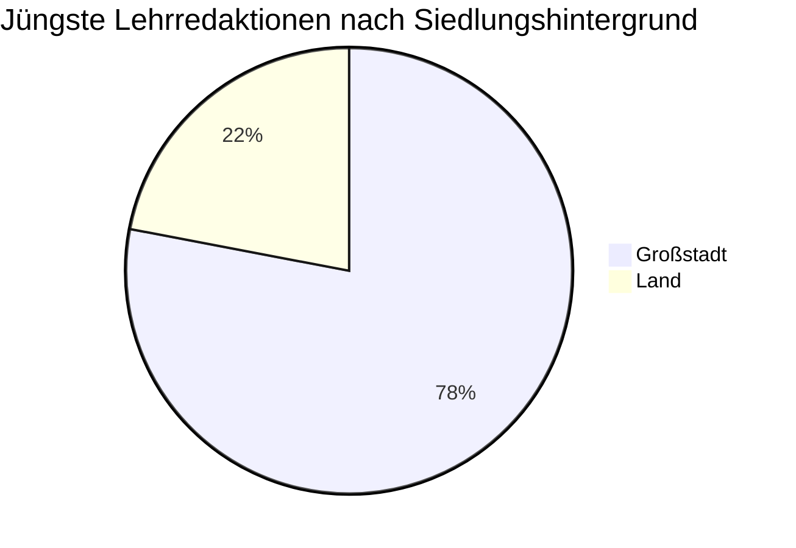

# Dossier zur Deutschen Journalistenschule in München

## Executive Summary

Die entity["organization","Deutsche Journalistenschule","München, Deutschland"] in entity["city","München","Bayern, Deutschland"] ist die älteste praktische Journalistenschule der Bundesrepublik und gehört bis heute zu den sichtbarsten und einflussreichsten Ausbildungsinstitutionen des deutschen Journalismus. Sie wurde 1949 als Werner-Friedmann-Institut gegründet, 1959 in einen gemeinnützigen Trägerverein überführt und 1961 in Deutsche Journalistenschule umbenannt. Heute bildet sie nach eigenen Angaben jährlich 45 Nachwuchsjournalistinnen und -journalisten aus, davon zwei Drittel im Kooperationsmodell mit der entity["organization","Ludwig-Maximilians-Universität München","München, Deutschland"]. Die Ausbildung ist schulgeldfrei; finanziert wird sie durch eine breite Trägerschaft sowie Zuschüsse von Bund, Freistaat Bayern und der Landeshauptstadt München. citeturn16view0turn15view3turn19search1turn19search8turn9search0

Die herausragenden Stärken der DJS sind ihre institutionelle Langlebigkeit, ihr starkes Alumni-Netzwerk, die hohe Einbettung in Redaktionen und Branchenmilieus, die crossmediale Grundausrichtung sowie die schulische und wissenschaftliche Verzahnung im Mastermodell. Belastbare Erfolgsindikatoren veröffentlicht die DJS allerdings nur punktuell: Eine eigene Auswertung von 2019 kam für die jüngsten fünf Jahrgänge auf 92 Prozent hauptberufliche Tätigkeit im Journalismus, bei den 2018 Eingestiegenen sogar auf 98 Prozent; zwei Drittel der Befragten gaben ein Bruttojahreseinkommen von mehr als 40.000 Euro an. Zugleich zeigt die öffentlich verfügbare Quellenlage deutliche Leerstellen: Die Schule publiziert keine umfassend zugänglichen Jahresberichte oder vollständigen Haushalte; aktuelle, systematisch erhobene Daten zu sozialer Herkunft, regionaler Herkunft, Behinderung oder Klassenlage fehlen. citeturn15view0turn15view3turn26search3turn13view0

Analytisch ist die DJS weniger durch einen einzelnen Skandal als durch vier wiederkehrende Spannungen geprägt. Erstens: der Widerspruch zwischen dem Anspruch demokratischer Offenheit und der empirisch erkennbaren sozialen Selektivität journalistischer Eliten. Zweitens: die historische Spannung zwischen antifaschistischem Gründungsimpuls und bislang nur fragmentarisch aufgearbeiteten NS-Kontinuitäten einzelner früher Dozenten und Schulleiter. Drittens: die Ambivalenz einer „unabhängigen“ Schule, die zwar gerade wegen ihrer breiten Trägerschaft Autonomie reklamiert, aber institutionell eng mit Medienhäusern, Verbänden und politischen Akteuren verflochten bleibt. Viertens: die aktuelle Transformationsphase, in der Curriculum, Diversity-Politik und Ausbildungsdauer sichtbar umgebaut werden, die offizielle Webkommunikation diesen Übergang aber noch nicht überall konsistent abbildet. citeturn30view0turn32view0turn32view2turn39view3turn14search8turn8view7turn15view3

Im Vergleich zu anderen deutschen Journalistenschulen positioniert sich die DJS als generalistische, crossmediale, öffentlich wie privat vernetzte Schule mit starkem Qualitäts- und Elitenarrativ. Sie ist weniger konzerngebunden als die Henri-Nannen-Schule, weniger konfessionell profiliert als das ifp, weniger fachlich spezialisiert als die Kölner Journalistenschule und stärker universitär eingebunden als viele rein betriebliche Ausbildungsmodelle. Gerade diese Mischform erklärt ihre hohe Reputation – aber auch ihre besondere Verwundbarkeit für Kritik an sozialer Selektivität, Datenintransparenz und historischer Selbstbeschreibung. citeturn41search4turn41search16turn41search0turn41search1turn41search2turn41search6turn41search7turn27search15turn14search10

## Historie und institutionelle Entwicklung

Die DJS entstand aus einem sehr spezifischen Nachkriegsmoment. Auf einen Aufruf von entity["people","Werner Friedmann","Journalist und Gründer der DJS"] in der Münchner Abendzeitung meldeten sich 1949 rund 1.700 Interessierte; 21 Personen – vier Frauen und 17 Männer – wurden für die erste Lehrredaktion ausgewählt. Die Schule war von Beginn an als praktische, unentgeltliche Journalistenausbildung gedacht, ausdrücklich mit demokratischem Erneuerungsanspruch in einer vom Nationalsozialismus diskreditierten Presselandschaft. Zehn Jahre später wurde mit dem Trägerverein Deutsche Journalistenschule e.V. die institutionelle Grundlage geschaffen; 1961 erfolgte die Umbenennung von Werner-Friedmann-Institut in Deutsche Journalistenschule. citeturn42view0turn16view0turn16view1turn27search4turn27search5

Die DJS entwickelte sich seither in klar erkennbaren Schüben: Zunächst als printzentrierte Lehrredaktion mit allgemeinbildenden Elementen, ab Mitte der 1960er Jahre mit staatlicher Förderung, verlängerten Ausbildungszeiten sowie den ersten festen Modulen für Hörfunk und Fernsehen; ab den 1970er Jahren mit stärkerem Praxisfokus; seit den 1990er und 2000er Jahren mit newsroom-orientierter Computerisierung, kompletter Digitalisierung von Foto, Audio und Video, Online-Journalismus als vierter Säule, später Podcasting, Formatentwicklung und Integrationsmodulen für digitale Produktionslogiken. 2008 wurde die ältere Aufbaustudienstruktur in den kooperativen Master Journalismus mit der LMU überführt. Seit 2026 kommuniziert die DJS eine Verlängerung der Ausbildung auf 18 Monate. citeturn16view1turn16view5turn17view0turn17view1turn17view2turn17view4turn14search8

Weniger bekannt, aber institutionell wichtig, sind mehrere Seitenpfade dieser Entwicklung. 1986 richtete die DJS eine zusätzliche Kompaktklasse für Berliner Teilnehmende ein; aus diesem Modell ging 1992 eine eigenständige Berliner Journalistenschule hervor. Von 1989 bis 2011 absolvierte zudem die Burda-Journalistenschule ihre überbetriebliche Grundausbildung an der DJS. Nach dem Fall der Mauer schrieb die Schule 1990 zusätzlich ein Auswahlverfahren speziell für Bewerberinnen und Bewerber mit Wohnsitz in der DDR aus; acht ostdeutsche Teilnehmer wurden zusätzlich aufgenommen. Diese Episoden zeigen, dass die DJS nicht nur ausbildete, sondern zeitweise selbst als institutioneller Inkubator für weitere Journalismusausbildungen fungierte. citeturn16view2turn30view1

### Zeitleiste der institutionellen Entwicklung

| Jahr | Zäsur | Analytische Bedeutung | Quelle |
|---|---|---|---|
| 1949 | Gründung des Werner-Friedmann-Instituts, 1. Lehrredaktion | praktische Nachkriegsausbildung mit demokratischem Erneuerungsanspruch | citeturn42view0turn16view0 |
| 1959 | Gründung des Trägervereins DJS e.V. | Übergang von Gründerprojekt zur dauerhaft getragenen Institution | citeturn42view0turn16view0 |
| 1961 | Umbenennung in DJS, Einzug Altheimer Eck | institutionelle Konsolidierung | citeturn42view0turn16view1 |
| 1965 | Bayernförderung, zwei Klassen, Radio/TV im Plan | Kapazitäts- und Medienausweitung | citeturn16view1 |
| 2000 | vollständige Digitalisierung von Foto, Audio und Video | technischer Modernisierungsschub | citeturn16view5 |
| 2004 | Online-Journalismus als reguläre vierte Säule | formale Reaktion auf digitalen Medienwandel | citeturn17view1 |
| 2008 | Master Journalismus mit LMU | Hybridisierung von Praxis und Wissenschaft | citeturn17view2turn9search0 |
| 2012 | Umzug an die Hultschiner Straße | infrastrukturelle Modernisierung und Nähe zum Verlagsstandort | citeturn17view2turn23search0 |
| 2017 | Podcast-Storytelling als feste Ausbildungskomponente | Anpassung an neue Audioformate | citeturn17view4 |
| 2018 | #journalistenschule und MINT-/KTS-Förderung | Medienkompetenzarbeit und wissenschaftsjournalistische Öffnung | citeturn17view4turn19search2 |
| 2020 | Regionalfellowships | Brücke zum Regionaljournalismus und zur digitalen Transformation | citeturn17view5 |
| 2023 | #DuKannstJournalismus | institutionalisierte Diversity-Rekrutierung | citeturn17view5turn21search10 |
| 2026 | kommunizierte Verlängerung auf 18 Monate | curricularer Umbau in laufender Transformation | citeturn14search8turn11search6 |

Die Zeitleiste verdichtet ausschließlich in den öffentlichen Primärquellen und der begleitenden Forschung dokumentierte Entwicklungsschritte. citeturn42view0turn16view1turn17view0turn17view4turn17view5turn14search8

## Standort, Infrastruktur, Governance und Finanzierung

Die DJS sitzt heute an der Hultschiner Straße 8 in München. Seit 2012 befindet sie sich im vierten Stock des Verlags- und Medienhochhauses an diesem Standort; zuvor war sie mehr als fünf Jahrzehnte am Altheimer Eck in der Münchner Innenstadt untergebracht. Schon das alte Schulhaus am Altheimer Eck verfügte laut offizieller Geschichtsdarstellung über Hörfunkstudio, Fotolabor und elektronische Arbeitsplätze. Der neue Standort im Münchner Osten bietet eine deutlich modernere Gebäudestruktur; das Hochhaus selbst wurde 2007 fertiggestellt, misst 99,95 Meter und erhielt als nachhaltiger Bürokomplex ein LEED-Gold-Zertifikat. citeturn23search0turn23search2turn16view0turn17view2turn24view0

Für die Ausbildungsinfrastruktur ist weniger die Architektur als die Produktionsumgebung entscheidend. Offizielle DJS-Quellen nennen crossmediale Lehrredaktionen, Hörfunk-/Audioarbeit, TV-/Video-Elemente, Digitalproduktion und persönliche Entwicklungsangebote; die LMU-Modulhandbücher für den kooperativen Master konkretisieren dies in ECTS-bewertete Praxismodule zu Text-, Audio-, Video- und integrierter journalistischer Praxis. Gleichzeitig arbeitet die Schule mit rund 110 praxisaktiven Dozentinnen und Dozenten aus Print-, Online-, öffentlich-rechtlichen und privaten Medien. Die Einrichtung versteht sich also weniger als Campus im klassischen Hochschulsinn denn als verdichteter, redaktionsähnlicher Produktions- und Feedbackraum. citeturn15view1turn42view1turn42view2turn42view3turn42view4

Organisatorisch ist die DJS ein eingetragener, gemeinnütziger Verein. Der Vorstand des Trägervereins fungiert als Aufsichtsgremium; laut Datenschutzerklärung wird der Verein vom Vorsitzenden des Vorstands, entity["people","Volker Herres","Vorstandsvorsitzender der DJS"], und von der Schulleiterin und Geschäftsführerin entity["people","Henriette Löwisch","Schulleiterin der Deutschen Journalistenschule"] vertreten. Das operative Team umfasst sechs hauptamtliche Mitarbeitende; sie verantworten Ausbildung, Technik, Finanzen, Aufnahmeverfahren, Stipendien, Stundenpläne und die Koordination von Trägerverein und Förderkreis. Stellvertretender Schulleiter und Geschäftsführer für Technik, IT und Finanzen ist Sven Szalewa. citeturn18view0turn23search5turn19search8

Die Finanzierung ist plural, aber nur teilweise transparent. Offiziell erklären die Trägerseiten, dass Mitgliedsbeiträge von Medienhäusern, Verbänden, Gewerkschaften, Institutionen, Unternehmen, Stiftungen und Parteien zusammen mit Zuschüssen von Bund, Freistaat Bayern und Stadt München die schulgeldfreie Ausbildung ermöglichen. Zum 75-jährigen Jubiläum nennt die DJS 60 Träger. Der Förderkreis mit inzwischen mehr als 1.500 Mitgliedern finanziert nach DJS-Angaben sieben von 45 Ausbildungsplätzen. Zusätzlich gibt es zweckgebundene Förderinstrumente wie 50.000 Euro jährlich der Klaus Tschira Stiftung für wissenschaftsjournalistische Förderung und mindestens ein öffentlich dokumentiertes Bundesprojekt aus dem BKM-Programm zur „strukturellen Stärkung des Journalismus“ in Höhe von 169.170 Euro für „Vertrauen durch Vielfalt“. Im bayerischen Haushalt ist zudem ein freiwilliger Zuschuss von bis zu 70.000 Euro jährlich für die DJS ausgewiesen. Was fehlt, ist ein öffentlich zugänglicher Gesamthaushalt, aus dem sich Anteile, Abhängigkeiten und Mittelverwendung systematisch rekonstruieren ließen. citeturn19search1turn19search8turn15view3turn16view2turn19search2turn22view1turn21search7turn21search5

### Governance- und Finanzarchitektur im Überblick

| Element | Befund | Einordnung | Quelle |
|---|---|---|---|
| Rechtsform | eingetragener, gemeinnütziger Verein | institutionell nicht staatlich, aber öffentlich mitfinanziert | citeturn19search1turn19search8 |
| Aufsicht | Vorstand des Trägervereins | pluralistische Kontrolle statt singulärer Eigentümerstruktur | citeturn19search8turn23search5 |
| Operatives Team | sechs hauptamtliche Mitarbeitende | schlanke Verwaltung, hohe Dozentenabhängigkeit | citeturn18view0 |
| Trägerbasis | 60 Medienhäuser, Verbände, Institutionen, Unternehmen, Stiftungen, Parteien | Breite stärkt Unabhängigkeit, erschwert aber Transparenz über Einflussgewichte | citeturn15view3turn19search1 |
| Förderkreis | >1.500 Mitglieder, finanziert sieben von 45 Plätzen | Alumni-Netzwerk als substanzieller Kofinanzierer | citeturn16view2 |
| Öffentliche Mittel | Bund, Bayern, München; Bayern bis zu 70.000 Euro/Jahr; BKM-Projekt 169.170 Euro | öffentliche Mitfinanzierung plus projektbezogene Förderlogik | citeturn19search1turn21search5turn22view1 |
| Transparenzlücke | kein frei zugänglicher Vollhaushalt in den eingesehenen Quellen | erschwert externe Prüfung von Finanzierungsstruktur und Prioritäten | citeturn19search1turn19search8 |

## Auswahlverfahren, Ausbildungswege und soziale Zusammensetzung

Die DJS rekrutiert heute auf zwei Wegen: über die Kompaktausbildung und über den gemeinsam mit der LMU angebotenen Master Journalismus. Offizielle DJS-Seiten nennen 45 Ausbildungsplätze pro Jahr; davon entfallen 30 auf den Master und 15 auf die Kompaktausbildung. Für die Masterklassen läuft die Online-Anmeldung laut DJS üblicherweise vom 15. Mai bis 15. September, für die Kompaktklassen vom 15. Oktober bis 15. Januar. Die Ausbildung ist kostenlos; allerdings trägt die Schule nicht den Lebensunterhalt, weshalb Stipendien und Förderangebote relevant bleiben. citeturn15view3turn6view0turn6view2turn14search8turn19search2turn19search17

Das Auswahlverfahren ist mehrstufig und leistungsorientiert. Laut DJS beginnt es mit Online-Anmeldung, Lebenslauf, Arbeitsprobe und Fragebogen; im zweiten Schritt werden rund 150 Bewerberinnen und Bewerber zu einem zweitägigen Test nach München eingeladen. Dort gehören Wissenstest, Reportageaufgabe, Interview- bzw. Gesprächssituationen und weitere Eignungselemente zum Verfahren. Bemerkenswert ist, dass bereits die erste Aufnahmeprüfung 1949 ähnliche Elemente enthielt – Bildertest, Wissenstest, Reportage und Aufnahmegespräch. Die Schule inszeniert damit Kontinuität: weniger formale Zertifikate als journalistische Eignung, Beobachtungsfähigkeit und Schreibvermögen zählen. citeturn6view0turn6view3turn42view0

Die DJS kommuniziert Diversität als Auswahlziel, aber die Daten zeigen ein gemischtes Bild. Für die „jüngsten Lehrredaktionen“ nennt die Schule 53 Prozent Frauen und 47 Prozent Männer, 78 Prozent Großstadt- und 22 Prozent Landherkunft, 75 Prozent Auslandserfahrung, 10 Prozent „Deutsche mit sogenanntem Migrationshintergrund“ sowie weitere 6 Prozent aus dem Ausland; zudem hatten vier von fünf bereits ein Praktikum absolviert. Diese Angaben sind nützlich, aber methodisch unscharf: Erhebungszeitraum, Grundgesamtheit, Definitionen und Erhebungsverfahren werden auf der Website nicht weiter erläutert. citeturn13view0

Die wissenschaftliche Sekundärliteratur zeichnet für die Alumni-Population ein noch klareres Selektionsmuster. Die 2016 erhobene Alumni-Studie von Dirk Hansen beschreibt DJS-Absolventinnen und -Absolventen als mehrheitlich männlich, mit unterrepräsentiertem Migrationshintergrund, überwiegend westdeutscher Sozialisation und deutlich überdurchschnittlich gebildeten Elternhäusern. 8,5 Prozent der befragten Alumni hatten einen Migrationshintergrund; bei den Eltern lagen Hochschulabschlüsse signifikant über dem Bevölkerungsdurchschnitt. Hansen resümiert, dass die Herkunftsstruktur von DJS-Alumni deutlich von der Allgemeinbevölkerung abweicht und von bildungsbürgerlicher Mittelschicht dominiert wird. Damit bestätigt die Forschung strukturell das, was Kritikerinnen und Kritiker seit Jahren im deutschen Journalismus bemängeln: mangelnde soziale Öffnung. citeturn32view0turn32view1

### Schema des Aufnahmeverfahrens

Das Schema fasst die im offiziellen DJS-Bewerbungsverfahren beschriebenen Schritte zusammen; die Zahl von rund 150 Personen für die zweite Runde stammt aus der DJS-Darstellung der Aufnahmeprüfungen. citeturn6view0turn6view3

### Demografische Indikatoren

| Indikator | Aktuelle DJS-Webangabe zu „jüngsten Lehrredaktionen“ | Alumni-Befund in der Forschung | Einordnung | Quelle |
|---|---|---|---|---|
| Geschlecht | 53 % Frauen, 47 % Männer | 56 % männlich, 41,2 % weiblich, 2,8 % keine Angabe | aktuelles Webbild wirkt ausgeglichener als Alumni-Bestand | citeturn13view0turn32view0 |
| Regionale Herkunft | 78 % Großstadt, 22 % Land | 93,6 % Westdeutschland, 4,4 % neue Länder, 2 % Ausland (Kindheit) | Stadt-/Land-Angabe und Ost-/West-Angabe nicht direkt vergleichbar, deuten aber beide auf Selektivität | citeturn13view0turn32view0 |
| Migration | 10 % Deutsche mit Migrationshintergrund, 6 % aus dem Ausland | 8,5 % Migrationshintergrund | beide Werte liegen deutlich unter dem Bevölkerungsanteil | citeturn13view0turn32view0 |
| Praktische Vorerfahrung | 80 % hatten bereits ein Praktikum | nicht direkt ausgewiesen | frühe branchenspezifische Vorsozialisation ist fast Standard | citeturn13view0 |
| Soziale Herkunft | auf Website nicht erhoben | dominierende bildungsbürgerliche Mittelschicht, hohe Elternbildung | größte offene Datenlücke der DJS-Öffentlichkeit | citeturn26search3turn32view1 |

Die beiden Diagramme visualisieren ausschließlich die auf der DJS-Website veröffentlichten Prozentwerte zu den „jüngsten Lehrredaktionen“. Mangels Methodendokumentation sind sie als Selbstauskunft mit begrenzter Interpretierbarkeit zu lesen. citeturn13view0

## Curriculum, Didaktik und Leistungsnachweise

Das Curriculum der DJS ist gegenwärtig im Umbau. Die Startseite und die FAQ kommunizieren seit 2026 eine 18-monatige Ausbildung mit 12 Monaten Unterricht in München und 6 Monaten Praktika; für den Master werden 27 Monate einschließlich LMU-Anteilen und Masterarbeit genannt. Auf älteren bzw. nicht überall aktualisierten Unterseiten stehen jedoch weiterhin 16 Monate für die Kompaktausbildung oder Formulierungen von „gut 180 Arbeitstagen“ bzw. „zehn Monaten Ganztagesunterricht“. Diese Quellenkollision ist kein Nebenaspekt: Sie zeigt, dass die DJS ihr Ausbildungsmodell gerade sichtbar transformiert, die institutionelle Kommunikation diesen Übergang aber noch nicht vollständig harmonisiert hat. citeturn11search6turn14search8turn8view7turn15view3

Inhaltlich folgt die DJS einem generalistischen crossmedialen Ansatz. Offizielle Seiten gliedern den Unterricht in Grundlagen, Print, Hörfunk, TV & Video, Digital und Persönliche Entwicklung; Projektarbeit und Teamkritik sind laut DJS zentrale Lernformen. Für die Master-Ausbildung wird die journalistische Praxis über konkrete Pflichtmodule der LMU dokumentiert: „Kommunikationswissenschaftliche Theorie und journalistische Grundlagen“ im ersten Semester, danach Text-Journalismus, Audio-Journalismus, integrierte journalistische Praxis sowie Video-Journalismus. Die DJS-Seite selbst ergänzt dazu den Unterricht durch Praktikerinnen und Praktiker, Newsroom-Logik, Podcasting, Digital Storytelling und öffentlich sichtbare Projekte wie das Abschlussmagazin *Klartext*. citeturn15view1turn42view1turn42view2turn42view3turn42view4turn17view0turn17view4turn40search19

Didaktisch dominiert eine Werkstattlogik. Die DJS betont, dass sie keinen Frontalunterricht anbietet, sondern praktische Redaktionsarbeit, Konferenzen, Textkritik, Themenentwicklung, Recherchecoaching und produktionelle Verantwortung im Team. Die Dozierenden kommen direkt aus Redaktionen; zwischen Studierenden und Lehrenden soll ausdrücklich ein kollegiales Verhältnis entstehen. Das unterscheidet die DJS von rein akademischen Journalismusangeboten. Im Master ist die wissenschaftliche Rahmung gleichwohl substanziell: Öffentlichkeitstheorien, Mediensystem, Medienpolitik, Medienrecht, Medienökonomie und Forschungsmethoden gehören laut LMU-Handbuch explizit zum Curriculum. Die Schule bleibt also keine „reine Handwerksschule“, sondern ein Hybrid aus Handwerk, professionsbezogener Reflexion und universitärer Theoriebildung. citeturn15view1turn42view1turn9search0turn9search2

Bei den Leistungsnachweisen ist zwischen Ausbildungswegen zu unterscheiden. Die Kompaktausbildung endet nach DJS-Angabe mit dem „von den Tarifparteien anerkannten Redakteurszeugnis“. Im Master sind die DJS-Praxisblöcke als benotete Pflichtmodule mit ECTS-System in das LMU-Studium integriert; für mindestens ein Grundlagenmodul sind Klausur oder mündliche Prüfung explizit ausgewiesen, die Praxisanteile erscheinen als Pflichtübungen mit definierter Präsenzzeit und benoteter Modulstruktur. Hinzu kommen zwei obligatorische Praktika in der Kompaktausbildung beziehungsweise Pflichtpraktika als integraler Bestandteil des DJS-Trainings. Nicht öffentlich einsehbar sind dagegen detaillierte Bewertungsraster für einzelne journalistische Produkte oder eine konsolidierte Rubrik zur Kompetenzmessung über alle Ausbildungssegmente hinweg. citeturn8view7turn10view0turn42view2turn42view3turn42view4

### Kurzübersicht des Curriculums

| Bereich | Offiziell dokumentierte Inhalte | Assessment / Output | Quelle |
|---|---|---|---|
| Grundlagen | journalistische Grundlagen plus kommunikationswissenschaftliche Theorie | benotetes Pflichtmodul; im Master Klausur oder mündliche Prüfung möglich | citeturn42view1turn10view0 |
| Text | Ressorts, Textformen, Reportage, Feature, Layout, Zeitung/Zeitschrift | redaktionelle Arbeit, publizistische Produkte | citeturn42view2turn10view0 |
| Audio | Darstellungsformen, Audio-Technik, Sprechen, Moderation, digitaler Schnitt, Podcast, Internetradio | praktische Produktionen | citeturn42view3turn10view0 |
| Integrierte Praxis / Digital | aktuelle Herausforderungen des Journalismus, kanal- und plattformübergreifende Produktion, konzeptionelle Arbeit | crossmediale Projektarbeit | citeturn42view4turn15view1 |
| Video | Grundformen des Video-Journalismus und Produktion | praktische audiovisuelle Beiträge | citeturn10view0 |
| Praktika | zwei Pflichtpraktika, eines davon tagesaktuell | berufsbezogene Praxiserfahrung | citeturn8view7turn14search8 |
| Abschluss | Redakteurszeugnis bzw. Masterabschluss mit DJS/LMU-Verzahnung | tariflich bzw. hochschulisch anschlussfähig | citeturn8view7turn9search0turn10view1 |

## Alumni, Karrierewege, Netzwerke und Berufsausgänge

Zur Reichweite der Institution gehört vor allem ihr Netzwerk. Laut DJS haben inzwischen mehr als 2.600 Absolventinnen und Absolventen die Schule durchlaufen. Der Förderkreis zählt mehr als 1.500 Mitglieder; hinzu kommen rund 110 Dozierende aus der Praxis. Diese Zahlen sprechen dafür, die DJS nicht nur als Schule, sondern als dauerhaftes Netzwerkzentrum des deutschsprachigen Journalismus zu verstehen. Das wird auch in der Außendarstellung ständig mitkommuniziert: Die Alumni seien Teil des „Rückgrats“ der deutschsprachigen Medienlandschaft. Diese Formulierung ist selbstbewusst bis pathetisch, aber sie verweist auf einen realen Mechanismus symbolischer Macht: Wer DJS-Absolventin oder -Absolvent ist, erwirbt berufliche Kontakte, Sichtbarkeit und eine institutionell hoch bewertete Herkunftsmarke. citeturn15view3turn15view1turn30view3

Belastbarste Karrierekennziffer ist die DJS-interne Auswertung von 2019. Danach arbeiten 92 Prozent der neuesten Absolventinnen und Absolventen hauptberuflich im Journalismus; für den 2018 gerade in den Beruf eingetretenen Nachwuchs nennt die Schule 98 Prozent. Zwei Drittel der Befragten gaben ein Jahresbrutto von mehr als 40.000 Euro an; ein Jahr nach Abschluss lagen 15 Prozent über 50.000 Euro, fünf Jahre nach Abschluss 59 Prozent. Methodisch ist diese Statistik nicht unproblematisch, weil sie von der DJS selbst stammt, sich nur auf die Jahrgänge 50 bis 55 bezieht und mit einer durchschnittlichen Rücklaufquote von 62 Prozent arbeitet. Gleichwohl ist sie die einzige öffentlich sichtbare Outcome-Messung, die von der Institution selbst vorgelegt wird. citeturn15view0

Für die symbolische Reichweite der Alumni liefert die Forschung zusätzliche Hinweise. Die Studie von Dirk Hansen zeigt, dass DJS-Alumni in Preisen, Fachjurys und Ranglisten journalistischer Reputation überproportional vorkommen; für 2016 weist Hansen überdurchschnittliche Anteile bei Reporterpreis, Medium-Magazin-Rankings und anderen Formen fachlicher Anerkennung aus. Sein Befund ist analytisch wichtig: Die DJS produziert nicht nur Beschäftigung, sondern symbolisches Kapital. Sie vergibt – um Hansens Formulierung sinngemäß aufzugreifen – einen Stempel der Leistungselite und verstärkt damit die Deutungsmacht ihrer Absolventinnen und Absolventen im Feld. citeturn29view0turn30view2turn30view3

Die Partnerschaften sind dabei funktional. Im Master ist die LMU der akademische Partner; im Regionaljournalismus dienen die Regionalfellowships als Brücke zu regionalen Zeitungen; mit der Klaus Tschira Stiftung existiert eine wissenschaftsjournalistische Talentförderung; die Workshops von #DuKannstJournalismus entstehen in Kooperation mit Mitgliedern des Trägervereins; Austauschprogramme werden laut Teamseite organisatorisch betreut; seit den späten 1980er Jahren ist die DJS außerdem in europäische Netzwerke journalistischer Ausbildung eingebunden. Das Netzwerk ist also nicht nur ein Alumni-Effekt, sondern eine bewusst gepflegte institutionelle Infrastruktur. citeturn9search0turn17view4turn17view5turn18view0turn16view2

### Verifizierbare Karriere- und Netzwerkindikatoren

| Indikator | Befund | Bewertung | Quelle |
|---|---|---|---|
| Alumni gesamt | mehr als 2.600 | große historische Reichweite | citeturn15view3 |
| Hauptberuflich im Journalismus | 92 % der jüngsten fünf Jahrgänge | starke Berufsrelevanz, aber nur institutionseigene Messung | citeturn15view0 |
| 2018er Einstiegskohorte | 98 % hauptberuflich im Journalismus | bemerkenswert hoher Wert, methodisch vorsichtig zu lesen | citeturn15view0 |
| Einkommen | zwei Drittel > 40.000 Euro brutto/Jahr | über dem verbreiteten Krisennarrativ des Berufs | citeturn15view0 |
| Förderkreis | >1.500 Mitglieder | belastbares Alumni-Kapital | citeturn16view2 |
| Praxisdozierende | rund 110 | hohe Branchenanbindung | citeturn15view1 |

### Auswahl verifizierter prominenter Alumni

| Person | Verifizierte Rollen / Karriereangaben in den eingesehenen Quellen | Quelle |
|---|---|---|
| entity["people","Götz Aly","Historiker und Journalist, DJS-Alumnus"] | Historiker, Autor und Journalist; beschreibt selbst seine DJS-Zeit 1967/68 und seinen späteren Weg über Studium, Aktivismus und Journalismus | citeturn37view0 |
| entity["people","Nicole Diekmann","Journalistin und DJS-Alumna"] | seit 2015 Korrespondentin im ZDF-Hauptstadtstudio; zuvor Kriegs- und Krisenreporterin | citeturn20search5 |
| entity["people","Richard Gutjahr","Journalist und DJS-Alumnus"] | freier Reporter für die ARD, langjähriger News-Moderator, Kolumnist | citeturn20search8 |
| entity["people","Simon Hurtz","Journalist und DJS-Alumnus"] | journalistische Laufbahn zwischen DJS und Redaktionsarbeit; in BLM-Referentenbiografie dokumentiert | citeturn20search6 |

Die öffentlich zugängliche Alumni-Darstellung der DJS ist reich an Namen, aber arm an systematischer Outcome-Statistik. Eine vollständige, maschinenlesbare Absolventenliste oder ein nach Branchen geordnetes Karriere-Monitoring war in den eingesehenen Quellen nicht verfügbar; die entsprechende Website-Unterseite erschien im Textzugriff praktisch leer. citeturn15view2turn11search4

## Kontroversen, Kritik, öffentliche Wahrnehmung und blinde Flecken

In der öffentlichen Wahrnehmung genießt die DJS unübersehbar hohes Prestige. Sie bezeichnet sich selbst als „angesehenste unabhängige Ausbildungsstätte für Journalismus im deutschsprachigen Raum“, und externe Fach- und Medienquellen sprechen regelmäßig von einer „renommierten“ oder „einer der renommiertesten“ Journalistenschulen Deutschlands. Das 75-jährige Jubiläum 2024 mit einem Festakt im Prinzregententheater, einer Festrede des Bundeskanzlers und einem Grußwort des bayerischen Ministerpräsidenten war deshalb nicht nur Geburtstagsritual, sondern ein öffentlich sichtbarer Akt symbolischer Aufwertung. citeturn27search15turn14search10turn25search19turn15view3

Die schärfste substanzielle Kritik betrifft soziale und biografische Homogenität. Die Forschung von Hansen beschreibt DJS-Alumni als überwiegend westdeutsch, bildungsbürgerlich und mit unterrepräsentiertem Migrationshintergrund; die Debattenbeiträge von DJS-Alumni wie entity["people","Marco Maurer","Journalist und DJS-Alumnus"] und entity["people","Anne Fromm","Journalistin und DJS-Alumna"] werden in derselben Studie als Belege dafür gelesen, dass nicht nur Recherchequalität, sondern auch die soziale Zusammensetzung von Journalistenschulklassen ein Problem der Repräsentation ist. Hansen berichtet zudem, die DJS habe auf Nachfrage keine Daten zur sozioökonomischen Herkunft erhoben. Die Schule hat darauf in den vergangenen Jahren mit Diversity-Initiativen reagiert – etwa „Vertrauen durch Vielfalt“ und #DuKannstJournalismus –, aber die öffentliche Datengrundlage bleibt hinter dem programmatischen Anspruch zurück. citeturn26search3turn32view1turn32view2turn21search10turn17view5

Ein zweiter, deutlich heiklerer Kritikpunkt betrifft die historische Selbstaufarbeitung. In einer 2024 veröffentlichten Recherche der DJS-eigenen *Klartext*-Redaktion wird erstmals systematischer öffentlich gemacht, dass einzelne frühere Dozenten und ein früherer Schulleiter NS-belastete Biografien hatten. Die Redaktion arbeitet am Beispiel von Hermann Proebst, Hans Schuster und Franz Hugo Mösslang heraus, dass Personen mit erheblicher publizistischer Nähe zum NS-Regime später an der DJS lehrten oder sie leiteten. Wörtlich bilanziert die studentische Recherche, die DJS habe sich „bisher noch nicht systematisch“ mit diesem Aspekt ihrer Geschichte befasst. Das ist für eine Institution, die sich normativ auf Demokratie und freie Presse beruft, ein zentraler blinder Fleck. Wichtig ist dabei die Differenzierung: Es geht nicht um eine Gründungsidentität der DJS als NS-Projekt – der Gründer Werner Friedmann war selbst NS-verfolgt –, sondern um personelle Kontinuitäten in den Nachkriegsjahrzehnten. citeturn42view6turn39view3turn37view0turn38search2

Eine dritte Debattenlinie betrifft journalistische Ethik im Zeitalter von Relotius und narrativem Storytelling. Nach dem Fall Claas Relotius wurde öffentlich diskutiert, ob Journalistenschulen zu stark Dramaturgie, „Drehbuch“ und große Reportagegesten lehren. Für die DJS lässt sich aus den eingesehenen Quellen keine direkte institutionelle Verstrickung ableiten; sehr wohl aber eine Reaktion auf die Debatte. Deutschlandfunk berichtete 2019, die DJS prüfe inzwischen stärker, ob Szenen in Bewerbungsreportagen plausibel seien, und auf einer Tutzinger Fachtagung wurde berichtet, dass die DJS Medienrecht im Stundenplan aufgewertet habe. Das ist kein DJS-Skandal, sondern eher ein Zeichen professionsethischer Anpassung an eine Branchenkrise. citeturn40search2turn40search8turn40search4

Zu den kleineren, aber aussagekräftigen internen Geschichten der jüngeren Zeit gehört die 2024 veröffentlichte *Klartext*-Recherche zum Alkoholverbot. Die studentische Redaktion rekonstruierte anhand von Hausordnungen, Alumni-Gesprächen und einem E-Mail-Hinweis aus 2023, dass ein ausdrückliches schriftliches Alkoholverbot offenbar erst 2012 – also mit dem Umzug an die Hultschiner Straße – in der Hausordnung auftauchte und lange nicht konsequent durchgesetzt wurde. Das ist keine große Affäre. Aber es ist institutionell interessant, weil es zeigt, wie stark Journalismusausbildung an der Grenze zwischen Beruf, sozialer Gemeinschaft, Belastung und Überarbeitung operiert – und wie lange branchenübliche Kulturmuster selbst in Ausbildungskontexten nachwirken. citeturn35view1turn35view2

### Kritikfelder und institutionelle Reaktionen

| Kritikfeld | Evidenz | Reaktion / Gegenbewegung | Quelle |
|---|---|---|---|
| soziale Selektivität | bildungsbürgerliche Herkunft dominiert; zu wenig Daten über soziale Herkunft | #DuKannstJournalismus, „Vertrauen durch Vielfalt“, Stipendienprogramme | citeturn32view1turn32view2turn21search10turn17view5turn19search17 |
| historische Aufarbeitung | NS-belastete frühere Dozenten und Schulleiter; bisher keine systematische Aufarbeitung laut Klartext | bisher keine systematisch dokumentierte öffentliche Aufarbeitungsinitiative in den eingesehenen Quellen | citeturn39view3turn42view6 |
| Daten- und Transparenzlücken | keine öffentlich sichtbaren Vollhaushalte, keine umfassenden Outcome-Daten nach 2019 | punktuelle Faktenblätter, Jubiläums- und Websitekommunikation | citeturn19search1turn15view0turn42view0 |
| Kommunikationskonsistenz | parallele Angaben von 16, 18 und faktisch 10+6 Monaten auf verschiedenen DJS-Seiten | Übergang 2026, aber Webkonsistenz noch unvollständig | citeturn14search8turn8view7turn15view3 |

## Vergleich, Visualisierung und Quellenlage

Im Vergleich mit anderen deutschen Journalistenschulen fällt die DJS durch ihre Mischform auf: Sie ist nicht primär konzerngebunden, aber brancheneng; nicht rein akademisch, aber universitär verzahnt; nicht konfessionell, aber normativ stark gerahmt; nicht spezialisiert auf Politik/Wirtschaft oder Fernsehen allein, sondern generalistisch crossmedial. Die Henri-Nannen-Schule ist länger praktische Vollausbildung mit Vergütung und klarer Verlagsbindung; die Kölner Journalistenschule ist stärker fachlich auf Politik und Wirtschaft spezialisiert und institutionell enger an ein Studium gekoppelt; das ifp ist kirchlich getragen und studienbegleitend organisiert; die RTL Journalistenschule ist broadcaster- und plattformorientiert. Die DJS besetzt damit die Nische einer traditionsreichen, breit getragenen Generalistenschule mit hohem symbolischem Kapital. citeturn41search0turn41search4turn41search16turn41search1turn41search5turn41search2turn41search6turn41search7

### Vergleich mit anderen deutschen Journalistenschulen

| Schule | Trägerschaft / institutioneller Typ | Dauer / Struktur | Kohorte / Auswahl | Profil | Quelle |
|---|---|---|---|---|---|
| entity["organization","Deutsche Journalistenschule","München, Deutschland"] | gemeinnütziger Verein mit breiter Trägerschaft; Kooperation mit LMU | aktuell kommuniziert: 18 Monate; Master mit LMU parallel/verlängert | 45 pro Jahr, davon 30 Master / 15 Kompakt; ca. 150 in Endauswahlrunde | generalistisch, crossmedial, schulgeldfrei | citeturn15view3turn14search8turn6view3 |
| entity["organization","Henri-Nannen-Schule","Hamburg, Deutschland"] | von drei Verlagshäusern getragen | 21 Monate; 33 Wochen Schule, 50 Wochen Praktika; 1.400 € monatlich | Lehrgang alle zwei Jahre; zuletzt 15 Personen; 1.000–1.500 Registrierungen | stark redaktions- und verlagseinbettet, praxisintensiv | citeturn41search0turn41search16turn41search12turn41search8 |
| entity["organization","Kölner Journalistenschule für Politik und Wirtschaft","Köln, Deutschland"] | Schule mit enger Uni-Kopplung | 4 Jahre Vollausbildung oder 2 Jahre Kompaktausbildung | mit Bachelor bzw. Masteroption an Uni Köln verzahnt | Politik- und Wirtschaftsjournalismus | citeturn41search2turn41search6turn41search14 |
| entity["organization","Institut für publizistische Ausbildung","München, Deutschland"] | Journalistenschule der katholischen Kirche | studienbegleitend parallel zum Studium | offiziell als multimedial und kostenlos beschrieben | stärker konfessionell gerahmtes Modell | citeturn41search1turn41search5 |
| entity["organization","RTL Journalistenschule","Köln, Deutschland"] | betriebliche Journalistenschule | 2 Jahre; Schulblöcke und Praxisstationen | 15–18 Personen; mehrere Auswahlstufen | TV-, Online-, Audio- und Social-Media-orientiert | citeturn41search7turn41search11turn41search19 |

Für eine Präsentation oder Visualisierung dieses Dossiers empfiehlt sich eine Dreiteilung. Erstens eine historische Zeitleiste mit den Wendepunkten 1949, 1959, 2004, 2008, 2012, 2023 und 2026. Zweitens ein Strukturdiagramm, das Trägerverein, Förderkreis, öffentliche Zuschüsse, LMU-Kooperation, Regionalfellowships und Stiftungsförderung als Netzwerk zeigt. Drittens eine Doppelvisualisierung zur Zusammensetzung: aktuelle DJS-Webdaten zu Geschlecht, Großstadt/Land und Migrationsbezug neben den Alumni-Befunden der Hansen-Studie zu Bildungskapital und Herkunft. Besonders erhellend wäre außerdem ein transparenter Gap-Chart: „Was die DJS öffentlich misst“ versus „was für eine moderne Diversity- und Governance-Berichterstattung noch fehlt“. Diese Empfehlungen folgen direkt aus den dokumentierten Stärken und Datenlücken der Institution. citeturn13view0turn32view0turn19search1turn15view0

### Quellenlage und offene Fragen

Die belastbarsten Primärquellen in diesem Dossier waren die offizielle Website der urlDeutschen Journalistenschulehttps://djs-online.de, die Studien- und Modulunterlagen des kooperativen LMU-Studiengangs urlMaster Journalismus an der LMUhttps://www.sw.lmu.de/ifkw/de/studium/studiengaenge/ma-journalismus/, amtliche Haushalts- und Bundestagsdokumente sowie zwei einschlägige akademische Arbeiten aus dem LMU-Umfeld. Ergänzt wurden sie durch Fachpresse und qualitätsgesicherte Medienberichterstattung. citeturn27search15turn9search0turn21search5turn22view1turn29view0turn33view0turn14search10

Offen bleibt vor allem viererlei. Erstens fehlt ein öffentlich zugänglicher Gesamthaushalt der DJS; die Finanzierungsarchitektur ist erkennbar, die Mittelverteilung aber nicht. Zweitens gibt es keine kontinuierlich veröffentlichten Outcome-Daten nach 2019. Drittens sind aktuelle Daten zu sozialer Herkunft, Behinderung, Ost-/West-Herkunft oder Klassenlage der Studierenden weiterhin lückenhaft. Viertens ist die historische Aufarbeitung der NS-Kontinuitäten zwar angestoßen, aber in den eingesehenen Quellen nicht als institutionell abgeschlossenes Projekt dokumentiert. Diese offenen Punkte mindern nicht die Bedeutung der DJS, markieren aber präzise die Stellen, an denen ein professionelles Dossier, ein Jahresbericht oder eine externe Evaluation heute ansetzen müsste. citeturn19search1turn15view0turn26search3turn39view3

### Hauptquellen

**Primär- und amtliche Quellen**

- DJS: Geschichte der Schule, Team, Träger, Studierende, FAQ, Ausbildungswege, Jubiläum 75 Jahre. citeturn16view0turn18view0turn19search1turn13view0turn14search8turn15view3
- LMU / IfKW: Master Journalismus, Prüfungs- und Studienordnung 2025, Modulhandbuch 2026. citeturn9search0turn10view1turn10view0
- Deutscher Bundestag / BKM: Förderprogramm „Schutz und strukturelle Stärkung journalistischer Arbeit“. citeturn22view1
- Freistaat Bayern: Haushaltsunterlagen mit ausgewiesenem DJS-Zuschuss. citeturn21search5turn21search7

**Wissenschaftliche Quellen**

- Dirk Hansen: *Generationen bei der Grenzarbeit. Journalistenschüler:innen im Medienwandel* (LMU-Dissertation, 2023). citeturn29view0turn32view0turn32view1turn32view2
- Julia Bayer: *Media Diversity in Deutschland* (LMU, 2013). citeturn33view0

**Fachpresse und Medienberichte**

- ver.di *Menschen machen Medien* zur DJS als renommierter Journalistenschule. citeturn14search10
- Deutschlandfunk / APB Tutzing zur Relotius-Debatte und journalistischen Ausbildungsethik. citeturn40search2turn40search8
- DJS-*Klartext*-Recherche 2024 zu NS-Kontinuitäten und internen Schulgeschichte-Leerstelle. citeturn39view3turn42view6