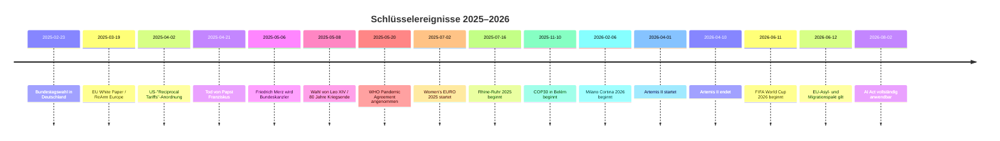

# RECHERCHE 2025/2025_Deep.md

## Executive Summary

Die Nachrichtenlage 2025/26 wird in entity["country","Deutschland","Bundesrepublik Deutschland"], in der entity["organization","Europäischen Union","politische und wirtschaftliche Union Europas"] und international von fünf übergreifenden Linien geprägt: erstens Regierungs- und Machtverschiebungen, zweitens Sicherheits- und Kriegsfragen, drittens die Rückkehr harter Industrie-, Handels- und Finanzpolitik, viertens der Übergang von „AI-Hype“ zu konkreter Regulierung und fünftens eine verdichtete Jubiläums- und Erinnerungspolitik. In Deutschland dominieren die entity["event","Bundestagswahl 2025","Wahl zum 21. Deutschen Bundestag"], der Regierungswechsel zu entity["politician","Friedrich Merz","Bundeskanzler Deutschlands"], die Reform der Schuldenregeln samt Infrastruktur-Sondervermögen, die AfD-/Verfassungsschutz-Frage sowie der Ausbau von Verteidigung und Ukraine-Unterstützung. Auf EU-Ebene sind ReArm Europe/Readiness 2030, die Umsetzung des Asylpakts, die KI-Regulierung, das Wettbewerbs- und Industrieprogramm sowie der 2040-Klimapfad die tragenden Dossiers. International sind die zweite Präsidentschaft von entity["politician","Donald Trump","47. Präsident der Vereinigten Staaten"], Handelskonflikte, die fortdauernden Kriege in Ukraine, Gaza und Sudan, die Wahl von entity["people","Pope Leo XIV","Robert Francis Prevost, Papst"], das WHO-Pandemieabkommen, entity["event","COP30","UN-Klimakonferenz 2025 in Belém"] und die entity["sports_event","2026 FIFA World Cup","Herren-Weltmeisterschaft in Kanada, Mexiko und USA"] die dauerhaft quiz- und rechercherelevantesten Themenfelder. citeturn38search0turn39search0turn5search1turn12search12turn12search2turn25search8turn25search3turn25search6turn30search3turn29search1

Für spätere Quizfragen ist methodisch wichtig: Besonders bei Wirtschaftsprognosen, Konfliktlagen, EU-Implementierungsfristen und für 2026 noch bevorstehenden Ereignissen sollte jede Frage mit Datum, Institution und Bezugsstand formuliert werden, weil sich Zahlen und Rechtsstände zwischen Frühjahr 2025 und Frühjahr 2026 mehrfach verschoben haben. Wo Entscheidungen noch nicht endgültig sind oder 2026 erst anstehen, ist das unten ausdrücklich als offen, strittig oder „unspezifiziert“ markiert. citeturn6search22turn6search1turn15search7turn14search2turn12search14

## Deutschland

### Innenpolitik, Finanz- und Wirtschaftspolitik, Sicherheit

**Bundestagswahl 2025 und Regierungswechsel**

**Kurzbeschreibung:** Die Bundestagswahl vom 23. Februar 2025 brachte ein stark fragmentiertes Parteiensystem hervor; CDU und CSU wurden stärkste Kraft, die AfD wurde zweitstärkste Kraft, die SPD fiel deutlich zurück. Am 6. Mai 2025 wurde entity["politician","Friedrich Merz","Bundeskanzler Deutschlands"] im zweiten Wahlgang zum Bundeskanzler gewählt; der Koalitionsvertrag von CDU, CSU und SPD trägt den Titel „Verantwortung für Deutschland“. citeturn38search0turn38search1turn39search0turn40search2

**Relevanz/Impact:** Das Thema ist politisch maximal relevant, weil es die gesamte innenpolitische Achse 2025/26 definiert: Regierungsfähigkeit, Oppositionsrolle der AfD, Stabilität der neuen Koalition und die Richtung in Wirtschafts-, Migrations- und Sicherheitspolitik. Medial wichtig ist vor allem, dass Merz erst im zweiten Wahlgang gewählt wurde – ein ungewöhnlich konfliktbeladener Start in die Legislatur. citeturn39search0turn39search4turn40search11

**Zeitliche Einordnung:** Wahl am 23. Februar 2025; endgültiges Wahlergebnis am 14. März 2025; Koalitionsvertrag vorgestellt am 9. April 2025 und unterzeichnet am 5. Mai 2025; Kanzlerwahl am 6. Mai 2025. citeturn38search0turn40search2turn39search0

**Primärquellen/Belege:** urlBundeswahlleiterin – Endgültiges Ergebnis der Bundestagswahl 2025turn38search0; urlBundeswahlleiterin – Bundesergebnis und Sitzverteilungturn38search4; urlBundestag – Kanzlerwahl Friedrich Merzturn39search0; urlBundesregierung – Koalitionsvertrag 2025turn40search2

**Mögliche Quizfragen/Fragentypen:** Wer wurde am 6. Mai 2025 im zweiten Wahlgang zum Bundeskanzler gewählt? Welche drei Parteien unterzeichneten den Koalitionsvertrag „Verantwortung für Deutschland“? Wie hoch war die Wahlbeteiligung bei der Bundestagswahl 2025?

**Schuldenbremse-Reform und 500-Milliarden-Sondervermögen**

**Kurzbeschreibung:** Im März 2025 beschloss der Bundestag die verfassungsrechtlichen Voraussetzungen für eine weitreichende Neuordnung der Fiskalpolitik: Verteidigungs- und bestimmte sicherheitspolitische Ausgaben oberhalb einer definierten Schwelle werden erleichtert, zugleich wurde ein Sondervermögen von bis zu 500 Milliarden Euro für zusätzliche Investitionen in Infrastruktur und Klimaneutralität angelegt. 2025/26 wurde daraus eine zentrale Erzählung von „Investitionsoffensive“ und staatlicher Handlungsfähigkeit. citeturn5search1turn5search6turn8search13turn5search5

**Relevanz/Impact:** Das ist einer der politisch und ökonomisch größten Einschnitte seit Jahren, weil sich damit die Finanzierungslogik des Staates verändert: mehr Spielraum für Verteidigung, Verkehr, Netze, Schulen, Krankenhaus- und Digitalinfrastruktur. Gesellschaftlich wird daran die Glaubwürdigkeit gemessen, ob Politik jenseits der Debatte tatsächlich sichtbare Modernisierung liefern kann. citeturn5search5turn5search13turn8search5

**Zeitliche Einordnung:** Grundgesetzänderung im März 2025; einfachgesetzliche Grundlage im Juli und September 2025; operative Nutzung des Sondervermögens ab Herbst 2025, mit fortlaufender Umsetzung 2026. citeturn5search1turn5search6turn5search16turn5search8

**Primärquellen/Belege:** urlBundestag – Mehrheit für Reform der Schuldenbremseturn5search1; urlBundestag – Gesetz zum Sondervermögen Infrastruktur und Klimaneutralitätturn5search6; urlBundesregierung – Investitionsoffensive und Sondervermögenturn5search5

**Mögliche Quizfragen/Fragentypen:** Wie hoch ist das neue Sondervermögen für Infrastruktur und Klimaneutralität? Welche zwei großen Politikfelder verknüpft die Reform besonders eng? Warum ist die Reform auch für die Verteidigungspolitik entscheidend?

**Wachstumsschwäche, Reformdruck und neue Konjunkturerzählung**

**Kurzbeschreibung:** Die deutsche Wirtschaft blieb 2025 in einer Schwächephase, und offizielle Prognosen wurden mehrfach nach unten angepasst oder nur zögerlich verbessert. Im Frühjahr 2025 rechnete die Bundesregierung für 2025 mit Stagnation, im Frühjahr 2026 für 2026 nur mit 0,5 Prozent Wachstum; die Bundesbank und der Sachverständigenrat sahen ebenfalls nur eine langsame Erholung. citeturn6search22turn6search1turn6search19turn6search14

**Relevanz/Impact:** Dieses Thema ist für fast jede spätere Quizfrage anschlussfähig, weil es Steuer-, Sozial-, Industrie-, Handel- und Arbeitsmarktpolitik zusammenbindet. Medial wirkt es als Dauerhintergrund aller Debatten über Energiepreise, Bürokratieabbau, Investitionsanreize, Autoindustrie und Standortpolitik. citeturn6search0turn6search8turn6search10

**Zeitliche Einordnung:** Jahreswirtschaftsbericht Januar 2025; Frühjahrsprojektion 2025 im April 2025; neue Regierungsprognose 2026 im Januar 2026; laufende Revisionen bis Frühjahr 2026. citeturn6search0turn6search22turn6search1

**Primärquellen/Belege:** urlBMWE – Jahreswirtschaftsbericht 2025turn6search0; urlBMWE – Konjunktur und Wachstum / Frühjahrsprojektion 2026turn6search1; urlBundesbank – Deutschland-Prognose Juni 2025turn6search19; urlSachverständigenrat – Frühjahrsgutachten 2025turn6search14

**Mögliche Quizfragen/Fragentypen:** Mit welchem Wort beschreibt die Bundesregierung ihre Erwartung für das reale BIP 2025? Welche Institution prognostizierte für 2026 0,5 Prozent Wachstum? Warum sind institutionenbezogene Datumsangaben bei Konjunkturfragen wichtig?

**Ukraine-Unterstützung, Litauen-Brigade und Verteidigungsausbau**

**Kurzbeschreibung:** Deutschland koppelte 2025/26 seine nationale Sicherheitsdebatte enger an die NATO-Ostflanke und die Unterstützung für die Ukraine. Die Brigade Litauen erreichte im Mai 2025 einen entscheidenden Aufstellungsmeilenstein; zugleich stiegen die geplanten Verteidigungsausgaben 2026 auf 108,2 Milliarden Euro. Die Bundesregierung bezeichnete Deutschland 2026 als wichtigsten bilateralen Partner der Ukraine. citeturn36search0turn36search6turn36search2turn36search16

**Relevanz/Impact:** Sicherheitspolitisch wird hier die „Zeitenwende“ in dauerhafte Struktur übersetzt: nicht mehr nur Sonderbeschaffungen, sondern Truppenpräsenz, Haushaltsprioritäten und europäische Führungsrolle. Für Quizformate ist besonders ergiebig, dass Deutschland gleichzeitig Helfer der Ukraine, Rüstungsausbauer und Standort militärischer Reorganisation ist. citeturn36search1turn36search8turn36search16

**Zeitliche Einordnung:** Aufstellungsappell der Brigade Litauen am 22. Mai 2025; Integration der Brigade-Struktur ab 2025/26; Verteidigungshaushalt 2026 im Herbst 2025 beschlossen; deutsch-ukrainische Regierungskonsultationen im April 2026. citeturn36search0turn36search8turn36search16

**Primärquellen/Belege:** urlBMVg – Brigade Litauen: Aufstellungsappell in Vilniusturn36search0; urlBMVg – anerkannte Missionen / Brigade Litauen ab 2026turn36search6; urlBundestag – Etat 2026: Verteidigungsausgaben 108,2 Milliarden Euroturn36search2; urlBundesregierung – So unterstützt Deutschland die Ukraineturn36search1

**Mögliche Quizfragen/Fragentypen:** In welchem Land stationiert Deutschland eine Brigade mit rund 5.000 Soldatinnen und Soldaten? Wie hoch sind die geplanten deutschen Verteidigungsausgaben 2026? Warum ist die Litauen-Brigade symbolisch mehr als nur ein Auslandseinsatz?

### Wissenschaft, Technologie, Klima, Gesellschaft

**Elektronische Patientenakte für alle**

**Kurzbeschreibung:** Die bundesweite Einführung der ePA wurde 2025 vom Pilot- in den Regelbetrieb überführt: Testphase ab 15. Januar 2025, bundesweiter Rollout ab 29. April 2025, verpflichtende Nutzung für Leistungserbringer ab 1. Oktober 2025. Damit wurde eines der sichtbarsten Digitalisierungsprojekte des deutschen Gesundheitswesens in den Alltag geschoben. citeturn7search2turn7search6turn7search0

**Relevanz/Impact:** Gesellschaftlich und journalistisch ist die ePA ein Paradigma-Thema, weil sich daran Datenschutz, Versorgungseffizienz, digitale Kompetenz des Staates und Akzeptanz von Opt-out-Systemen bündeln. Für spätere Quizfragen ist die Dreiteilung Pilot – Rollout – Pflicht besonders dankbar. citeturn7search2turn7search3

**Zeitliche Einordnung:** 15. Januar 2025 Teststart; 29. April 2025 bundesweiter Rollout; 1. Oktober 2025 Pflichtnutzung. citeturn7search2turn7search6turn7search0

**Primärquellen/Belege:** urlBundesregierung – FAQ zur ePA für alleturn7search2; urlBMG – ePA für alle startet morgenturn7search6; urlBMG – Die elektronische Patientenakte für alleturn7search0; urlgematik – bundesweite Einführung startet am 29. April 2025turn7search1

**Mögliche Quizfragen/Fragentypen:** Ab wann wurde die ePA bundesweit verpflichtend? Welches Datum markiert den bundesweiten Rollout? Warum ist die ePA mehr als nur ein IT-Projekt?

**Klimaziele, Emissionen und investive Klimapolitik**

**Kurzbeschreibung:** Die deutsche Klimageschichte 2025/26 ist doppeldeutig: Das Umweltbundesamt sah die 2030-Ziele auf Basis der Projektionen 2025 grundsätzlich erreichbar, gleichzeitig sanken die Emissionen 2025 laut UBA nur noch marginal und der klimapolitische Handlungsdruck blieb hoch. Parallel wurde Klimaneutralität bis 2045 stärker mit Infrastruktur- und Haushaltsfragen verknüpft. citeturn8search7turn8search10turn8search2

**Relevanz/Impact:** Politisch ist das relevant, weil sich damit das Framing ändert: weniger reine Zieldebatte, mehr Debatte über Umsetzungsgeschwindigkeit, Investitionspfade und gesellschaftliche Akzeptanz. Medial ist gerade die Spannung wichtig zwischen „Ziele noch erreichbar“ und „neuer Schub nötig“. citeturn8search10turn8search18turn8search11

**Zeitliche Einordnung:** Projektionsbericht und Zielbewertung im März 2025; finale 2024er Emissionsdaten im Januar/März 2026; 2025er Emissionstrend im März 2026 kommuniziert. citeturn8search18turn8search4turn8search10

**Primärquellen/Belege:** urlUmweltbundesamt – Treibhausgasminderungsziele Deutschlandsturn8search7; urlUmweltbundesamt – Klimadaten 2025 brauchen neuen Schubturn8search10; urlBundesregierung – Sondervermögen und Klimaneutralität 2045turn8search2

**Mögliche Quizfragen/Fragentypen:** Welche Behörde erklärte 2025 die deutschen 2030-Klimaziele auf Basis von Projektionen für erreichbar? Warum blieb Klimaschutz 2026 trotzdem ein Problemthema? Wie hängt das Sondervermögen mit Klimaneutralität zusammen?

**Jahrestage: 80 Jahre Kriegsende und 35 Jahre Deutsche Einheit**

**Kurzbeschreibung:** 2025 verdichtete die deutsche Erinnerungspolitik zwei große Achsen: den 80. Jahrestag des Endes des Zweiten Weltkriegs am 8. Mai und 35 Jahre Deutsche Einheit. Beide Jubiläen wurden nicht nur historisch, sondern ausdrücklich demokratie- und gegenwartsbezogen gerahmt – mit Blick auf Krieg in Europa, Antisemitismus, Diktaturerfahrung und die Frage nach innerem Zusammenhalt. citeturn9search9turn9search6turn9search4

**Relevanz/Impact:** Diese Jahrestage sind quizrelevant, weil sie nicht nur Daten liefern, sondern Deutungswissen: „Befreiung“, „Erinnerungsorte“, SED-Diktatur, Ost-West-Debatten, Gegenwartsbezüge zur Ukraine. Gerade solche Jubiläen strukturieren politische Redeanlässe und mediale Sonderformate. citeturn9search6turn9search4turn9search13

**Zeitliche Einordnung:** 8. Mai 2025; Debatten um 35 Jahre Deutsche Einheit vor allem im Oktober 2025. citeturn9search6turn9search4

**Primärquellen/Belege:** urlBundesregierung – 80 Jahre Ende des Zweiten Weltkriegesturn9search9; urlBundesregierung – Gedenkstunde im Bundestag am 8. Mai 2025turn9search6; urlBundestag – 35 Jahre Deutsche Einheit: Freiheit in Deutschland und Europa festigenturn9search4

**Mögliche Quizfragen/Fragentypen:** Welches Jubiläum wurde am 8. Mai 2025 in Deutschland begangen? Welche Zahl markierte 2025 die Deutsche Einheit? Warum wurden beide Jahrestage mit aktueller Demokratie- und Sicherheitspolitik verknüpft?

### Recht, Justiz, Medien, Sport, Persönlichkeiten

**AfD, Verfassungsschutz und juristische Unschärfe**

**Kurzbeschreibung:** Die Auseinandersetzung um die AfD blieb 2025/26 eines der dominantesten deutschen Meta-Themen. Nach der öffentlichen Hochstufung durch das Bundesamt für Verfassungsschutz am 2. Mai 2025 als „gesichert rechtsextremistische Bestrebung“ wurde der weitere öffentliche Umgang gerichtlich umkämpft; zugleich blieb die Partei in den Verfassungsschutz- und Demokratiedebatten zentral. Der endgültige Rechtsstand ist für 2026 weiterhin nicht vollständig abgeschlossen und daher teilweise **unspezifiziert**. citeturn2search1turn41search4turn41search1

**Relevanz/Impact:** Politisch geht es um die Grenzziehung des demokratischen Verfassungsstaats, gesellschaftlich um Normalisierung oder Isolation, medial um Sprache, Framing und Reichweite. Für Quizformate ist entscheidend, strikt zwischen „Verdachtsfall“, „gesichert rechtsextremistisch“ und „gerichtlich umstritten“ zu unterscheiden. citeturn2search1turn41search4turn41search3

**Zeitliche Einordnung:** Frühere Verdachtsfallbestätigung 2024; öffentliche Hochstufung am 2. Mai 2025; fortgesetzte Verfahren 2025/26. citeturn41search4turn2search1

**Primärquellen/Belege:** urlVG Köln – Verfahren zur Einstufung der AfD 2026turn2search1; urlBfV – OVG NRW bestätigt 2024 Verdachtsfall-Einstufungturn41search4; urlBfV – Rechtsextremismus 2024/2025 Überblickturn41search1

**Mögliche Quizfragen/Fragentypen:** Welche Formulierung ist juristisch präziser: Verdachtsfall oder gesichert rechtsextremistisch? Warum ist bei AfD-Fragen 2025/26 der genaue Verfahrensstand entscheidend? Welche Behörde steht im Zentrum der Debatte?

**COMPACT-Urteil als Testfall der wehrhaften Demokratie**

**Kurzbeschreibung:** Das Bundesverwaltungsgericht machte 2025 den Fall des verbotenen COMPACT-Magazins zum Schlüsselthema für das Verhältnis von Vereinsrecht, Extremismusbekämpfung und Pressefreiheit. Der Fall ist ein Musterbeispiel dafür, wie Deutschland die Grenzen der wehrhaften Demokratie praktisch austestet. citeturn4search0

**Relevanz/Impact:** Der Fall ist für Recht, Medien und politische Kommunikation gleichermaßen wichtig, weil er zeigt, wie schwierig die Trennlinie zwischen publizistischer Tätigkeit, Organisation und verfassungsfeindlicher Bestrebung gezogen wird. Für spätere Quizfragen eignet er sich besonders als Urteils- und Begriffsfrage. citeturn4search0

**Zeitliche Einordnung:** 2024 wurde das Verbot politisch gesetzt; 2025 stand die gerichtliche Klärung im Zentrum. citeturn4search0

**Primärquellen/Belege:** urlBundesverwaltungsgericht – COMPACT-Magazin Urteil 2025turn4search0

**Mögliche Quizfragen/Fragentypen:** Welches Medium wurde 2025 zum zentralen Präzedenzfall zwischen Pressefreiheit und wehrhafter Demokratie? Welche zwei Rechtsgüter prallen im COMPACT-Fall besonders aufeinander?

**Sport und Großereignisse: Rhine-Ruhr 2025 als deutscher Host-Moment**

**Kurzbeschreibung:** Die Rhine-Ruhr 2025 FISU World University Games vom 16. bis 27. Juli 2025 machten Deutschland zum Gastgeber eines der größten Multisportevents des Jahres. Austragungsorte waren mehrere Ruhrgebietsstädte plus Berlin; beteiligt waren Tausende Athletinnen und Athleten aus über 100 Ländern. citeturn10search0turn10search1turn10search8

**Relevanz/Impact:** Sportjournalistisch ist das Ereignis als deutsches Sommer-Schaufenster wichtig; kultur- und regionalpolitisch war es eine Bühne für das Ruhrgebiet als Event-, Campus- und Transformationsraum. Für Quizfragen bietet es saubere Faktenanker: Zeitraum, Gastgeberregion, Format, Teilnehmerdimension. citeturn10search0turn10search21

**Zeitliche Einordnung:** 16. bis 27. Juli 2025. citeturn10search0turn10search12

**Primärquellen/Belege:** urlFISU – Rhine-Ruhr 2025turn10search0; urlRhine-Ruhr 2025 – offizielle Seiteturn10search1

**Mögliche Quizfragen/Fragentypen:** In welcher Region fanden die FISU World University Games 2025 statt? Welcher Zeitraum markierte das Event? Warum ist das Turnier auch kulturpolitisch interessant?

**Personen im Fokus in Deutschland**

Für spätere Quizfragen sind in Deutschland besonders vier Namen belastbar: entity["politician","Friedrich Merz","Bundeskanzler Deutschlands"] als Kanzler und Gesicht des Regierungswechsels; entity["politician","Alice Weidel","Vorsitzende der AfD-Bundestagsfraktion"] als zentrale Oppositionsfigur; Lars Klingbeil als SPD-Schlüsselakteur in Koalition und Finanzpolitik; Ruth Brand als Bundeswahlleiterin und Referenzperson für Wahlfakten. Diese Personen sind nicht einfach „prominent“, sondern tragen je eigene Quizachsen: Regierungsbildung, Opposition, Haushalts- und Investitionspolitik, Wahladministration. citeturn39search2turn39search12turn5search9turn38search0

## Europa

### Innenpolitik, Außenpolitik, Sicherheit, Wirtschaft

**ReArm Europe/Readiness 2030**

**Kurzbeschreibung:** Die EU-Kommission und die Hohe Vertreterin präsentierten im März 2025 das Weißbuch für europäische Verteidigung und den Plan ReArm Europe/Readiness 2030. Ziel ist ein massiver Investitions- und Fähigkeitsaufwuchs; mit SAFE wurde ein zentraler Finanzierungsbaustein benannt, der laut Kommission insgesamt über 800 Milliarden Euro an Verteidigungsausgaben ermöglichen soll. citeturn12search12turn12search20turn12search8

**Relevanz/Impact:** Das Thema ist für Europa 2025/26 fast so grundlegend wie Eurokrise oder Green Deal in früheren Zyklen: Die EU definiert sich stärker als sicherheits- und rüstungsfähiger Akteur. Medial hoch relevant ist, dass die Debatte nicht mehr nur normativ geführt wird, sondern in sehr konkreten Instrumenten, Finanzhebeln und Fähigkeitsprojekten. citeturn12search12turn12search16

**Zeitliche Einordnung:** Präsentation des Weißbuchs am 19. März 2025; Konkretisierung über SAFE und die Readiness Roadmap im Laufe von 2025. citeturn12search0turn12search20turn12search8

**Primärquellen/Belege:** urlEU-Kommission – White Paper for European Defence / Readiness 2030turn12search0; urlEU-Kommission – Questions and answers zu ReArm Europe/Readiness 2030turn12search4; urlEU-Kommission – SAFE / Security Action for Europeturn12search20

**Mögliche Quizfragen/Fragentypen:** Wie heißt der EU-Verteidigungsplan von 2025? Welche Jahreszahl steckt im strategischen Zielnamen? Welches Finanzinstrument ist als erster Pfeiler des Plans besonders wichtig?

**Ukraine: Sanktionen, Ukraine Facility und 90-Milliarden-Kredit**

**Kurzbeschreibung:** Die EU blieb 2025/26 zentraler geopolitischer und finanzieller Rückhalt der Ukraine. Im Februar 2025 verabschiedete sie das 16., im Mai 2025 das 17. Sanktionspaket gegen Russland; parallel lief die Ukraine Facility im Volumen von bis zu 50 Milliarden Euro weiter. Ende 2025/Frühjahr 2026 kam zusätzlich ein 90-Milliarden-Euro-Unterstützungskredit für 2026/27 auf die Agenda und in die Rechtsform. citeturn13search0turn13search1turn13search2turn13search3turn13search17

**Relevanz/Impact:** Dieses Dossier ist außenpolitisch und finanzpolitisch zugleich zentral. Für Quizfragen eignet es sich, weil man Sanktionen, Finanzhilfen, Ratsbeschlüsse und Europäische-Rat-Schlussfolgerungen relativ klar voneinander trennen kann. citeturn13search8turn13search11turn13search18

**Zeitliche Einordnung:** 16. Paket am 24. Februar 2025; 17. Paket am 20. Mai 2025; neue 90-Milliarden-Unterstützung im Dezember 2025 beschlossen und im April 2026 legislative finalisiert. citeturn13search0turn13search1turn13search3turn13search18

**Primärquellen/Belege:** urlRat der EU – 16. Sanktionspaketturn13search0; urlRat der EU – 17. Sanktionspaketturn13search1; urlEU-Kommission – The Ukraine Facilityturn13search2; urlRat der EU – Council finalises €90 billion support loan to Ukraineturn13search3

**Mögliche Quizfragen/Fragentypen:** Welches Sanktionspaket beschloss die EU am 24. Februar 2025? Wie hoch ist das Volumen der Ukraine Facility? Welche Zahl prägte die neue EU-Unterstützung für 2026/27?

**Clean Industrial Deal und der nächste EU-Haushalt**

**Kurzbeschreibung:** Mit dem Clean Industrial Deal vom 26. Februar 2025 verschob die Kommission den Fokus von reiner Klimaregulierung hin zu Wettbewerbsfähigkeit, Energiepreisen, sauberer Industrie und strategischer Autonomie. Parallel baute sie den nächsten langfristigen EU-Haushalt 2028–2034 schrittweise auf; im September 2025 wurde das Paket sektoraler Vorschläge vervollständigt. citeturn12search1turn12search5turn14search12turn14search18

**Relevanz/Impact:** Hier liegen die wirtschaftspolitischen Leitfragen Europas: Wie verbindet die EU Dekarbonisierung mit Industriepolitik, wie finanziert sie Sicherheit, Migration, Ukraine und Wettbewerbsfähigkeit zugleich, und wie stark wird der nächste MFF priorisieren statt breit verteilen? citeturn12search1turn14search12turn12search13

**Zeitliche Einordnung:** Clean Industrial Deal seit Februar 2025; Nachlieferung weiterer Maßnahmen im Juli 2025; MFF-Rahmen 2028–2034 bis September 2025 wesentlich konkretisiert. citeturn12search1turn12search5turn14search12

**Primärquellen/Belege:** urlEU-Kommission – Clean Industrial Dealturn12search1; urlEU-Kommission – Delivering on the Clean Industrial Deal Iturn12search5; urlEU-Kommission – EU budget 2028-2034turn14search12

**Mögliche Quizfragen/Fragentypen:** Wie heißt das industriepolitische Leitprojekt der Kommission von Februar 2025? Welcher längerfristige Finanzrahmen stand 2025/26 parallel auf der Agenda? Warum ist der Clean Industrial Deal mehr als Klimapolitik?

**Migration und Asyl: Der Pakt wird zur Vollzugsrealität**

**Kurzbeschreibung:** Das 2024 beschlossene Asyl- und Migrationspaket wechselte 2025/26 von der Gesetzgebung in die Umsetzung. Besonders wichtig: Der Pakt tritt am 12. Juni 2026 in Anwendung; Ende 2025 wurde die Solidaritätsarchitektur für 2026 politisch vereinbart, Anfang 2026 kamen zusätzliche Regeln zu sicheren Herkunfts- und Drittstaaten hinzu. citeturn14search2turn14search8turn14search11turn14search15

**Relevanz/Impact:** Für die EU ist das eines der innenpolitisch explosivsten Themen, weil daran Grenzverfahren, Rückführungen, Solidarität zwischen Mitgliedstaaten und Grundrechtsschutz hängen. Für Quizfragen ist vor allem das Datum des Inkrafttretens und der Unterschied zwischen Pakt, Solidaritätspool und Safe-Country-Regeln relevant. citeturn14search2turn14search8turn14search15

**Zeitliche Einordnung:** 8. Dezember 2025 Solidaritätspool; 23. Februar 2026 finale Zustimmung zu Safe-Country-Maßnahmen; 12. Juni 2026 Beginn der Anwendung des Pakts. citeturn14search2turn14search8

**Primärquellen/Belege:** urlRat der EU – Member states agree on solidarity poolturn14search2; urlRat der EU – Final greenlight for safe countries measuresturn14search8; urlRat der EU – Migration and asylum pact overviewturn14search11

**Mögliche Quizfragen/Fragentypen:** An welchem Datum beginnt die Anwendung des EU-Migrations- und Asylpakts? Was ist der Solidaritätspool? Welche Funktion hat die Safe-Country-Regelung?

### Wissenschaft, Technologie, Klima, Medien, Gesellschaft

**AI Act, DSA und europäische Demokratieabwehr**

**Kurzbeschreibung:** 2025/26 wurde aus Europas Digitalregulierung konkrete Praxis. Beim AI Act griffen die Verbote verbotener Praktiken ab 2. Februar 2025, Regeln für General-Purpose-AI-Modelle ab 2. August 2025 und die volle Geltung ist – vorbehaltlich späterer Anpassungen – für den 2. August 2026 angelegt. Parallel wurde der Verhaltenskodex gegen Desinformation in den DSA-Rahmen integriert; im November 2025 legte die Kommission zusätzlich den European Democracy Shield vor. citeturn12search2turn12search22turn12search10turn23search1turn23search17turn23search0

**Relevanz/Impact:** Das ist für Technik-, Medien- und Demokratiejournalismus ein Kernkomplex: Wie reguliert Europa KI, wie zwingt es Plattformen zu mehr Verantwortung und wie versucht es, Wahl- und Meinungsbildungsprozesse gegen Desinformation und ausländische Einflussnahme robuster zu machen? Medial wichtig ist, dass hier Rechtsdurchsetzung an die Stelle bloßer Leitlinien tritt. citeturn23search12turn23search6turn12search14

**Zeitliche Einordnung:** 2. Februar 2025 erste AI-Act-Anwendung; 13. Februar 2025 DSA-Code gegen Desinformation; 12. November 2025 Democracy Shield; 2. August 2026 volle AI-Act-Anwendbarkeit als Referenzdatum. citeturn12search2turn23search1turn23search0

**Primärquellen/Belege:** urlEU – AI Act timelineturn12search2; urlEU – GPAI Code of Practice / application from 2 August 2025turn12search22; urlEU-Kommission – DSA Code of Practice on Disinformationturn23search1; urlEU-Kommission – European Democracy Shieldturn23search6

**Mögliche Quizfragen/Fragentypen:** An welchem Datum begannen die Verbote verbotener KI-Praktiken im AI Act? Wann sollen die Regeln voll anwendbar sein? Wie heißt das EU-Paket gegen Desinformation und ausländische Einflussnahme vom November 2025?

**ECB, Inflation und vorsichtige Eurozonen-Erholung**

**Kurzbeschreibung:** Die EZB senkte im März und Juni 2025 die Leitzinsen um jeweils 25 Basispunkte; der Einlagensatz fiel dabei bis Juni 2025 auf 2,0 Prozent. Anfang 2026 hielt sie die Zinsen zunächst unverändert, während die Konjunktur robust, aber anfällig blieb und geopolitische Risiken – insbesondere aus dem Nahen Osten – wieder stärker auf die Inflationsdebatte durchschlugen. Für das Gesamtjahr 2025 schätzte Eurostat das Eurozonen-BIP auf plus 1,5 Prozent. citeturn15search15turn15search6turn15search0turn15search3turn15search8

**Relevanz/Impact:** Das ist der monetäre Unterbau fast aller europäischen Wirtschaftsfragen. Für Quizformate sind Zinsentscheidungen, Einlagensatz, Inflationsziel und die Differenz zwischen EZB-, Kommissions- und IWF-Prognosen besonders ergiebig. citeturn15search7turn15search16

**Zeitliche Einordnung:** 6. März 2025; 5. Juni 2025; 5. Februar 2026; 19. März 2026. citeturn15search15turn15search6turn15search0turn15search3

**Primärquellen/Belege:** urlEZB – Beschluss vom 6. März 2025turn15search15; urlEZB – Beschluss vom 5. Juni 2025turn15search6; urlEZB – Beschlüsse Anfang 2026turn15search0; urlEurostat – BIP-Wachstum 2025 im Euroraumturn15search8

**Mögliche Quizfragen/Fragentypen:** Auf welchen Wert sank der EZB-Einlagensatz im Juni 2025? Welche Institution schätzte das Eurozonen-Wachstum 2025 auf 1,5 Prozent? Warum wird Anfang 2026 wieder stärker über geopolitische Inflationsrisiken gesprochen?

**2040-Klimaziel und CBAM-Übergang in die Praxis**

**Kurzbeschreibung:** Die Kommission schlug im Juli 2025 eine Änderung des EU-Klimagesetzes vor, die ein 2040-Ziel von minus 90 Prozent Netto-Treibhausgasemissionen gegenüber 1990 gesetzlich verankern soll. Gleichzeitig lief der CBAM aus der Testphase in die definitive, ab 2026 wirksame Phase über – ein klassischer Fall, in dem Klima-, Handels- und Industriepolitik ineinander übergehen. citeturn22search0turn22search11turn22search10turn22search7

**Relevanz/Impact:** Politisch markiert das die europäische Post-2030-Debatte: Was folgt auf Fit-for-55, wie werden Industrie und Handel eingebunden, und wie teuer wird ambitionierte Klimapolitik im globalen Wettbewerbsumfeld? Für Quizfragen ist die Kombination aus „90 Prozent bis 2040“ und „CBAM ab 2026“ besonders prägnant. citeturn22search2turn22search14turn22search1

**Zeitliche Einordnung:** Juli 2025 Zielvorschlag; definitive CBAM-Phase ab Januar 2026. citeturn22search0turn22search10

**Primärquellen/Belege:** urlEU-Kommission – 2040 climate target proposalturn22search0; urlEU Climate Action – 2040 climate targetturn22search2; urlRat der EU / EU-Daten – CBAM definitive phase from 2026turn22search10

**Mögliche Quizfragen/Fragentypen:** Welches 2040-Ziel schlug die Kommission 2025 vor? Wofür steht die Abkürzung CBAM? Warum ist CBAM auch ein Handelsinstrument?

**Schengen, Schuman und europäische Erinnerungspolitik**

**Kurzbeschreibung:** 2025/26 war auch ein Jahr europäischer Selbstvergewisserung. Seit 1. Januar 2025 sind Bulgarien und Rumänien vollständig im Schengen-Raum; im Juni 2025 bekannte sich der Rat zum 40. Jahrestag des Schengen-Abkommens neu zum gemeinsamen Raum ohne Binnengrenzen. Europa-Tag 2025 markierte zugleich 75 Jahre Schuman-Erklärung, 2026 dann 76 Jahre sowie 40 Jahre der offiziellen Europe-Day-Feiern und des Beitritts von Spanien und Portugal. citeturn24search7turn24search1turn24search3turn24search5

**Relevanz/Impact:** Solche Jubiläen sind nicht nur symbolisch; sie strukturieren politische Redeweisen in Phasen geopolitischer Unsicherheit. Für Quizformate sind sie deshalb ideal, weil sie Datum, Ort, historische Erzählung und aktuelle EU-Selbstbeschreibung verbinden. citeturn24search14turn24search13

**Zeitliche Einordnung:** 1. Januar 2025; 9. Mai 2025; 12./13. Juni 2025; 9. Mai 2026. citeturn24search7turn24search3turn24search1turn24search5

**Primärquellen/Belege:** urlRat der EU – Schengen area explainedturn24search7; urlRat der EU – Schengen 40th anniversary declarationturn24search1; urlEU – Europe Day / Schuman Declarationturn24search5; urlEU – Schuman Declaration May 1950turn24search14

**Mögliche Quizfragen/Fragentypen:** Welche zwei Staaten wurden ab 1. Januar 2025 vollständig Teil des Schengen-Raums? Welches Jubiläum wurde am Europa-Tag 2025 gefeiert? Wie alt wurde Schengen im Jahr 2025?

### Sport, Großereignisse und Persönlichkeiten

**UEFA Women’s EURO 2025 und Milano Cortina 2026**

**Kurzbeschreibung:** Die entity["sports_event","UEFA Women's EURO 2025","Frauenfußball-Europameisterschaft in der Schweiz"] lief vom 2. bis 27. Juli 2025 in der Schweiz; das Finale fand in Basel statt. Unmittelbar danach richtete sich der kontinentale Sportblick auf entity["sports_event","Milano Cortina 2026","Olympische und Paralympische Winterspiele 2026"] mit Olympischen Spielen vom 6. bis 22. Februar 2026 und Paralympics vom 6. bis 15. März 2026. citeturn11search5turn11search11turn29search2turn29search5

**Relevanz/Impact:** Beides sind europäische Großereignisse mit hoher grenzüberschreitender Medienwirkung. Für spätere Quizfragen eignen sich Austragungsländer, Finalorte, Turnierdauer und die Parallelität von Sport-, Tourismus- und Infrastrukturthemen. citeturn11search14turn29search2

**Zeitliche Einordnung:** Juli 2025; Februar und März 2026. citeturn11search5turn29search2

**Primärquellen/Belege:** urlUEFA – Women’s EURO 2025 in der Schweiz: Alle Paarungenturn11search5; urlUEFA – Alles Wissenswerte zu Women’s EURO 2025turn11search14; urlMilano Cortina 2026 – offizielle Ticketing-/Terminseiteturn29search5

**Mögliche Quizfragen/Fragentypen:** In welchem Land fand die Women’s EURO 2025 statt? In welchem Zeitraum wurden die Winterspiele Milano Cortina 2026 angesetzt? Welche Stadt war Austragungsort des EM-Finales?

**Personen im Fokus in Europa**

Die europäische Personallogik 2025/26 konzentriert sich stark auf institutionelle Spitzenämter: entity["politician","Ursula von der Leyen","Präsidentin der Europäischen Kommission"] führt seit 1. Dezember 2024 ihre zweite Kommissionsmandatsphase; entity["politician","António Costa","Präsident des Europäischen Rates"] steuert die Gipfelarchitektur; entity["politician","Kaja Kallas","Hohe Vertreterin der EU für Außen- und Sicherheitspolitik"] prägt Außen- und Sanktionspolitik; entity["people","Christine Lagarde","Präsidentin der Europäischen Zentralbank"] bleibt der wichtigste Name für Geldpolitik. Für Quizformate sind diese Rollen sauber unterscheidbar – Kommission, Rat, Außenpolitik, EZB. citeturn37search12turn37search5turn37search2turn37search7

## International

### Innen- und Außenpolitik, Wirtschaft, Konflikte

**Trump II: Präsidentschaft, Grenzpolitik und Zollwende**

**Kurzbeschreibung:** Mit der Vereidigung von entity["politician","Donald Trump","47. Präsident der Vereinigten Staaten"] am 20. Januar 2025 begann eine zweite Trump-Präsidentschaft, die von Beginn an auf Exekutivmacht, Grenzpolitik, Souveränitätsrhetorik und Zollpolitik setzte. Schon am 20. Januar 2025 erklärte das Weiße Haus den nationalen Notstand an der Südgrenze; am 2. April 2025 folgte die große Anordnung zu „reciprocal tariffs“, die später mehrfach modifiziert wurde. citeturn35search3turn35search5turn25search8turn25search0turn25search4

**Relevanz/Impact:** Diese Politik ist globaler Hauptstoff, weil sie Handelsketten, Wechselkurse, Verbündetenbeziehungen, Migrationspolitik und die Sicherheitsarchitektur gleichzeitig beeinflusst. Für Quizformate eignen sich besonders Daten, Titel von Executive Orders und der Zusammenhang zwischen innenpolitischen Notstandsnarrativen und außenwirtschaftlichen Maßnahmen. citeturn35search0turn35search8turn25search8

**Zeitliche Einordnung:** 20. Januar 2025 Amtsantritt; 20. Januar 2025 Grenz-Notstand; 2. April 2025 reziproke Zölle; weitere Modifikationen bis 2026. citeturn35search3turn35search5turn25search8turn25search4

**Primärquellen/Belege:** urlWhite House – Swearing-In Ceremony of Donald J. Trumpturn35search3; urlWhite House – National Emergency at the Southern Borderturn35search5; urlWhite House – Reciprocal Tariff Executive Order vom 2. April 2025turn25search8

**Mögliche Quizfragen/Fragentypen:** An welchem Datum wurde Donald Trump als 47. Präsident vereidigt? Welche zwei Politikfelder setzte die zweite Trump-Präsidentschaft sofort auf die Agenda? Wie heißt die zentrale Zollanordnung vom 2. April 2025?

**Globale Wirtschaft zwischen Zollschock und Kriegsrisiko**

**Kurzbeschreibung:** Die internationale Konjunkturerzählung 2025/26 wurde stark von Handelskonflikten und geopolitischen Krisen geprägt. Der IMF rechnete im April 2026 – unter der Annahme eines begrenzten Nahostkriegs – nur noch mit 3,1 Prozent Weltwachstum 2026; die WTO beschrieb 2025/26 als Phase atypischer Handelsbewegung, in der Vorzieheffekte, Zölle und Unsicherheit das Muster des Welthandels veränderten und 2026 bremsten. citeturn25search1turn25search13turn28search3turn28search1

**Relevanz/Impact:** Das ist wirtschaftsjournalistisch ein Meta-Thema, weil sich hier Währung, Inflation, Lieferketten, Industriepolitik und Geopolitik kreuzen. Für spätere Quizfragen sind Institution, Veröffentlichungsmonat und Basisszenario immer mitzufragen, weil IWF- und WTO-Zahlen stark vom zugrunde gelegten Szenario abhängen. citeturn28search2turn28search19turn25search17

**Zeitliche Einordnung:** WTO-Handelswarnung im April 2025, WTO-Update im März/Oktober 2025 und März 2026; IMF-WEO im Juli 2025 und April 2026. citeturn28search1turn28search3turn28search18turn25search1

**Primärquellen/Belege:** urlIMF – World Economic Outlook April 2026turn25search1; urlWTO – Global Trade Outlook and Statistics March 2026turn28search3; urlWTO – Temporary tariff pause mitigates trade contractionturn28search1

**Mögliche Quizfragen/Fragentypen:** Welche Organisation prognostizierte 2026 3,1 Prozent Weltwachstum? Welche Organisation sprach 2025/26 von starken Auswirkungen von Zöllen und Unsicherheit auf den Welthandel? Warum sollte man in Quizfragen immer die Institution nennen?

**Konfliktbogen 2025/26: Ukraine, Gaza, Sudan, DR Kongo**

**Kurzbeschreibung:** International relevant bleiben vor allem vier Konflikträume: die Ukraine als europäischer Krieg mit globaler Finanz- und Sicherheitswirkung, Gaza als humanitäre und völkerrechtliche Dauerkrise, Sudan als größte humanitäre Notlage der Gegenwart und der Osten der Demokratischen Republik Kongo als eskalierender, aber im deutschsprachigen Mainstream oft untererzählter Konfliktraum. Die folgenden Konflikte eignen sich besonders für Vergleichsfragen, weil sie sehr unterschiedliche Muster von Krieg, Vertreibung, Diplomatie und Medienaufmerksamkeit zeigen. citeturn26search14turn26search4turn26search1turn26search3

**Relevanz/Impact:** Politisch geht es um Sicherheit, Flucht, humanitäre Hilfe und internationales Recht; medial um asymmetrische Aufmerksamkeit. Für Quizformate sind Größenordnungen der Vertreibung, Art des Konflikts und beteiligte Institutionen besonders geeignet. citeturn26search26turn26search16turn26search5turn26search11

**Zeitliche Einordnung:** fortlaufend 2025/26; in der aktuellen Recherche bis Frühjahr 2026. citeturn26search14turn26search0turn26search1turn26search3

**Primärquellen/Belege:** urlUNHCR – Ukraine Situation 2025/26turn26search18; urlOCHA oPt – Humanitarian Situation Report 7 May 2026turn26search4; urlOCHA – Sudan Humanitarian Needs and Response Plan 2026turn26search1; urlOCHA – Democratic Republic of the Congo overviewturn26search3

**Mögliche Quizfragen/Fragentypen:** Welcher Konflikt galt 2026 laut OCHA als die weltweit größte humanitäre Notlage? In welchem Konfliktraum sprach OCHA im Mai 2026 weiterhin von massiver Binnenvertreibung und prekärer Wasser- und Gesundheitslage? Welcher Konflikt prägt in Europa weiterhin Flucht- und Sicherheitsdebatten am stärksten?

### Persönlichkeiten, Jahrestage, Wissenschaft, Klima, Recht, Medien, Sport

**Vatikan nach Franziskus: Tod des Papstes und Wahl Leos XIV.**

**Kurzbeschreibung:** entity["people","Pope Francis","Jorge Mario Bergoglio, Papst"] starb am 21. April 2025 im Alter von 88 Jahren; am 8. Mai 2025 wählte das Konklave Robert Francis Prevost zu entity["people","Pope Leo XIV","Robert Francis Prevost, Papst"]. Das machte 2025 zu einem außergewöhnlichen Vatikanjahr, weil das Heilige Jahr 2025 pontifikatsübergreifend verlief. citeturn32search0turn32search1turn25search3turn25search7turn32search12

**Relevanz/Impact:** Der Papstwechsel ist international, religiös, kulturell und politisch relevant. Für Quizfragen bieten sich Name, Datum, Geburtsname, Altersangabe, Wahl- und Todesdatum sowie der Kontext des Jubiläumsjahres an. citeturn32search5turn25search11

**Zeitliche Einordnung:** 21. April 2025 Tod von Franziskus; 26. April 2025 Begräbnis; 8. Mai 2025 Wahl Leos XIV. citeturn32search1turn32search5turn25search3

**Primärquellen/Belege:** urlVatican News – Pope Francis has diedturn32search0; urlHoly See Press Office – Declaration of the death of Francisturn32search1; urlVatican News – Leo XIV is the new Popeturn25search3

**Mögliche Quizfragen/Fragentypen:** Wann starb Papst Franziskus? Welchen Papstnamen nahm Robert Francis Prevost an? Warum war das Jubiläumsjahr 2025 im Vatikan besonders außergewöhnlich?

**WHO Pandemic Agreement**

**Kurzbeschreibung:** Die Weltgesundheitsversammlung verabschiedete am 20. Mai 2025 das WHO Pandemic Agreement. Zugleich hielt die Resolution fest, dass der Vertrag erst nach weiteren Verfahrensschritten für Unterzeichnung und Ratifikation geöffnet wird; damit ist das Abkommen ein historischer, aber institutionell noch nicht vollständig abgeschlossener Meilenstein. citeturn25search6turn25search10turn25search14

**Relevanz/Impact:** Das ist ein Kernbaustein globaler Gesundheitsgovernance nach COVID-19. Journalistischer Mehrwert entsteht aus der Kombination von Symbolik („historisch“) und juristischer Nüchternheit (weiterer Abschluss- und Ratifikationsbedarf). citeturn25search2turn25search18

**Zeitliche Einordnung:** Annahme am 20. Mai 2025; Folgearbeiten 2025/26. citeturn25search6turn25search14

**Primärquellen/Belege:** urlWHO – World Health Assembly adopts historic Pandemic Agreementturn25search6; urlWHO – Pandemic Agreement topic pageturn25search2; urlWHO – Resolution WHA78.1turn25search10

**Mögliche Quizfragen/Fragentypen:** An welchem Datum wurde das WHO-Pandemieabkommen angenommen? Warum ist „angenommen“ nicht automatisch gleichbedeutend mit „voll in Kraft“? Welche Weltorganisation ist Trägerin des Abkommens?

**Artemis II**

**Kurzbeschreibung:** Mit Artemis II startete am 1. April 2026 erstmals seit rund 50 Jahren wieder eine bemannte Mondumrundung der NASA. Die Mission dauerte knapp zehn Tage und endete am 10. April 2026 mit der Wasserung im Pazifik – ein technologischer Symbolmoment für die Rückkehr bemannter Mondmissionen. citeturn31search0turn31search16turn31search12

**Relevanz/Impact:** Wissenschaftlich ist Artemis II ein seltenes Großereignis mit langfristiger Raumfahrtbedeutung; medial eignet es sich ideal für Quiz und Jahresrückblicke, weil es ein klar datierbarer technischer Meilenstein ist. citeturn31search8turn31search14

**Zeitliche Einordnung:** 1. bis 10. April 2026. citeturn31search0turn31search12

**Primärquellen/Belege:** urlNASA – Artemis II mission pageturn31search0; urlNASA – Mission milestones recapturn31search16

**Mögliche Quizfragen/Fragentypen:** Welche NASA-Mission brachte 2026 Menschen wieder um den Mond? Wann startete Artemis II? Warum gilt die Mission als Schritt in Richtung langfristiger Mond- und Marsprogramme?

**COP30, NDC 3.0 und neue Klimadiplomatie**

**Kurzbeschreibung:** entity["event","COP30","UN-Klimakonferenz 2025 in Belém"] fand vom 10. bis 21. November 2025 in Belém statt; der Staats- und Regierungschef-Gipfel war auf den 6. und 7. November 2025 vorgezogen. Parallel war 2025 die neue NDC-Runde („NDC 3.0“) fällig; aus COP30 gingen auch Roadmaps etwa zum fossilen Ausstieg und zu Wäldern hervor. citeturn30search3turn30search1turn30search11turn30search12

**Relevanz/Impact:** Das ist das wichtigste globale Klimadiplomatie-Cluster 2025. Für Quizfragen sind Ort, Zeitraum, Gastgeberland, die Rolle des Amazonas-Raums und der Zusammenhang mit den neuen NDCs besonders geeignet. citeturn30search0turn30search2turn30search9

**Zeitliche Einordnung:** Gipfel am 6./7. November 2025; COP30 vom 10. bis 21. November 2025; Nachbereitung 2026. citeturn30search1turn30search3turn30search15

**Primärquellen/Belege:** urlUNFCCC – COP30 participant information and datesturn30search3; urlCOP30 Brasil – summit dates 6 and 7 November 2025turn30search1; urlUNFCCC – NDCs and 2025 NDC cycleturn30search11

**Mögliche Quizfragen/Fragentypen:** In welcher Stadt fand COP30 statt? Welche Abkürzung bezeichnet die 2025 fällige neue Runde nationaler Klimapläne? Warum war Belém als Austragungsort symbolisch besonders aufgeladen?

**UN80 sowie Hiroshima und Nagasaki 80 Jahre später**

**Kurzbeschreibung:** 2025 markierte den 80. Jahrestag der Vereinten Nationen; der Generalsekretär startete dazu im März 2025 die UN80-Initiative, und am 22. September 2025 fand ein hochrangiges Gedenktreffen statt. Parallel fielen auch die 80. Jahrestage der Atombombenabwürfe auf Hiroshima und Nagasaki. citeturn33search1turn33search3turn33search20turn33search4turn33search7

**Relevanz/Impact:** Diese Jubiläen sind nicht bloß Kalenderstoff. Sie verknüpfen Reformdebatten der UN mit atomarer Erinnerungskultur, multilateraler Krise und der Frage, ob die Nachkriegsordnung 2025/26 noch trägt. citeturn33search8turn33search21

**Zeitliche Einordnung:** März 2025 Start der UN80-Initiative; 22. September 2025 UN-Gedenktreffen; 6. und 9. August 2025 Hiroshima/Nagasaki 80 Jahre. citeturn33search1turn33search3turn33search4turn33search7

**Primärquellen/Belege:** urlUN – UN80 official pageturn33search1; urlUNGA – high-level meeting for the 80th anniversaryturn33search3; urlUN – Hiroshima anniversary messageturn33search4; urlUN – Nagasaki anniversary messageturn33search7

**Mögliche Quizfragen/Fragentypen:** Welches Jubiläum feierten die Vereinten Nationen 2025? Wie heißt die Reforminitiative des Generalsekretärs? Welche beiden japanischen Städte standen 2025 im Zeichen des 80. Jahrestags der Atombombenabwürfe?

**ICC, ICJ und die Belastungsprobe des Völkerrechts**

**Kurzbeschreibung:** Das internationale Recht blieb 2025/26 stark politisiert. Die USA verhängten am 6. Februar 2025 Sanktionen gegen den Internationalen Strafgerichtshof; der ICC wies das zurück. Zugleich blieb das Verfahren South Africa v. Israel wegen des Gazastreifens 2025/26 vor dem Internationalen Gerichtshof anhängig. citeturn27search1turn27search3turn27search17turn27search2turn27search10turn27search12

**Relevanz/Impact:** Für Journalismus ist das ein ideales Zusammenhangsthema, weil sich daran Machtpolitik, Völkerrecht, Institutionenkonflikt und öffentliches Framing ablesen lassen. Für Quizfragen eignet sich besonders die Differenz zwischen ICC und ICJ. citeturn27search3turn27search2turn27search12

**Zeitliche Einordnung:** 6. Februar 2025 US-Sanktionen gegen den ICC; Verfahren am ICJ fortlaufend 2025/26. citeturn27search1turn27search2

**Primärquellen/Belege:** urlWhite House – Sanctions on the ICCturn27search1; urlICC – reaction to US sanctionsturn27search3; urlICJ – South Africa v. Israel case pageturn27search2

**Mögliche Quizfragen/Fragentypen:** Welche zwei internationalen Gerichte sollte man 2025/26 strikt unterscheiden? Welcher Staat verhängte 2025 Sanktionen gegen den ICC? Welches Verfahren blieb vor dem ICJ anhängig?

**KI, Deepfakes und Informationsintegrität**

**Kurzbeschreibung:** 2025/26 wurde international klarer, dass generative KI die Wahl- und Informationsräume nicht nur ökonomisch, sondern demokratisch verändert. UNESCO und UNDP legten 2025 einen Brief zu KI, Meinungsfreiheit und Wahlen vor; der UN-Generalsekretär warnte im September 2025 ausdrücklich vor Deepfakes gegen Friedensprozesse, humanitären Zugang und Wahlen. citeturn34search4turn34search1turn34search3

**Relevanz/Impact:** Dieses Thema ist für künftige Quizfragen besonders geeignet, weil es klassische Desinformation mit neuer KI-Produktionslogik verbindet. Wichtig ist, dass 2025/26 nicht mehr nur über potentielle Risiken gesprochen wurde, sondern über konkrete institutionelle Gegenmaßnahmen und Governance-Fragen. citeturn34search4turn34search19

**Zeitliche Einordnung:** Mai/Juni 2025 UNESCO/UNDP-Brief; 24. September 2025 UN-Sicherheitsratsdebatte; fortlaufende Zuspitzung 2026. citeturn34search4turn34search3

**Primärquellen/Belege:** urlUNESCO/UNDP – AI, freedom of expression and electionsturn34search4; urlUNESCO – Freedom of expression, artificial intelligence and electionsturn34search1; urlUN – Secretary-General on AI and international peace and securityturn34search3

**Mögliche Quizfragen/Fragentypen:** Welche UN-Organisation warnte 2025 zusammen mit dem UNDP vor KI-Risiken für Wahlen? Vor welchen drei Zielbereichen warnte der UN-Generalsekretär im September 2025 besonders? Warum unterscheiden sich Deepfake-Fragen von klassischen Fake-News-Fragen?

**Club World Cup 2025 und World Cup 2026**

**Kurzbeschreibung:** Der neue FIFA Club World Cup lief vom 14. Juni bis 13. Juli 2025 in den USA erstmals im 32-Team-Format. Noch größer ist die entity["sports_event","2026 FIFA World Cup","Herren-Weltmeisterschaft in Kanada, Mexiko und USA"]: Sie beginnt am 11. Juni 2026, endet am 19. Juli 2026 und wird mit 48 Teams und 104 Spielen die bislang größte Männer-WM. citeturn29search15turn29search12turn29search18turn29search1turn29search25

**Relevanz/Impact:** Diese Turniere sind nicht nur Sport, sondern auch geopolitische Soft-Power-Ereignisse. Für Quizfragen sind Formatänderungen, Gastgeberstruktur, Daten und Größenordnungen ideal. citeturn29search1turn29search24

**Zeitliche Einordnung:** 14. Juni bis 13. Juli 2025; 11. Juni bis 19. Juli 2026. citeturn29search15turn29search25

**Primärquellen/Belege:** urlFIFA – Club World Cup 2025 official informationturn29search12; urlFIFA – Club World Cup kick-off and final datesturn29search15; urlFIFA – World Cup 2026 scheduleturn29search1; urlFIFA – World Cup 2026 ticketing / datesturn29search25

**Mögliche Quizfragen/Fragentypen:** Wie viele Teams nehmen an der WM 2026 teil? In welchen drei Ländern findet sie statt? Was war am Club World Cup 2025 formatpolitisch neu?

**Personen im Fokus international**

International dominieren für quizfähige Personalisierung vor allem entity["politician","Donald Trump","47. Präsident der Vereinigten Staaten"], entity["people","Pope Leo XIV","Robert Francis Prevost, Papst"], entity["politician","Volodymyr Zelenskyy","Präsident der Ukraine"] und entity["politician","António Guterres","Generalsekretär der Vereinten Nationen"]. Der Mehrwert dieser Namen liegt nicht in bloßer Prominenz, sondern darin, dass sie klar unterschiedlichen Themenfeldern zuzuordnen sind: US-Machtpolitik, Vatikan und Weltkirche, Ukrainekrieg, UN-Reform und multilaterale Ordnung. citeturn35search3turn25search3turn13search11turn33search1

## Vergleichstabellen und Timeline

### Konfliktvergleich 2025/26

| Konfliktraum | Nachrichtenkern | Humanitärer/strategischer Haken | Gute Quizachse |
|---|---|---|---|
| Ukraine | Europäischer Abnutzungs- und Finanzkrieg mit direkter Wirkung auf EU- und NATO-Politik | Verbindung von Frontlage, Sanktionen, Flucht und Wiederaufbau | Hilfsinstrumente, Sanktionspakete, Zahl vertriebener Menschen |
| Gaza / Westbank | Dauerkrise aus Krieg, Vertreibung, Versorgungskollaps und Völkerrechtsstreit | Extrem hohe moralische, humanitäre und juristische Aufladung | OCHA-Berichte, Verfahren vor ICJ, Daten und Begriffe |
| Sudan | Größte humanitäre Notlage weltweit 2026 laut OCHA | Hohe Opfer- und Vertreibungszahlen bei relativ geringerer deutscher Mainstream-Aufmerksamkeit | „größte humanitäre Krise“, OCHA-Zahlen, Konfliktparteien |
| DR Kongo | Eskalierende Gewalt im Osten, starke Vertreibungsdynamik | Beispiel für strukturell unterbeachteten, aber schwerwiegenden Konflikt | Ort, Akteurskonstellation, Unterschied zu Sudan/Gaza/Ukraine |

Quellen der Vergleichstabelle: urlUNHCR – Ukraine Situationturn26search18; urlOCHA oPt – Humanitarian Situation Report 7 May 2026turn26search4; urlOCHA – Sudan HNRP 2026turn26search1; urlOCHA – DRC overviewturn26search3. Die Tabelle verdichtet die Lagebilder dieser Institutionen. citeturn26search18turn26search4turn26search1turn26search3

### Schlüsseltermine 2025–2026

| Datum | Ereignis | Region | Status |
|---|---|---|---|
| 23.02.2025 | Bundestagswahl 2025 | Deutschland | abgeschlossen |
| 19.03.2025 | EU-Defence White Paper / ReArm Europe | Europa | abgeschlossen |
| 02.04.2025 | US-Anordnung zu „reciprocal tariffs“ | International | abgeschlossen |
| 21.04.2025 | Tod von Papst Franziskus | International | abgeschlossen |
| 06.05.2025 | Friedrich Merz zum Bundeskanzler gewählt | Deutschland | abgeschlossen |
| 08.05.2025 | Leo XIV gewählt; 80 Jahre Kriegsende in Europa | Deutschland / International | abgeschlossen |
| 20.05.2025 | WHO Pandemic Agreement angenommen | International | abgeschlossen |
| 02.07.2025 | Start Women’s EURO 2025 | Europa | abgeschlossen |
| 16.07.2025 | Start Rhine-Ruhr 2025 FISU Games | Deutschland | abgeschlossen |
| 10.11.–21.11.2025 | COP30 in Belém | International | abgeschlossen |
| 12.06.2026 | EU-Migrations- und Asylpakt beginnt zu gelten | Europa | zum Recherchezeitpunkt noch bevorstehend |
| 11.06.–19.07.2026 | FIFA World Cup 2026 | International | zum Recherchezeitpunkt noch bevorstehend |
| 02.08.2026 | volle Anwendbarkeit des AI Act als Referenzdatum | Europa | zum Recherchezeitpunkt noch bevorstehend |

Quellen der Terminübersicht: urlBundeswahlleiterin – Bundestagswahl 2025turn38search0; urlEU-Kommission – Defence White Paper / Readiness 2030turn12search0; urlWhite House – Reciprocal Tariffs EOturn25search8; urlVatican News – Francis / Leo XIVturn32search0; urlBundestag – Kanzlerwahl Merzturn39search0; urlWHO – Pandemic Agreementturn25search6; urlUEFA – Women’s EURO 2025turn11search14; urlFISU – Rhine-Ruhr 2025turn10search0; urlUNFCCC – COP30 datesturn30search3; urlRat der EU – Migration pact / 12 June 2026turn14search2; urlFIFA – World Cup 2026 datesturn29search25; urlEU – AI Act timelineturn12search2. citeturn38search0turn12search0turn25search8turn32search0turn39search0turn25search6turn11search14turn10search0turn30search3turn14search2turn29search25turn12search2

### Timeline

Die Timeline basiert auf den offiziellen Termin- und Ereignisquellen aus Bundestag, EU-Institutionen, White House, Vatican, WHO, UEFA, FISU, UNFCCC, NASA und FIFA. Für die letzten drei Termine 2026 gilt: sie waren zum Recherchestand noch **prospektiv**; Ergebnisse, politische Begleitkonflikte oder Terminverschiebungen waren daher noch **unspezifiziert**. citeturn39search0turn12search12turn25search8turn32search0turn25search3turn25search6turn11search14turn10search0turn30search3turn29search5turn31search0turn29search25turn14search2turn12search2

## Offene Punkte und Unsicherheiten

Für 2026 sind mehrere Themen bereits hochrelevant, aber in ihrem Endzustand noch offen: die genaue praktische Wirkung des EU-Migrationspakts ab dem 12. Juni 2026, die volle Anwendbarkeit des AI Act ab dem 2. August 2026, die sportlichen Ergebnisse von WM 2026 und Milano Cortina 2026 sowie die weitere operative Ausgestaltung von Readiness 2030. Solche Punkte sollten für Quizfragen nicht als abgeschlossene Tatsachen, sondern als angekündigte oder bevorstehende Ereignisse formuliert werden. citeturn14search2turn12search2turn29search25turn29search5turn12search8

Auch bei rechtlich-politischen Konflikten gilt Vorsicht: Der AfD-/Verfassungsschutz-Komplex ist 2025/26 ausdrücklich streitbefangen; bei internationalen Gerichten muss strikt zwischen ICC und ICJ unterschieden werden; beim WHO-Pandemieabkommen ist zwischen Annahme in der WHO und vollständiger Ratifikations- bzw. Inkrafttretenslogik zu unterscheiden. Wenn im Quiz ein eindeutiges „richtig/falsch“ verlangt ist, sollte der Institutionenname immer Teil der Frage sein. citeturn2search1turn27search1turn27search2turn25search10turn25search14

Schließlich sind Prognosen ausdrücklich datumsgebunden. Das gilt besonders für Deutschland-, Eurozonen- und Weltwachstum sowie für Energie- und Handelsrisiken. Für späteres Quiz-Design empfiehlt sich daher die Formulierung „Welche Institution prognostizierte im [Monat/Jahr] …?“ statt „Wie stark wächst …?“ – sonst entsteht Mehrdeutigkeit. citeturn6search22turn6search1turn15search7turn25search1turn28search3