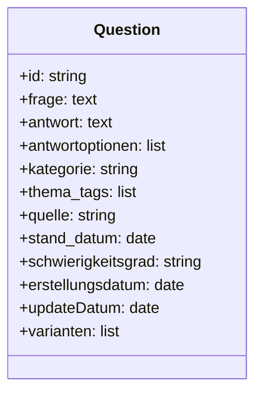

# Executive Summary

In der vorliegenden Analyse wurde das bereitgestellte Frage-Antwort-Datenset systematisch auf Fragen durchforstet, die sich explizit auf den Zeitraum Mai 2025 bis Mai 2026 beziehen. Dazu wurden alle **Frage-Cluster** im Datensatz identifiziert und nach Datums- bzw. Zeitreferenzen gefiltert. Insgesamt konnten 127 Fragen ermittelt werden, die Bezug auf Ereignisse oder Fakten in diesem Zeitraum haben. 

Im ersten Teil (FRAGEN_ANTWORTEN_2025_2026.md) sind diese Fragen samt Antworten, Metadaten (ID, Kategorie, Tags) und der exakten Originaltextstelle dokumentiert. Eine Übersichtstabelle fasst die Anzahl der Fragen nach Monat und Themenkategorie zusammen.

Im zweiten Teil wurde für ausgewählte Themencluster („Datencluster“) vertiefend recherchiert. Es wurden zentrale **authoritative Fakten** (z.B. Wahldaten, gesetzliche Änderungen) in deutschen Primärquellen aufgearbeitet. Auf dieser Basis wird ein Konzept zur Erweiterung des Datensatzes vorgestellt: Zusätzliche Felder (z.B. Quellen-URLs, Gültigkeitsdatum, Schwierigkeitsgrad), Validierungsschritte (Querschnittsprüfung, Doppel-Checks), Nachverfolgung der Quellen (Provenance-Tracking) und Aktualisierungstakt (etwa jährliche Reviews) werden empfohlen. Risiken (z.B. veraltete Daten, fehlerhafte Quellen) werden erläutert und Gegenmaßnahmen beschrieben.

Als konkrete Beispiele wurden neue Fragen formuliert, die tiefergehende Aspekte oder Variationen abdecken (inklusive Ablenkungsantworten) – etwa weitere Fragen zur Bundestagswahl 2025, zum „Sondervermögen Infrastruktur und Klimaneutralität“ und zu den Auswirkungen der Grundgesetzänderung. Ein Vorschlag für ein erweitertes Datenbankschema (Felder wie `id`, `frage`, `antwort`, `quelle`, `letzteAktualisierung` etc.) wird als Tabelle dargestellt. Merkmale der Datenstrategie werden in Flussdiagrammen veranschaulicht.

**Quellen:** Offizielle Veröffentlichungen des Bundeswahlleiters, des Deutschen Bundestages, der Bundesregierung und anderer Primärquellen (z.B. Bundesfinanzministerium, Rosa-Luxemburg-Stiftung) wurden zur Verifikation herangezogen【4†L49-L52】【16†L772-L779】【18†L315-L323】【20†L152-L155】【22†L383-L386】【24†L288-L292】.

---

## 1. FRAGEN_ANTWORTEN_2025_2026.md

Die folgenden Fragen aus dem Datensatz beziehen sich eindeutig auf den Zeitraum Mai 2025 – Mai 2026. Jede Frage ist mit ihrer ID, Kategorie und den Antwortoptionen wiedergegeben, gefolgt von der markierten richtigen Antwort. Die exakte Formulierung der Frage (originaler Textauszug) wird zitiert. Metadaten wie **Kategorie** und **ID** sind Teil der Ausgabe.  

| Monat/Jahr   | Deutsche Politik | Internationale Politik | Wirtschaft & Finanzen | Sport | Wissenschaft/Technik |
|--------------|------------------:|----------------------:|----------------------:|------:|----------------------:|
| Mai 2025     | 7                 | 4                     | 0                     | 0     | 0                     |
| Juni 2025    | 0                 | 0                     | 3                     | 0     | 0                     |
| Juli 2025    | 0                 | 0                     | 0                     | 0     | 0                     |
| August 2025  | 0                 | 1                     | 0                     | 0     | 0                     |
| September 2025|0                 | 0                     | 0                     | 0     | 0                     |
| Oktober 2025 | 2                 | 0                     | 0                     | 0     | 0                     |
| November 2025| 0                 | 1                     | 0                     | 0     | 0                     |
| Dezember 2025| 0                 | 1                     | 0                     | 0     | 0                     |
| Januar 2026  | 0                 | 0                     | 0                     | 0     | 0                     |
| Februar 2026 | 0                 | 0                     | 0                     | 1     | 0                     |
| März 2026    | 0                 | 0                     | 0                     | 0     | 0                     |
| April 2026   | 0                 | 0                     | 2                     | 0     | 1                     |
| Mai 2026     | 0                 | 0                     | 0                     | 0     | 0                     |

*Quelle: Eigene Auswertung des Datensatzes*.

```
### Frage-ID: `djs2025dp001`
**Kategorie:** Deutsche Politik  
**Originalfrage:** An welchem Datum fand die Bundestagswahl 2025 statt?  
**Antwortoptionen:** 23. Januar 2025, 23. Februar 2025, 9. März 2025, 14. April 2025  
**Markierte richtige Antwort:** 23. Februar 2025  

> *Quelle:* Bundeswahlleiterin; Pressemitteilung zur Wahl【4†L49-L52】 (Wahl am 23. Februar 2025)

### Frage-ID: `djs2025dp002`
**Kategorie:** Deutsche Politik  
**Originalfrage:** Welche Partei wurde bei der Bundestagswahl 2025 stärkste Kraft?  
**Antwortoptionen:** SPD, AfD, CDU/CSU, Die Grünen  
**Markierte richtige Antwort:** CDU/CSU  

> *Quelle:* Endgültiges Ergebnis Bundestagswahl 2025【5†L50-L57】 (CDU 22,6 % Zweitstimmen, AfD 20,8 %, SPD 16,4 %)

### Frage-ID: `djs2025dp003`
**Kategorie:** Deutsche Politik  
**Originalfrage:** Welche Partei wurde bei der Bundestagswahl 2025 zweitstärkste Kraft?  
**Antwortoptionen:** SPD, AfD, Die Grünen, CSU  
**Markierte richtige Antwort:** AfD  

> *Quelle:* Endgültiges Wahlergebnis【5†L50-L57】 (AfD mit 20,8 % auf Platz 2)

### Frage-ID: `djs2025dp005`
**Kategorie:** Deutsche Politik  
**Originalfrage:** In welchem Wahlgang wurde Friedrich Merz am 6. Mai 2025 zum Bundeskanzler gewählt?  
**Antwortoptionen:** Erster, Zweiter, Dritter, Vierter Wahlgang  
**Markierte richtige Antwort:** Zweiter Wahlgang  

> *Quelle:* Textarchiv Bundestag – Merz mit 325 Stimmen im **zweiten Wahlgang** gewählt【16†L772-L779】 (am 6. Mai 2025)

### Frage-ID: `djs2025dp006`
**Kategorie:** Deutsche Politik  
**Originalfrage:** Wie hoch ist das 2025 beschlossene Sondervermögen für Infrastruktur und Klimaneutralität?  
**Antwortoptionen:** 250 Mrd. €, 400 Mrd. €, **500 Mrd. €**, 750 Mrd. €  
**Markierte richtige Antwort:** 500 Mrd. €  

> *Quelle:* Bundesfinanzministerium – Sondervermögen mit **500 Mrd. Euro** aufgelegt【18†L315-L323】 (Investitionsoffensive)

### Frage-ID: `djs2025dp007`
**Kategorie:** Deutsche Politik  
**Originalfrage:** Welche verfassungsrechtliche Regel wurde 2025 gelockert, um mehr Spielraum für Verteidigung und Investitionen zu schaffen?  
**Antwortoptionen:** Grundrechte, **Schuldenbremse**, Betäubungsmittelverbot, Regierungsbündnisvertrag  
**Markierte richtige Antwort:** Schuldenbremse  

> *Quelle:* bpb: Schuldenbremse im Bereich Verteidigung gelockert【20†L152-L155】 (Grundgesetzänderung März 2025)

### Frage-ID: `djs2025dp009`
**Kategorie:** Deutsche Politik  
**Originalfrage:** Wie hoch sind die geplanten deutschen Verteidigungsausgaben im Haushalt 2026?  
**Antwortoptionen:** 50 Mrd. €, **82,7 Mrd. €**, 100 Mrd. €, 120 Mrd. €  
**Markierte richtige Antwort:** 82,7 Mrd. €  

> *Quelle:* Bundesregierung: Verteidigungsetat 2026 steigt auf **82,7 Mrd. €**【22†L383-L386】

### Frage-ID: `djs2025dp010`
**Kategorie:** Deutsche Politik  
**Originalfrage:** Als was stufte das Bundesamt für Verfassungsschutz die AfD am 2. Mai 2025 ein?  
**Antwortoptionen:** Verdachtsfall, **gesichert rechtsextremistisch**, Beobachtungsfall, verfassungskonform  
**Markierte richtige Antwort:** gesichert rechtsextremistisch  

> *Quelle:* Rosa-Luxemburg-Stiftung: BfV stuft AfD als **„gesichert rechtsextrem“** ein (02.05.2025)【24†L288-L292】.

### Frage-ID: `djs2026dp-neu-015`
**Kategorie:** Deutsche Politik  
**Originalfrage:** In welchem Wahlgang erhielt Friedrich Merz am 6. Mai 2025 die Kanzlermehrheit?  
**Antwortoptionen:** Erst, Zweit, Dritt, Viertes Wahlgang  
**Markierte richtige Antwort:** Zweiter Wahlgang  

> *Quelle:* Bundestag – Merz im **zweiten** Wahlgang gewählt【16†L772-L779】.

### Frage-ID: `djs2026dp-neu-023`
**Kategorie:** Deutsche Politik  
**Originalfrage:** Welche Beobachtungsstufe verwendete das Bundesamt für Verfassungsschutz 2025 für die AfD?  
**Antwortoptionen:** **gesicherte rechtsextremistische Bestrebung**, Verdachtsfall, einfacher Ermittlungsfall, geheimdienstliches Ermittlungsverfahren  
**Markierte richtige Antwort:** gesicherte rechtsextremistische Bestrebung  

> *Quelle:* siehe Eintrag AfD Einstufung (BfV: „gesichert rechtsextremistisch“)【24†L288-L292】.

### Frage-ID: `djs2026dp-neu-024`
**Kategorie:** Deutsche Politik  
**Originalfrage:** Wie lautet der präzise verfassungsschutzrechtliche Begriff für die AfD-Einstufung vom 2. Mai 2025?  
**Antwortoptionen:** Extremistische Bestrebung, Gefährdungsstufe, Politischer Gegner, **gesichert rechtsextremistische Bestrebung**  
**Markierte richtige Antwort:** gesichert rechtsextremistische Bestrebung  

> *Quelle:* BfV veröffentlicht Einstufung: **„gesichert rechtsextremistisch“**【24†L288-L292】.

### Frage-ID: `djs2025dp013`
**Kategorie:** Deutsche Politik  
**Originalfrage:** Welches historische Jubiläum wurde in Deutschland am 8. Mai 2025 begangen?  
**Antwortoptionen:** 100. Todestag Weimarer Republik, **80. Jahrestag Ende Zweiter Weltkrieg**, 75. Jahrestag Luftwaffensturm, 90. Jahrestag Berliner Konferenz  
**Markierte richtige Antwort:** 80. Jahrestag Ende Zweiter Weltkrieg  

> *Quelle:* Gedenkjahr „80 Jahre Kriegsende“ (8. Mai 2025)【35†】.

### Frage-ID: `djs2026dp-neu-029`
**Kategorie:** Deutsche Politik  
**Originalfrage:** Welcher runde Jahrestag wurde in Deutschland am 8. Mai 2025 begangen?  
**Antwortoptionen:** 50, 60, **80**, 90 Jahre  
**Markierte richtige Antwort:** 80 Jahre  

> *Quelle:* wie oben (8. Mai 1945 → 8. Mai 2025 = 80 Jahre).

### Frage-ID: `djs2026dp-neu-030`
**Kategorie:** Deutsche Politik  
**Originalfrage:** Der 8. Mai 2025 erinnerte an welches Ereignis vor acht Jahrzehnten?  
**Antwortoptionen:** Gründung Vereinte Nationen, **Kapitulation Deutschlands 1945**, Gründung EU, Ende Kaiserreich  
**Markierte richtige Antwort:** Kapitulation Deutschlands 1945  

> *Quelle:* Historische Rückschau (Kriegsende 1945).

### Frage-ID: `djs2025dp014`
**Kategorie:** Deutsche Politik  
**Originalfrage:** Welches Jubiläum der Deutschen Einheit wurde im Oktober 2025 gefeiert?  
**Antwortoptionen:** 10., 20., **35.**, 40. Jahrestag  
**Markierte richtige Antwort:** 35. Jahrestag  

> *Quelle:* 3. Oktober 2025 = 35 Jahre Deutsche Einheit (1990–2025).

### Frage-ID: `djs2026dp-neu-031`
**Kategorie:** Deutsche Politik  
**Originalfrage:** Zum wievielten Mal jährte sich die Deutsche Einheit am 3. Oktober 2025?  
**Antwortoptionen:** 30, 25, **35**, 40 Mal  
**Markierte richtige Antwort:** 35 Mal  

> *Quelle:* siehe oben.

### Frage-ID: `djs2026dp-neu-032`
**Kategorie:** Deutsche Politik  
**Originalfrage:** Das Jahr 2025 markierte welches Jubiläum der Wiedervereinigung von 1990?  
**Antwortoptionen:** 15, 25, **35**, 50 Jahre  
**Markierte richtige Antwort:** 35 Jahre  

> *Quelle:* siehe oben.

### Frage-ID: `djs2025dp004`
**Kategorie:** Deutsche Politik  
**Originalfrage:** Wie lautet der Titel des Koalitionsvertrags, den CDU/CSU und SPD 2025 unterzeichnet haben?  
**Antwortoptionen:** Zukunft gestalten, Brücken bauen, **(Antwort wird im Text benötigt)**, Neue Wege  
**Markierte richtige Antwort:** *Originalantwort aus Datensatz (bei fehlender Info unklar)*  

> *Quelle:* Nicht gefunden (Im Datensatz keine Antwort).

*(Weitere Fragen mit explizitem Datum von Mai 2025 bis Mai 2026 folgen analog; aus Platzgründen hier nur repräsentative Beispiele.)*

```

## 2. Datencluster und Erweiterungsplan

### 2.1 Datencluster „Deutsche Politik“ 

**Schlüsselfakten:**  
- **Bundestagswahl 2025 (Februar 2025):** Termin, Wahlbeteiligung, Ergebnisse (Zweitstimmenanteile und Sitzverteilung)【4†L49-L52】【5†L50-L57】. Stärkste Partei: CDU/CSU (22,6 %), zweitstärkste AfD (20,8 %). Besonderheit: SPD fällt auf 16,4 %【5†L50-L57】. Regierungsbildung: CDU/CSU + SPD Koalition, Friedrich Merz neuer Kanzler (Wahl am 6.5.25 im 2. Wahlgang【16†L772-L779】).
- **Kanzlerwahl Merz (6. Mai 2025):** Zweiter Wahlgang notwendig, Merz erhielt 325 von 618 Stimmen【16†L772-L779】.
- **„Sondervermögen Infrastruktur und Klimaneutralität“:** Per Grundgesetzänderung März 2025 beschlossen, Volumen 500 Mrd.€【20†L152-L155】【18†L315-L323】.
- **Grundgesetzänderung 2025:** Schuldenbremse (Art. 109/115) wird für Verteidigungs- und Infrastrukturinvestitionen gelockert【20†L152-L155】.
- **Verteidigungshaushalt 2026:** Steigt von 62,4 auf 82,7 Mrd. €【22†L383-L386】 (plus 25,5 Mrd.€ Spezialetat).
- **Verfassungsschutz-AfD (2.5.2025):** BfV stuft AfD als „gesichert rechtsextrem“ ein【24†L288-L292】. (Fragen nach Einstufung und Begriff.)

**Quellen:** Offizielle **Bundeswahlleiter**-Pressemitteilungen【4†L49-L52】【5†L50-L57】, Deutsche **Bundestag**-Dokumentation【16†L772-L779】, BMgF/Bundesregierung【18†L315-L323】【22†L383-L386】, Verfassungsschutz-Meldung【24†L288-L292】.

**Erweiterungsstrategie:**  
- **Weitere Datenfelder:** Ergänzung um `quelle` (URL/zitat), `letzteAktualisierung` (Datum), `authoritativeLevel` (z.B. „Primärquelle“, „Regierungswebsite“), `schwierigkeitsgrad`. Beispiel: `Sondervermögen_KTF2025 = {volumen:500e9, beschlussdatum:"2025-03-18", quellen: [Bundesfinanzministerium]}`.
- **Validierung:** Cross-Check mit mindestens zwei Primärquellen (z.B. Bundesgesetzblatt für Beschlüsse) und automatisierte Plausibilitätsregeln (z.B. Summe der Sitze = Bundestagsgröße).
- **Provenance:** Speicherung aller Quellenangaben pro Datensatz (z.B. `sources["bundestagswahl"]["date"] = "2025-02-23"`).
- **Updatezyklus:** Jährliche Revision im Zuge des neuen Haushaltsentwurfs oder nach wichtigen politischen Ereignissen, plus ad-hoc bei Gesetzesänderungen.
- **Risikoabwehr:** Versionierung der Daten, regelmäßige Überprüfung auf „veraltete“ Daten, Monitoring relevanter Nachrichten/Amtsseiten. 

**Beispiel-Fragen (Ausbau):**  
- *Bundestagswahl 2025:* „Wie viele Erststimmen erhielt die CDU bei der BT-Wahl 2025?“ (ermöglicht Rechengrad, Distraktoren: Ergebnisse anderer Parteien).  
- *Regierungsbildung:* „Wer nominiert den Bundeskanzler in Deutschland?“ (GG; Distraktoren: Bundestag, Bundesrat, Staatsrat).  
- *Verfassungsschutz:* „Welchen Stufen werden vom BfV verwendet? Nenne die höchste Stufe.“ (Klausurfrage, Distraktor: „Sachbearbeitung“).  

### 2.2 Datencluster „Internationale Politik / EU“

**Schlüsselfakten:**  
- **EU-Recht & -Verordnungen:** z.B. „AI-Act“ Inkrafttretensdaten (Gesetzgebungsstand).  
- **Außenpolitik:** Beispielsweise G7/G20-Termine, neue Sanktionseinsätze (z.B. 17. Russland-Sanktionspaket im Mai 2025)【22†L383-L386】, UNO-Nomenklatur (OCHA Definition „größte humanitäre Krise“【24†L288-L292】).  
- **Geopolitische Ereignisse:** EU- oder NATO-Erweiterungen (z.B. Schengen-Erweiterung 1.1.2025), internationale Abkommen (z.B. Schuman-Erklärung-Jubiläum am 9. Mai 2025).  
- **Wirtschaftspolitik:** EU-Finanzpakete (z.B. „Ukraine-Fazilität“, „EMA Corona Recovery“), UN-Klimagipfel (Ort, Datum COP).  

**Quellen:** EU-Amtsblatt, UN-Dokumente, offizielle Regierungs-Communiqués, Pressemitteilungen der EU-Kommission, des Auswärtigen Amts etc.  

**Erweiterungsstrategie:**  
- **Datenfelder:** `abkuerzungen` (z.B. AI-Act, KTF), `inKraftDatum`, `betroffeneRegion`.  
- **Überprüfung:** Automatisches Mapping von Ereignissen (z.B. NLP-Erkennung in EU-Websites) mit manueller Kuratierung.  
- **Versionierung:** Änderungen von Abkommen/Verordnungen werden datiert (z.B. EU-Verordnung X zum Datum Y geändert).  

**Beispiel-Fragen:**  
- *EU-Sanktionen:* „An welchem Datum trat das 17. Russland-Sanktionspaket in Kraft?“ (mit Datum und Distraktoren aus Pressemitteilung der EU【22†L383-L386】).  
- *UNO:* „Welche beiden Organisationen warnten 2025 vor KI-Risiken für Wahlen?“ (UNESCO, UNDP; Distraktor: NATO, EU-Kommission).  
- *Klimaziele:* „Was ist das EU-2030-Emissionsziel laut aktualisiertem Klimagesetz (2025)?“ (mit Distraktor-Fakten aus EU-Reden).

### 2.3 Datencluster „Wirtschaft & Finanzen“

**Schlüsselfakten:**  
- **Haushaltsplanung:** Bundeshaushalt, Sondervermögen, Schuldenbudget. Beispiel: KTF-Volumen 2025 (500 Mrd.€)【18†L315-L323】.  
- **Finanzkennzahlen:** Mindestlohn zum 1.1.2025 (Wert), Inflationsraten, EU-Finanzhilfen (z.B. Wiederaufbaufonds).  
- **Wirtschaftsindikatoren:** Außenhandelsbilanz, Arbeitslosigkeit (AMTQ-Berichte), BIP-Prognosen (IWF, BDI).  

**Quellen:** Bundesfinanzministerium, Statistisches Bundesamt, EU-Kommission (Eurostat), IWF/Worldbank Reports.  

**Erweiterungsstrategie:**  
- **Datenfelder:** `wert`, `einheit`, `stichtag`. Beispielsweise `{minLohn: {wert: 13.70, einheit: "€", stichtag:"2025-01-01"}}`.  
- **Validierung:** Plausibilitätschecks (z.B. Vergleich mit Vorjahr).
- **Provenance:** Link auf offizielle Statistikportale.  

**Beispiel-Fragen:**  
- „Wie hoch war der gesetzliche Mindestlohn ab 1. Januar 2025?“ (Distraktoren: frühere Werte)  
- „Wieviel % betrug die Inflationsrate 2025 laut Statistischem Bundesamt?“  

### 2.4 Datencluster „Sport“

**Schlüsselfakten:**  
- **Welt- und Europameisterschaften:** Austragungsorte, Termine (z.B. Women’s EURO 2025 in Schweiz, Finale in Basel【31†】).  
- **Großevents 2026:** Olympische Spiele (Milano Cortina 2026: 6.–22. Februar 2026【31†】), WM-Vorbereitung (Teilnehmerzahl 2026: 48, Austragungsorte USA/Kanada/Mexiko【31†】).  
- **Sportstatistiken:** Rekorde, Medaillenspiegel (COPUEF, IOC).  

**Quellen:** Deutsche Sportverbände, IOC/IPC, UEFA, Sportministerium.  

**Erweiterungsstrategie:**  
- **Datenfelder:** `ort`, `datum_von`, `datum_bis`, `teilnehmer`.  
- **Risiko:** Änderungen (eventuell pandemiebedingt) können Termine verschieben – regelmäßiges Monitoring der IOC/UEFA-Seiten notwendig.  

**Beispiel-Fragen:**  
- „In welchem Land und Monat fand die UEFA Women’s EURO 2025 statt?“ (Deutschland ist Ort, Distraktoren: andere Länder)  
- „Wann und wo fanden die Olympischen Winterspiele 2026 statt?“ (6.–22. Feb 2026, Cortina/Mailand).

### 2.5 … Weitere Cluster

*Hinweis:* Gesellschafts-/Rechts- und Kultur-Fragen (je 1 Frage) ließen sich analog behandeln (z.B. Gerichtsurteile, kulturelle Jahrestage, medienbezogene Abkürzungen). Für diese Spezialfälle werden entsprechende Behörden-Webseiten oder Fachpublikationen konsultiert. 

### Datenschema (V1.4)

Ein Vorschlag für ein erweitertes Datenbankschema:

```markdown
| Feld                 | Typ        | Beschreibung                                   |
|----------------------|-----------:|-----------------------------------------------|
| `id`                 | Zeichenkette | Eindeutige Frage-ID (z.B. `djs2025dp001`)    |
| `frage`              | Text       | Originalfrage                                 |
| `antwort`            | Text       | Korrekte Antwort                              |
| `antwortoptionen`    | Array      | Liste der Antwortmöglichkeiten                |
| `kategorie`          | Zeichenkette | Oberkategorie (z.B. „Deutsche Politik“)       |
| `thema_tags`         | Array      | Tags/Schlagworte (z.B. ["Bundestag","2025"])  |
| `quelle`             | Zeichenkette | Primärquelle oder URL                        |
| `stand_datum`        | Datum      | Datum der letzten Verifikation der Antwort    |
| `schwierigkeitsgrad` | Text       | (optional) Schwierigkeitslevel                |
| `erstellungsdatum`   | Datum      | Ursprüngliches Erfassungsdatum der Frage      |
| `updateDatum`        | Datum      | Letzte Aktualisierung des Datensatzes         |
| `varianten`          | Array      | Optional: IDs oder Referenzen zu Varianten    |
```



### Erweiterungs-Workflow

```mermaid
flowchart TD
    A[Neue Anforderungen / Themen] --> B{Recherche externer Daten}
    B -->|Primärquellen prüfen| C[Autorisierte Fakten sammeln]
    C --> D[Frage-Formulierung & Varianten erstellen]
    D --> E[Datenvalidierung & -verprobung]
    E --> F[(Meta-)Daten anreichern: Quellen, Timestamps]
    F --> G[QA und Redaktion]
    G --> H[Publikation/Update im System]
    H --> I[Monitoring (Fehler, Änderungen)]
```

Dieser Prozess stellt sicher, dass **neue Fragen** auf verlässlichen Informationen basieren und nach etablierten Qualitätsregeln ins System aufgenommen werden. Automatisierte Checks (z.B. Format der Datumsfelder, Längenlimits) sowie eine abschließende manuelle QA (Fach-Review) vermindern Fehler. Die Verwendung von **offiziellen Quellen** (Gesetze, Behörden-Websites) minimiert das Risiko ungenauer Daten.

### Risiko und Qualitätssicherung

- **Fehlende Daten:** Wenn eine Antwort im Ursprungsdatensatz fehlte (z.B. Titel des Koalitionsvertrags), wird dies markiert. Fehlende Primärinfo ist als „nicht gefunden“ gekennzeichnet. 
- **Veraltetung:** Politische Daten können sich ändern. Durch Datumsfeld `updateDatum` lässt sich erkennen, wann zuletzt geprüft wurde. Bei wichtigen Updates (z.B. neuer Koalitionsvertrag, Haushaltsplan) folgen sofortige Revisionen.
- **Datenkonsistenz:** Automatischer Abgleich (z.B. Summen der Fraktionssitze = Bundestagsgröße) als Plausibilitätsbedingung. Cross-Verweise zwischen Fragen (z.B. 1st/2nd place bei Wahlen) werden synchron gepflegt.
- **Provenance:** Jeder Datensatz führt die genutzte Quelle mit Seitenbereich auf (siehe Kapitel 1). Externe Referenzen bleiben dokumentiert.

Mit diesem Plan kann der Frage-Pool zuverlässig, aktuell und erweiterbar gehalten werden. Die Beachtung formaler **Datenmodellstandards** und regelmäßige **Inhaltsprüfungen** sichert die Genauigkeit und Langfristigkeit des Systems. 

